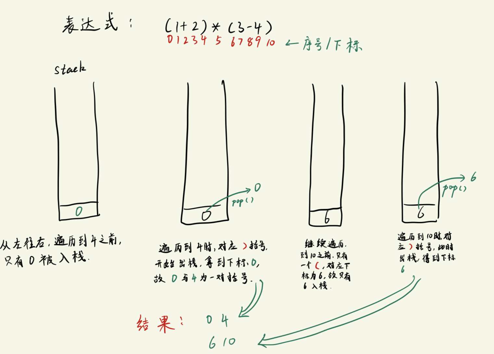

# 栈的应用 -- 括号匹配
核心思想:
```txt
1. 从左到右遍历, 没有遇到`)`之前, 遍历过的元素全部入栈
2. 入栈的是元素的下标 (栈里面存放的都是整数)
3. 遇到`)`之后, 开始逐一出栈, 直到遇到`(`, 将此时 栈里存放的下标 和 当前下标 组成一对, 存入结果集.
```

例子看下图:



代码例子 -- C语言版本
```c
#include <stdio.h>
#include <string.h>

int stack[512];        // 用数组实现栈
int top = 0;            // 栈顶指针

void push(int c);
int pop(void);
int isEmpty(void);
int isFull(void);

int main(void)
{
    char str[100];
    int i;
    int len;

    printf("Please enter a calculate expression: ");
    gets(str);      // 编译会有警告, 但只要输入的字符小于str的大小, 不越界, 就不会有问题

    len = strlen(str);
    for (i = 0; i < len; i++){
        if (str[i] == '('){         // 遍历到左括号
            push(i);
        }
        else if(str[i] == ')'){     // 遍历到右括号
            printf("%d %d\n", pop(), i);
        }
    }

    return 0;
}

void push(int c)
{
    if (!isFull()){
        stack[top++] = c;   // top++ 表示在执行完这行代码后自增1
    }
}

int pop(void)
{
    return stack[--top];    // --top 表示先自减1, 然后执行这行代码
}

int isEmpty(void)
{
    return top == 0;
}

int isFull(void)
{
    return top == 512;
}
```

C++ 版本
```cpp
#include <iostream>
#include <string>

using namespace std;

// --------- 用模板类实现简单的栈 -----------
// 实现栈结构主要由两部分: 数组 + 循环
//  核心就是管理好数组的存取, 以及防止内存泄露
template<class T>
class Stack
{
    private:
        int max_cap;    // 栈大小
        int top;        // 栈顶指针
        T * items;      // 存放栈元素的数组
    public:
        Stack(int m)
        {
            max_cap = m;
            top = 0;
            items = new T[max_cap];
        }
        ~Stack(){delete [] items;}

        bool isFull(void);          // 判断栈是否为满
        bool isEmpty(void);         // 判断栈是否为空
        bool push(const T &t);            // 压栈/入栈
        bool pop(T &t);             // 出栈
        void show();
};

template <class T>
bool Stack<T>::isEmpty()
{
    return top == 0;
}

template <class T>
bool Stack<T>::isFull()
{
    return top == max_cap;
}

template <class T>
bool Stack<T>::push(const T &t)
{
    if (top < max_cap && !isFull()){
        items[top++] = t;
        return true;
    }
    else{
        return false;
    }
}

template <class T>
bool Stack<T>::pop(T &t)
{
    if (top > 0 && !isEmpty()){
        t = items[--top];
        return true;
    }
    else{
        return false;
    }
}

template <class T>
void Stack<T>::show()
{
    if (!isEmpty()){
        int temp = top;
        while (temp > 0){
            cout << items[--temp];
        }
        cout << endl;
    }
    else{
        cout << "Sorry, Stack is Empty!" << endl;
    }
}

int main(void)
{
    string str;
    int i;

    printf("Please enter a calculate expression: ");
    getline(cin, str);

    Stack<int> myStack(str.size());
    for (i = 0; i < str.size(); i++){
        if (str[i] == '('){         // 遍历到左括号
            myStack.push(i);
        }
        else if(str[i] == ')'){     // 遍历到右括号
            int temp;
            myStack.pop(temp);
            printf("%d %d\n", temp, i);
        }
    }
    return 0;
}
```
