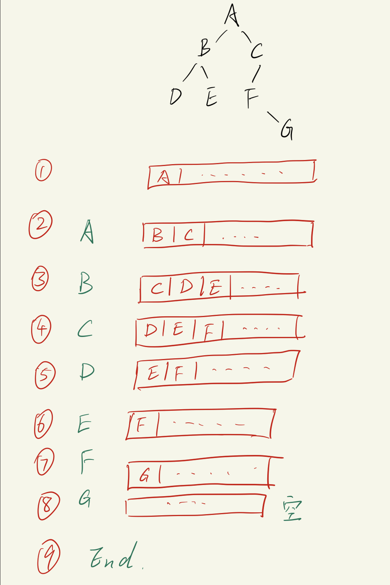
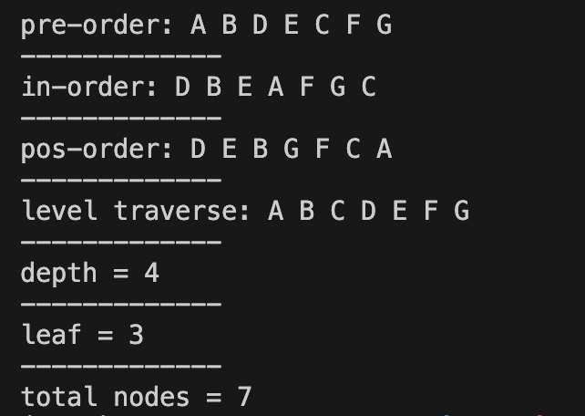

# 二叉树 -- 一定与递归有关

# 创建二叉树

二叉树相比 栈、队列以及链表 来说， 二叉树属于 "1对多" 的关系， 一个节点可以有两个子节点， 但是一个子节点只能有一个父节点。
- 栈和堆属于`顺序结构`， 方便查找， 但是插入和删除效率低
- 链表属于`链式结构`， 方便插入和删除， 但是查找效率低
- 二叉树属于`树形结构`， 既方便查找， 也方便插入和删除
  - 对于大批量离散数据的处理， 二叉树的优势非常明显

树结构有很多种， 比较经典&简单的结构就是二叉树，其他诸如 AVL树、红黑树、B树、B+树等等， 都是在二叉树的基础上进行改进的。


二叉树的特点：
- **有且只有一个根结点**（root）
- 根结点以外，其余结点分为两个**互不相交**的子集，分别称为 左子树(T1) 和 右子树(T2)
  - 二叉树**最多只有两个子树**
    - 由此可以推断出`二叉树一共有5种形态`:
      - 空二叉树: 没有节点
      - 只有根节点的二叉树
      - 只有左子树: 只有左节点
      - 只有右子树: 只有右节点
      - 全子树 -- 左右子树都有

也就是说: 二叉树不一定长得像"树", 只要**具有二叉树的数据存储结构**(结构体里面定义了 数据+左子树指针+右子树指针)的都可以称为二叉树, **哪怕就是一个节点, 也可以叫做二叉树**.

从上面的特征不难总结出:
```txt
对于每一个节点(或叫每一个二叉树), 它都应该包含:
    1. 节点内存放的数据
    2. 结构体指针
        - 指向左子树的指针
        - 指向右子树的指针

每一个子树也是一个二叉树, 也包含上面的两个特征
    -> 必然用到 递归 的思想
```

创建二叉树过程:
```txt
1. 输入一个节点信息, 创建一个节点 T
2. 为节点 T 创建 左子树T1
    yes: 递归创建左子树
    no: 节点的 左子树指针 = NULL
3. 为节点 T 创建 右子树T2
    yes: 递归创建右子树
    no: 节点的 右子树指针 = NULL
```

本笔记使用的二叉树样式:
```txt
         A
       /    \
      B      C
     / \    / 
    D   E  F 
            \ 
             G
```

## 代码实现 -- 创建二叉树
C语言版本:
```c
#include <stdio.h>
#include <stdlib.h>

struct BinTree_node
{
    unsigned char elem;
    struct BinTree_node *ltree, *rtree;
};

struct BinTree_node * create_bintree();

int main(void)
{
    struct BinTree_node * myTree =  create_bintree();
    return 0;
}

struct BinTree_node * create_bintree(void)
{
    unsigned char flag;
    struct BinTree_node * tree;
    tree = (struct BinTree_node *)malloc(sizeof(struct BinTree_node));

    // 当前节点
    printf("Please enter the element:\n ");
    while((tree->elem = getchar()) == '\n');        // 当读取的字符不是回车时, 就会跳出while, 这样做可以防止读到缓冲区里可能在上一次输入残存的回车

    // 左子树
    printf("Do you want to l_tree for %c, (Y/N)? \n", tree->elem);
    while((flag = getchar()) == '\n');              // 防止读到回车
    if(flag == 'Y'){
        tree->ltree = create_bintree();
    }
    else{
        tree->ltree = NULL;
    }

    // 右子树
    printf("Do you want to r_tree for %c, (Y/N)? \n", tree->elem);
    while((flag = getchar()) == '\n');              // 防止读到回车
    if(flag == 'Y'){
        tree->rtree = create_bintree();
    }
    else{
        tree->rtree = NULL;
    }
    
    return tree;
}
```


---

C++版本 (demo, 未完成, 暂时没有析构):
头文件 `BinTree.h`:
```cpp
#ifndef __BinTree_CPP_H__
#define __BinTree_CPP_H__
#include <iostream>

using namespace std;

template <class U>
struct BinTree_node
{
    U elem;
    struct BinTree_node * ltree, *rtree;
    // 构造函数(结构体也有构造函数)
    BinTree_node() : ltree(nullptr), rtree(nullptr){}
    BinTree_node(U x, BinTree_node * l, BinTree_node * r) : elem(x), ltree(l), rtree(r){}
};

template <class T>
class BinTree
{
    private:
        BinTree_node<T> * root;

    public:
        BinTree() : root(nullptr) {};
        ~BinTree();                     // 析构需要用到遍历二叉树的知识, 暂时不写

        BinTree_node<T> * create_tree();
};

template<class T>
BinTree_node<T> * BinTree<T>::create_tree()
{
    unsigned char flag;
    BinTree_node<T> * tree = new BinTree_node<T>;

    // 当前节点数据
    cout << "Please enter the element:" << endl;
    while((tree->elem = cin.get()) == '\n');

    // 左子树
    cout << "Do you want to create ltree for " << tree->elem << ", (Y/N)? " << endl;
    while((flag = cin.get()) == '\n');
    if(flag == 'Y'){
        tree->ltree = create_tree();
    }
    else{
        tree->ltree = nullptr;
    }

    // 右子树
        // 左子树
    cout << "Do you want to create rtree for " << tree->elem << ", (Y/N)? " << endl;
    while((flag = cin.get()) == '\n');
    if(flag == 'Y'){
        tree->rtree = create_tree();
    }
    else{
        tree->rtree = nullptr;
    }

    return tree;
}

#endif //!__BinTree_CPP_H__
```

测试文件 `create_bintree.cpp`:
```cpp
#include "bintree.h"

using namespace std;

int main(void)
{
    BinTree<char> *mytree;
    mytree->create_tree();
    return 0;
}
```

--- 

# 遍历二叉树
遍历二叉树的方法有三种:
1. 先序遍历
2. 中序遍历
3. 后序遍历

区分 & 巧记:
```txt
起名逻辑:
    什么时候访问 **根节点**, 就叫什么遍历.
        - 先序便利: 先访问根节点
        - 中序遍历: 根节点放在中间访问
        - 后序遍历: 最后才访问根节点

左右子树的遍历?
    全都是先左子树, 再右子树.
    故: 先看什么时候访问根节点, 然后再按照"先左后右"的顺序去遍历, 就知道整个遍历顺序了.
```

## 先序遍历
访问逻辑是`中-左-右`, 中指的是当前树的根节点.
1. 先访问`根`
2. 先序遍历`左子树`
   - 左子树本身也是一个二叉树, 同样使用先序遍历的方式, 递归地遍历它左子树的左子树
   - 简单来说, 就是**每走到一个节点**, 就去访问它的**左子树**, 而暂时忽略它的右子树, 如果当前路径的内的节点都访问完了, 就回到上一个节点, 然后访问它的右子树
3. 先序遍历`右子树`
   - 同样需要用递归的方式遍历右子树, 也是没走到一个节点就只访问它的右子树

访问过程分析:
```txt
         A
       /    \
      B      C
     / \    / 
    D   E  F 
            \ 
             G

    先序遍历:
        A -> B -> D -> E -> C -> F -> G

    遍历过程描述: 
        - 从根节点A出发, 先访问A的左子树, 于是走到B这里
        - B先访问它的左子树, 走到 D
        - D后面没有可访问的左子树了, 这时候轮到D的右子树, 发现D没有右子树, 所以回到D的前一个节点, 就是B
        - 此时B的左子树也已经遍历结束, 此时访问B的右子树, 走到E
        - E没有子树, 开始往回退, 先回到B, B已经访问完左右子树, 再回退, 走到A
        - 此时A的左子树访问完了, 开始走到右子树 C
        - C 开始走左子树, 取到 F
        - 发现F没有左子树, 开始走F的右子树, 走到G
        - G没有子树, 往回走到F, F的左右子树都访问完了, 往回走到C
        - C 左子树访问结束了, 此时看看右侧, 没有右子树, 往回走到A
        - 此时A是根节点, 它的左右子树都访问完了, 于是遍历结束.
```

### 代码实现 -- 先序遍历
```c
void pre_order(struct BinTree_node * tree)
{
    if(tree != NULL){   // 首先确保根节点是有效的二叉树结构
        printf("%c ", tree->elem);  // 中
        pre_order(tree->ltree);     // 先序遍历左子树
        pre_order(tree->rtree);     // 先序遍历右子树
    }
}
```


---

## 中序遍历
先序遍历的访问逻辑是`左-中-右`, 中指的是当前树的根节点.
1. 先中序遍历`左子树`
2. 再访问根节点
3. 再中序遍历右子树

访问过程分析:
```txt
         A
       /    \
      B      C
     / \    / 
    D   E  F 
            \ 
             G

    中序遍历:
        D -> B -> E -> A -> F -> G -> C

    遍历过程描述(左-中-右): 
        - 从根节点开始看, A的左子树是B二叉树, 再继续看B的左子树, 是D, 发现D没有左子树(相当于走到了D这个位置, 开始中序遍历D这个二叉树), 于是开始访问D这个二叉树的根节点(也就是D本身), 此时输出D, 对于D这个二叉树, 还要再检查D的右子树, 发现是空的, 开始返回, 回到 B 这个二叉树
        - 对于B这个二叉树, 它的左子树已经访问完, 开始访问B本身, 输出B, 然后开始访问B的右子树, 发现是E, 开始中序遍历E这个二叉树
        - 对于E这个二叉树, 尝试访问左子树, 是空指针; 然后轮到E本身, 有值, 于是输出E; 最后轮到E的右子树, 是空指针, 此时回到上一个二叉树B, B二叉树此时也已经访问完, 回到A二叉树
        - A二叉树的左子树也已经访问结束; 开始访问A本身, 发现有东西, 输出A; 再访问A的右子树, 是C二叉树
        - 对于C二叉树, 先访问左子树, 发现是F, 开始中序遍历F二叉树
        - 对于F二叉树, 先访问左子树, 发现是空指针; 然后访问F本身, 发现有值, 输出F; 最后访问F的右子树, 发现是G, 开始中序遍历G二叉树
        - 对于G二叉树, 先访问左子树, 发现是空指针; 然后访问G本身, 发现有值, 输出G; 最后访问G的右子树, 发现是空指针, 此时回到F二叉树
        - F二叉树的左右子树都访问完了, 回到C二叉树
        - C二叉树的左子树和右子树都访问完了, 回到A二叉树
        - A二叉树的左子树和右子树都访问完了, 遍历结束
```

### 代码实现 -- 中序遍历
```c
void in_order(struct BinTree_node * tree)
{
    if(tree != NULL){
        in_order(tree->ltree);      // 左
        printf("%c ", tree->elem);  // 中
        in_order(tree->rtree);      // 右
    }
}
```


---
## 后序遍历
后序遍历的访问逻辑是`左-右-中`, 中指的是当前树的根节点.
1. 先后序遍历`左子树`
2. 再后序遍历`右子树`
3. 最后访问根节点

访问过程分析:
```txt
         A
       /    \
      B      C
     / \    / 
    D   E  F 
            \ 
             G

    后序遍历:
        D -> E -> B -> G -> F -> C -> A

    遍历过程描述(左-右-中): 
        - 从根节点开始看, A的左子树是B二叉树, 再继续看B的左子树, 是D二叉树
        - 对于D二叉树, 进行后序遍历, 先看它的左子树, 是空指针; 再看它的右子树, 还是空指针; 最后访问D本身(根节点), 输出D; 然后回到上一层 B二叉树
        - 对于B二叉树, 此时左子树已经遍历完; 开始访问右子树, 是E二叉树
        - 对于E二叉树, 进行后序遍历, 先看它的左子树, 是空指针; 再看它的右子树, 还是空指针; 最后访问E本身(根节点), 输出E; 然后回到上一层 B二叉树
        - B此时已经访问完, 回到A二叉树; 此时A的左子树也访问完, 访问A的右子树, 是C二叉树
        - 对于C二叉树, 进行后序遍历, 先看它的左子树, 是F二叉树
        - 对于F二叉树, 进行后序遍历, 先看它的左子树, 是空指针; 再看它的右子树, 是G二叉树
        - 对于G二叉树, 进行后序遍历, 先看它的左子树, 是空指针; 再看它的右子树, 也是空指针; 最后访问G本身(根节点), 输出G; 然后回到上一层 F二叉树
        - 对于F二叉树, 左右子树都访问完了, 最后访问F本身(根节点), 输出F; 然后回到上一层 C二叉树
        - 对于C二叉树, 左右子树都访问完了, 最后访问C本身(根节点), 输出C; 然后回到上一层 A二叉树
        - 对于A二叉树, 左右子树都访问完了, 最后访问A本身(根节点), 输出A; 遍历结束.
```

### 代码实现 -- 后序遍历
```c
// 核心代码
void pos_order(struct BinTree_node * tree)
{
    if (tree != NULL){
        pos_order(tree->ltree);
        pos_order(tree->rtree);
        printf("%c ", tree->elem);
    }
}
```

--- 

## 层次遍历
从左到右, 从上到下, 逐层遍历二叉树.
- 从根节点开始, 逐层遍历
- 访问每一层时, 从左到右, 也就是先访问左子树, 再访问右子树


访问过程分析:
```txt
         A
       /    \
      B      C
     / \    / 
    D   E  F 
            \ 
             G

    层次遍历:
        A -> B -> C -> D -> E -> F -> G

    遍历过程描述:
    - 首先访问顶层: 也就是根节点, 输出A
    - 访问第二层: 从左到右分别输出 B 和 C
    - 访问第三层: 从左到右分别输出 D, E 和 F
    - 访问第四层: 从左到右输出 G
```

由从左到右的, 从上到下的访问顺序可以观察出, 对于每一层来说, 它都是**先来先访问**, 也就是符合`队列`的思想.
- 注意放入队列的是`二叉树节点`
  - 而每个节点本身又可以表示一棵二叉树(有左子树和右子树).

使用队列思想实现层次遍历的过程:

```txt
遍历从根节点开始:
1. 创建队列, 将根节点入队
2. 从队列中取出第一个节点并将节点的数据输出, 得到A; 然后将A的左子树B和右子树C入队
3. 从队列中取出第一个节点并将节点的数据输出, 得到B; 然后将B的左子树D和右子树E入队 
4. 从队列中取出第一个节点并将节点的数据输出, 得到C; 然后将C的左子树F入队
5. 从队列中取出第一个节点并将节点的数据输出, 得到D; 发现D没有左右子树, 于是跳过
6. 从队列中取出第一个节点并将节点的数据输出, 得到E; 发现E没有左右子树, 于是跳过
7. 从队列中取出第一个节点并将节点的数据输出, 得到F; 然后将F的右子树G入队
8. 从队列中取出第一个节点并将节点的数据输出, 得到G; 发现G没有左右子树, 于是跳过
9. 检查队列, 发现此时队列为空, 结束遍历.
```

### 代码实现 -- 层次遍历
头文件`queue.h`
```c
#ifndef __QUEUE_H__
#define __QUEUE_H__

#include <stdio.h>
#include "binary_tree.h"    // 为了使用二叉树结构体

#define SIZE 512

struct BinTree_node queue[SIZE];

void enqueue(struct BinTree_node c);
struct BinTree_node dequeue(void);
int isEmpty();
int isFull();

#endif //! __QUEUE_H__
```

源文件`queue.c`
```c
#include "queue.h"

int head = 0, tail = 0;     // 空队列头尾指针相同

void enqueue(struct BinTree_node c)
{
    queue[tail] = c;
    tail = (tail + 1) % SIZE;
}

struct BinTree_node dequeue(void)
{
    struct BinTree_node ch;
    ch = queue[head];
    head = (head + 1) % SIZE;
    return ch;
}

int isEmpty()
{
    return head == tail;
}

int isFull()
{
    return (tail+1) % SIZE == head;
}
```


头文件`binary_tree.h`
```c
#ifndef __BINARY_TREE_H__
#define __BINARY_TREE_H__

#include <stdio.h>
#include <stdlib.h>

// 结构体 -- 二叉树节点
struct BinTree_node
{
    unsigned char elem;
    struct BinTree_node *ltree, *rtree;
};

#include "queue.h"      // 为了使用 enqueue(struct BinTree_node)

// 函数声明
struct BinTree_node * create_bintree();         // 创建二叉树
void pre_order(struct BinTree_node * tree);     // 前序遍历
void in_order(struct BinTree_node * tree);      // 中序遍历
void pos_order(struct BinTree_node * tree);     // 后序遍历
void level_traverse(struct BinTree_node * tree);    // 层次遍历

#endif //!__BINARY_TREE_H__
```
- 注意, 这里`#include "queue.h`放在了`struct BinTree_node`的定义之后, 因为`struct BinTree_node`里面用到了`enqueue`函数, 所以必须先定义`struct BinTree_node`, 然后再`#include "queue.h"`


源文件`binary_tree.c`
```c
#include "binary_tree.h"

struct BinTree_node * create_bintree(void)
{
    unsigned char flag;
    struct BinTree_node * tree;
    tree = (struct BinTree_node *)malloc(sizeof(struct BinTree_node));

    // 当前节点
    printf("Please enter the element:\n");
    while((tree->elem = getchar()) == '\n');        // 当读取的字符不是回车时, 就会跳出while, 这样做可以防止读到缓冲区里可能在上一次输入残存的回车

    // 左子树
    printf("Do you want to create l_tree for %c, (Y/N)? \n", tree->elem);
    while((flag = getchar()) == '\n');              // 防止读到回车
    if(flag == 'Y'){
        tree->ltree = create_bintree();
    }
    else{
        tree->ltree = NULL;
    }

    // 右子树
    printf("Do you want to r_tree for %c, (Y/N)? \n", tree->elem);
    while((flag = getchar()) == '\n');              // 防止读到回车
    if(flag == 'Y'){
        tree->rtree = create_bintree();
    }
    else{
        tree->rtree = NULL;
    }
    
    return tree;
}

void pre_order(struct BinTree_node * tree)
{
    if(tree != NULL){   // 首先确保根节点是有效的二叉树结构
        printf("%c ", tree->elem);  // 中
        pre_order(tree->ltree);     // 左
        pre_order(tree->rtree);     // 右
    }
}

void in_order(struct BinTree_node * tree)
{
    if(tree != NULL){
        in_order(tree->ltree);      // 左
        printf("%c ", tree->elem);  // 中
        in_order(tree->rtree);      // 右
    }
}

void pos_order(struct BinTree_node * tree)
{
    if (tree != NULL){
        pos_order(tree->ltree);
        pos_order(tree->rtree);
        printf("%c ", tree->elem);
    }
}

void level_traverse(struct BinTree_node * tree)
{
    struct BinTree_node node;

    // 1. 根节点入队列
    enqueue(*tree);     // 注意: 入队列的不是指针, 而是结构体本身!

    // 2. 队列不为空时, 循环: 第一个元素出队列, 打印节点数据, 节点的左子树右子树依次入队列(如果有的话)
    while(!isEmpty()){  // 队列不为空时
        // 将第一个队列出队列, 并打印里面的数据
        node = dequeue();
        printf("%c ", node.elem);

        // 如果子树存在, 则 依次 将左子树和右子树入队
        if(node.ltree != NULL){
            enqueue(*node.ltree);       //入队列的是结构体本身(不是指针)
        }
        if (node.rtree != NULL) {
            enqueue(*node.rtree);       //入队列的是结构体本身(不是指针)
        }
    }
    printf("\n");
}
```


---

## 统计二叉树深度 + 叶子数 + 节点数

### 统计二叉树深度
二叉树的深度指的是`二叉树有多少层`.

统计二叉树的深度一共有两种情况:
- 二叉树的根节点为 NULL 时, 深度为0
- 一般情况下, `二叉树的深度 = 二叉树中根节点的左右子树最大深度 + 1`
  - 别忘了根节点


```txt
         A
       /    \
      B      C
     / \    / 
    D   E  F 
            \ 
             G

    一共有4层.
        A的左子树B一共2层
        A的右子树C一共3层 (较大)
        整个二叉树的深度 = 3 + 1 = 4
```

####  代码实现 -- 统计二叉树深度
```c

unsigned int depth(struct BinTree_node * tree)
{
    unsigned int l_depth = 0;
    unsigned int r_depth = 0;
    if(tree == NULL){       // 空二叉树的深度为0 (递归停止条件)
        return 0;
    }
    else{
        l_depth = depth(tree->ltree);       // 左子树的深度
        r_depth = depth(tree->rtree);       // 右子树的深度
        return (l_depth > r_depth) ? (l_depth + 1) : (r_depth + 1); // 当前二叉树的深度为最大的子树深度 + 1
    }
}
```


---

### 叶子数
叶子是指**没有子树的节点**, 叶子数就是二叉树中叶子的个数.
- 也就是整个二叉树底下没有分支的所有节点个数(不一定都在整个二叉树的最底层)

计算叶子数一共有三种情况:
- 二叉树为空时, 叶子数为 0
- 二叉树只有根节点时(无左右子树), 叶子数为 1
- 一般情况下, `二叉树的叶子数 = 左子树叶子数 + 右子树叶子数`

```txt
         A
       /    \
      B      C
     / \    / 
    D   E  F 
            \ 
             G

    一共有4层.
        最底层是第4层, 但是有3个叶子节点: D, E, G
        D E 位于第三层, G 位于第四层.
```

#### 代码实现 -- 计算叶子数
```c
unsigned int leaf_num(struct BinTree_node * tree)
{
    if(tree == NULL){
        return 0;
    }
    else if(tree->ltree == NULL && tree->rtree == NULL){
        return 1;
    }
    else{
        return leaf_num(tree->ltree) + leaf_num(tree->rtree);
    }
}
```

### 节点数 

二叉树节点数的情况:
- 二叉树为空, 节点数为0
- 一般情况: `节点数 = 左子树节点个数 + 右子树节点个数 + 1`
  - 别忘了根节点


#### 代码实现 -- 计算节点数
```c
unsigned int node_num(struct BinTree_node * tree)
{
    if(tree == NULL){
        return 0;
    }
    else{
        return node_num(tree->ltree) + node_num(tree->rtree) + 1;
    }
}
```

代码输出:


--- 

