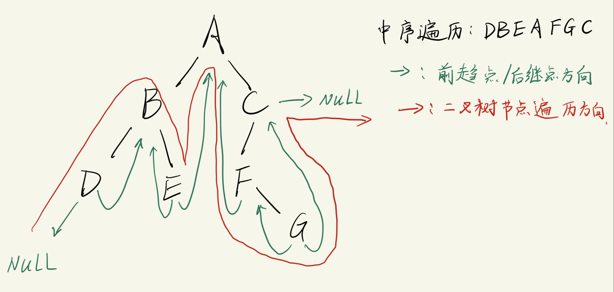

# 线索二叉树
它是从数据的存储方式为出发点细分出来的数据结构.

## 背景
```txt
常见的二叉树 -- 从根节点一直延伸到叶子节点的路径.
         A
       /    \
      B      C
     / \    / 
    D   E  F 
            \ 
             G

    构建二叉树时使用的存储结构:
        struct BinTree_node
        {
            int data;
            BinTree_node *left_tree;
            BinTree_node *right_tree;
        }

    在这种存储结构下, 二叉树无法快速找到某个节点的前驱和后继节点    ==> 不利于查找/遍历
        因为节点的结构体中只有 data, left_tree, right_tree 三个成员变量.
        这时候我们只知道 "去向", 无法根据当前节点知道 "来向"  
```
- 这种二叉树, 由于存储时每个节点都是在内存里离散存放的, 它**不连续**, 使用的是指针联系起来(类似链表), 因此也叫`非线性结构`.
  - 线性结构: 数组, 栈, 队列
    - 它们在内存中都是连续存放的, 因此索引的时候只需要利用`起始地址 + index`这种方式就能快速找到某个元素.

使用`线性结构进行存储`的二叉树, 叫做`线索二叉树`.

--- 

## 线索二叉树的构建方式
- 这种二叉树会根据不同的`遍历`方式, 有不同的存储结果:
  - 先序遍历: `ABDECFG`
  - 中序遍历: `DBEAFGC`
  - 后序遍历: `DEBGFCA`
- **确定排序结果(遍历方式)之后**, 直接将排序后的节点直接存入 **数组/栈/队列** 中, 之后就可以根据已知的排序方式或叫线索化方式快速找到前驱和后继节点了.
  - 例如: `DBEAFGC` 中, `B` 的前驱是 `D`, 后继是 `E`
    - 故: 哪怕是询问同一个节点, 使用不同的线索化方式(遍历方式), 将得到不一样的前趋点和后继点.

再次强调一下, 线索化二叉树的目的:
- 能在存储的数据中, 迅速找到当前节点的`前驱节点`和`后继节点`.

---

## 线索化方式的对比与选择

### 先序遍历的前趋点和后继点
```txt
         A
       /    \
      B      C
     / \    / 
    D   E  F 
            \ 
             G
    先序遍历的结果是: `ABDECFG`

对于前趋点(一共有 4种 情况):
    - 对于节点B来说:
        有父节点A, B是A的左子树, 因此B的前趋点是A
    - 对于节点G来说:
        有父节点F, 其左"兄弟"是空, G是右子树, 此时F是G的前趋点
    - 对于节点C来说:
        C节点是右子树, 其左"兄弟"是 B(不为空), 此时C的前趋点是 "左兄弟子树B" 进行先序遍历的最后一个节点    ==>  E
            也就是单独对B的子树进行先序遍历, 得到的遍历结果是 BDE, 故E是C的前趋点
    - 对于A来说:
        A是根节点, 没有父节点, 也没有左兄弟子树, 因此A的前趋点是空 ==> 无前趋点

对于后继点:
    - 对于B节点:
        有左子树, 则左子树节点就是它的后继点  ==> D
    - 对于F节点:
        无左子树, 后继点就是其右子树 ==> G
```
- 从上面分析可以知道, 采用先序遍历的线索化时, 寻找前趋点有**4种**情况, 寻找后继点有**2种**情况.

### 中序遍历的前趋点和后继点
```txt
         A
       /    \
      B      C
     / \    / 
    D   E  F 
            \ 
             G
    中序遍历的结果是: `DBEAFGC`

对于前趋点(一共有 2种 情况):
    - 对于A节点:
        中序遍历左子树后的最后一个节点就是它的前趋点 ==> E
            中序遍历左子树 B 的结果是: BDE, E是B的后继点 
            也可以简单理解为中序遍历后的 "左子树最右下" 的节点
    - 对于 D/E/G: 
        都无左子树, 稍后讨论(当前先看看哪种遍历方式更简单)

对于后继结点:
    - 对于A节点:
        其中序遍历右子树后, 访问的第一个节点就是它的后继点 ==> F
            A 的右子树是 C, C 的中序遍历结果是 FGC, 故F是C的后继点
            也可以简单理解为中序遍历后的 "右子树最左下" 的节点
    - 对于 C/E/G/D:
        都无右子树, 稍后分析(当前先看看哪种遍历方式更简单)
```
- 中序遍历的线索化方式, 寻找前趋点有**2种**情况, 寻找后继点有**2种**情况.


### 后序遍历的前趋点和后继点
```txt
         A
       /    \
      B      C
     / \    / 
    D   E  F 
            \ 
             G
    后序遍历的结果是: `DEBGFCA`

对于前趋点(一共有 2种 情况):
    - 有右子树, 如 A
        有右子树, 则右子树的根节点就是它的前趋点 ==> C
    - 无右子树: 如 D/E/C/G
        暂不详细讨论(当前先看看哪种遍历方式更简单)
    
    - 无右子树, 但有左子树, 如 C
        则左子树节点就是它的前趋点 ==> F

对于后继结点:
    - 对于C节点
        A是它的父节点, C是A的右子树, 则此时 A 是 C 的后继节点
            B, E节点也有相同特征.
    - 对于F节点
        C是F的父节点, F是C的左子树, 并且C的"右兄弟子树"为空, 则此时父节点C是它的后继节点 ==> C
    - 对于节点B:
        存在B的父节点(A点), 且C是B的"右兄弟子树"后序遍历后的第一个节点, 则此时B节点的后继点是 C
    - 如果是根节点A, 则没有后继节点
```


对比上面三种遍历的情况, `中序遍历`的前趋点和后继点的寻找方式最简单, 因此我们选择`中序遍历`的方式进行线索化. 


## 中序线索化二叉树
### 原理 -- 中序线索化二叉树的构建
```txt
         A
       /   \
      B     C
     / \   / 
    D   E F 
           \ 
            G
    中序遍历的结果是: DBEAFGC
```
线索化的方式确定之后, 剩下的工作就是寻找最合适的`线性结构`来存好这些数据.

分析过程:
```txt
- 前面提到过, 已经接触过并且最常见的线性存储方式是 "数组/栈/队列"
- 在完成线索化之后, 再把数据按照线性结构存储时, 如果直接使用 "栈/队列" 的方式来存储数据, 则必定需要频繁出入栈/队列, 这会消耗不少资源.
- 进一步观察这个二叉树, 不难发现几个特征:
    1. 每一个二叉树节点都有两个指针, 一个指向左子树, 一个指向右子树.
    2. 从根节点往下看, 如果整棵树有n个节点, 就一定会有 2n个指针域
    3. 从树的底部往根节点方向看, 这些指针域中真正被利用起来的只有 n-1 个, 故还有 n+1 个指针域没有被利用起来. 

    那么, 如果想要让存储数据的效率更高, 我们理所当然地会希望这 n+1 个指针域能被利用起来 (毕竟哪怕不存放数据, 这个指针域空间也已经被 new 出来了, 因为 new 的时候是按照整个结构体分配的空间).

    如果我们能直接使用者 n+1 个指针域, 就能避免频繁的出入栈/队列, 从而提高存储数据的效率.

- 一个很直观的想法当然是希望没有利用起来的 "l_tree/r_tree" 指针域直接指向当前节点的`前趋点/后继点`
    - 为了区分指针域存放的是 l_tree/r_tree 还是前趋点/后继点, 我们可以在结构体中添加一个成员变量, 用来标记当前指针域的状态.
        - lflag: 0 ==> 指向左子树
        - lflag: 1 ==> 指向前趋点
        - rflag: 0 ==> 指向右子树
        - rflag: 1 ==> 指向后继点
    
    此时, 二叉树节点的结构体变成:
    struct BinTree_node
    {
        int data;
        BinTree_node *left_tree;
        BinTree_node *right_tree;
        int lflag;      // 为0时, left_tree指向左子树, 为1时指向前趋点
        int rflag;      // 为0时, right_tree指向右子树, 为1时指向后继点
    };
```

为了使整个流程完整, 我们先重新回顾一下中序遍历(此时需要用上这里的新结构体).
```txt
二叉树必然涉及递归, 因此我们先总结一下中序遍历的规律, 可知其分成三个步骤:
1. 中序线索化左子树
2. 处理根节点
3. 中序线索化右子树
```
中序线索化图示:

- 此时需要两个指针, 一个指针`p`指向当前节点, 一个指针`pre`指向当前节点的**前趋点**.
  - 当前遍历的节点指针`p`在代码实现中就是 tree指针
  - 如果**当前节点左子树不存在**时, 需要把它的`ltree`指针指向`pre`, 并且把`lflag`置为1
  - 如果前趋点的**右子树指针不存在**时, 需要把前趋点的`rtree`指针指向`p`, 并且把`rflag`置为1

- 故:
  - 中序线索化二叉树时, `l_tree`为空的话, 利用`当前节点`来控制 & 填充
  - 中序线索化二叉树时, `r_tree`为空的话, 利用`前趋节点`来控制 & 填充

### 代码实现 -- 中序线索化二叉树
函数实现部分:
```c
#include <stdio.h>
#include <stdlib.h>

// 结构体 -- 二叉树节点
struct BinTree_node
{
    unsigned char elem;
    struct BinTree_node *ltree, *rtree;

    // 线索二叉树新增两个标志位
    int lflag, rflag;
};

struct BinTree_node * pre = NULL;         // 中序线索化二叉树需要使用的指针, 指向当前遍历节点的前趋点

// 函数声明
struct BinTree_node * create_bintree();         // 创建二叉树(问询法)
struct BinTree_node * Create_Bintree_pre();     // 创建二叉树(补空法-前序遍历)
void pre_order(struct BinTree_node * tree);     // 前序遍历
void in_order(struct BinTree_node * tree);      // 中序遍历
void pos_order(struct BinTree_node * tree);     // 后序遍历
void In_order_thread(struct BinTree_node *tree);       // 完成中序线索化的递归过程
void Create_InOrder_Thread(struct BinTree_node * T);   // 完成整个中序线索化

struct BinTree_node * create_bintree(void)
{
    unsigned char flag;
    struct BinTree_node * tree;
    tree = (struct BinTree_node *)malloc(sizeof(struct BinTree_node));

    // 当前节点
    printf("Please enter the element:\n");
    while((tree->elem = getchar()) == '\n');        // 当读取的字符不是回车时, 就会跳出while, 这样做可以防止读到缓冲区里可能在上一次输入残存的回车

    // 左子树
    printf("Do you want to create l_tree for %c, (Y/N)? \n", tree->elem);
    while((flag = getchar()) == '\n');              // 防止读到回车
    if(flag == 'Y'){
        tree->ltree = create_bintree();
    }
    else{
        tree->ltree = NULL;
    }

    // 右子树
    printf("Do you want to r_tree for %c, (Y/N)? \n", tree->elem);
    while((flag = getchar()) == '\n');              // 防止读到回车
    if(flag == 'Y'){
        tree->rtree = create_bintree();
    }
    else{
        tree->rtree = NULL;
    }
    
    return tree;
}

struct BinTree_node * Create_Bintree_pre()
{
    char ch;
    struct BinTree_node * tree;
    scanf("%c", &ch);
    if(ch == '#'){          // 递归停止条件
        tree = NULL;
    }
    else{                   // 递归过程
        tree = (struct BinTree_node *)malloc(sizeof(struct BinTree_node));
        tree->elem = ch;
        tree->ltree = Create_Bintree_pre();     // 递归创建左子树
        tree->rtree = Create_Bintree_pre();     // 递归创建右子树
    }
    return  tree;
}

void pre_order(struct BinTree_node * tree)
{
    if(tree != NULL){   // 首先确保根节点是有效的二叉树结构
        printf("%c ", tree->elem);  // 中
        pre_order(tree->ltree);     // 左
        pre_order(tree->rtree);     // 右
    }
}

void in_order(struct BinTree_node * tree)
{
    if(tree != NULL){
        in_order(tree->ltree);      // 左
        printf("%c ", tree->elem);  // 中
        in_order(tree->rtree);      // 右
    }
}

void pos_order(struct BinTree_node * tree)
{
    if (tree != NULL){
        pos_order(tree->ltree);
        pos_order(tree->rtree);
        printf("%c ", tree->elem);
    }
}

void In_order_thread(struct BinTree_node *tree)
{
    if(tree != NULL){
        // 1. 中序线索化左子树 (do in-order-thread to ltree)
        In_order_thread(tree->ltree);

        // 2. 处理根节点(do with current node)
        if(tree->ltree == NULL){    // 当前节点的左子树不存在时
            tree->lflag = 1;        // 此时左子树指针将指向前趋点
            // 让当前节点的左子树指向前趋点
            tree->ltree = pre;      // pre是全局变量
        }
        else{
            tree->lflag = 0;        // 左子树存在时
        }

        if(pre != NULL){     
            if(pre->rtree == NULL){ // 前趋点的右子树为空时
                pre->rflag = 1;     // 此时右子树将指向当前节点
                // 让前趋点的有指针域指向当前节点
                pre->rtree = tree;
            }
            else{
                pre->rflag = 0;     // 这种情况发生在中序遍历的起点(树的最左下节点)
            }
        }
        pre = tree;                 // 更新前趋点位置    
        /*
            注: 当前遍历的节点的更新在递归时完成(因为传参的时候传的是 tree->rtree, tree->ltree)
        */

        // 3. 中序线索化右子树 (do in-order-thread to rtree)
        In_order_thread(tree->rtree);
    }

}

void Create_InOrder_Thread(struct BinTree_node * T)
{
    if (T != NULL){
        In_order_thread(T);
        pre->rtree = NULL;          // 当走完中序线索化之后, pre指向的节点会停在中序遍历的最后一个节点, 此时这个节点的右子树应设置为NULL
        pre->rflag = 1;
    }
}
```


main函数部分
```c
int main(void)
{
    // struct BinTree_node * myTree =  create_bintree();

    printf("Please input a pre-order binary tree(with fill blank #)\n");
    struct BinTree_node * myTree =  Create_Bintree_pre();

    printf("-------------\n");
    printf("pre-order: ");
    pre_order(myTree);
    printf("\n");

    printf("-------------\n");
    printf("in-order thread: ");
    Create_InOrder_Thread(myTree);
    printf("\n");

    return 0;
}
```

ABD##E##CF#G###

 