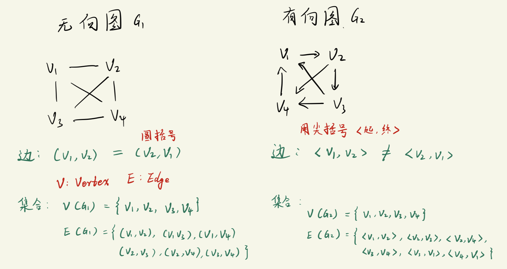

# 图的基本概念
对于基本数据结构而言, 链表/队列/栈是`一对一`的关系(一个节点连着另一个节点), 二叉树则是`一对多`的关系(一个节点连接2个节点), 图结构则是`多对多`的关系.

图结构主要由两部分组成:
1. 顶点(Vertex)
   - **不可**为空
2. 边(Edge)
   - **可以**为空

图大致可分为两种:
1. 无向图
2. 有向图



---

图结构中的一些基本概念:
```txt
简单图: 
    1) 不允许出现 "顶点i指向顶点i" 的边(自己指向自己), 这种情况称为"自环".
        即: 
            对于无向图, 不允许出现: (vi, vi)
            对于有向图, 不允许出现: <vi, vi>

    2) 同一条边不允许出现两次或两次以上. (这种称为 "多重图")

-------------------------------------------------------
完全图:
    图中任意两个顶点都有一条边连接.
        对于"有向完全图": 有n个顶点就有 n*(n-1) 条边.
        对于"无向完全图": 有n个顶点就有 n*(n-1)/2 条边.

-------------------------------------------------------
网:
    带"权值"的图, 就称为"网".

-------------------------------------------------------
邻接(描述顶点之间的关系):
    顶点与顶点之间如果存在 "直接相连的边", 则这两个顶点是 "相互邻接的顶点".
        存在 (vi, vj) 或 <vi, vj>, 则vi与vj是邻接点

-------------------------------------------------------
关联(描述边和顶点之间的关系):
    如果两个顶点vi, vj之间有边直接相连, 则称 "这条边关联vi和vj".

-------------------------------------------------------
度(顶点的度):
    与图中某个顶点vi相"关联"的 边的数量, 就称为顶点 vi 的度.

    握手定理:
        所有顶点的度数之和 = 边的数量的两倍

    有向图中还细分出:
        入度: 以 vi 为 "终点" 的边的数目(箭头指向 vi)
        出度: 以 vi 为 "起点" 的边的数目

        在有向图中: 所有顶点的入度 = 所有顶点的出度

-------------------------------------------------------
路径:
    接续的边的 "顶点构成的序列".
        如: s -> v1 -> v2 -> t 这个路径, 表示起来是 "s, v1, v2, t", 这是由顶点构成的序列
    路径的长度:
        这条路径中边的数目

回环(回路)路径:
    第一个顶点与最后一个顶点相同的路径, 就是回环路径.
        如 "s, v1, v2, t, v3, v4, s".

简单路径:
    整个路径中, 只有起点和终点是相同顶点的路径
        即: 路径中没有其它相同的顶点

-------------------------------------------------------
子图:
    从图结构中取出若干顶点和边, 取出来的那部分构成的图就是原图的子图.


生成子图:
    包含原图的 "所有顶点" 但是 "只取出若干条边" 所构成的图就是生成子图.

-------------------------------------------------------
连通图(针对无向图):
    连通: vi 和 vj 有路径进行连接, 则称 vi 和 vj 是连通的.
        注意: 这条路径可能不止一条边.
    连通图: 图中 "任意两点" 都有路径使之连通, 则这个图是连通图.

连通分量:
    无向图的所有 "最大连通子图" 都称为这个无向图的连通分量.
        最大连通子图: 一个无向图中只要再增加一个顶点, 就无法构成连通图时, 这个子图就是最大连通子图(哪怕只有一个孤立的顶点, 它也是一个最大连通子图)

            v1  --  v2              {v1, v2, v3, v4} 构成了一个最大连通子图
            |   v5  |       ==>    
            v4  --  v3              {v5} 也构成了一个最大连通子图

    连通图的连通分量就是 它本身.
    非连通图的连通分量一定 大于等于2个.

强连通图(针对有向图)
    有向图中 "任意两个顶点" vi, vj 都有路径连接
        注意: 路径的边可能不止一条.

强连通分量:
    有向图的所有 "最大强连通子图" 都是强连通分量.

    最大强连通子图: 与最大连通子图概念类似, 区别仅仅是有向图罢了.
```


