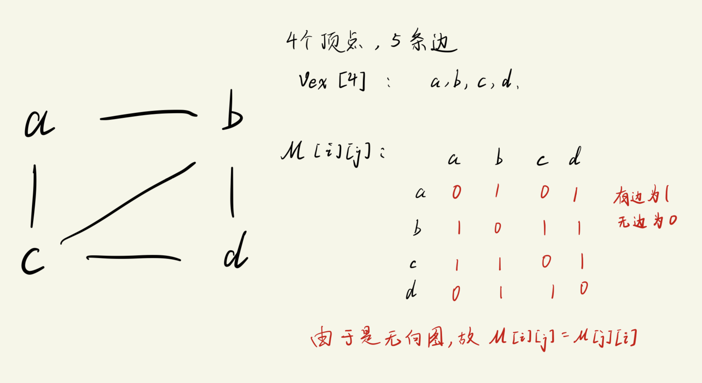

# 图 -- 使用邻接矩阵的表示方法

图的存储结构
1. 顺序存储
   - 邻接矩阵
2. 链式存储
   - 邻接表
   - 十字链表
   - 邻接多重表


## 邻接矩阵 (Adjacency Matrix)
邻接矩阵表示的是`顶点之间的关系`. 需要使用`两个数组`进行表示.
```txt
一维数组: 存放顶点信息
二维数组: 存放顶点之间的`邻接`关系      (重点)
```

### 无向图的实现方式


对于邻接矩阵部分
```txt
1. 有边直接相连时值为1, 无边直接相连值为0
2. 由于是无向图, 故:  M[i][j] = M[j][i]
3. 对称矩阵 -- 沿对角线对称
4. 对于无向图来说, 第i行(或第i列)中非零元素的个数 = 第i个顶点的`度`
```  


