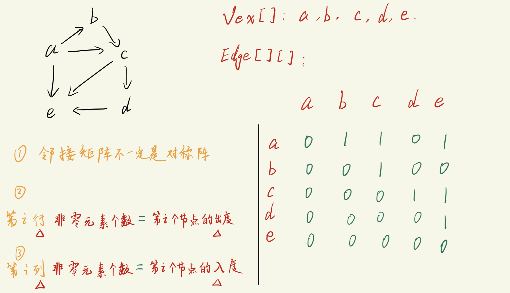
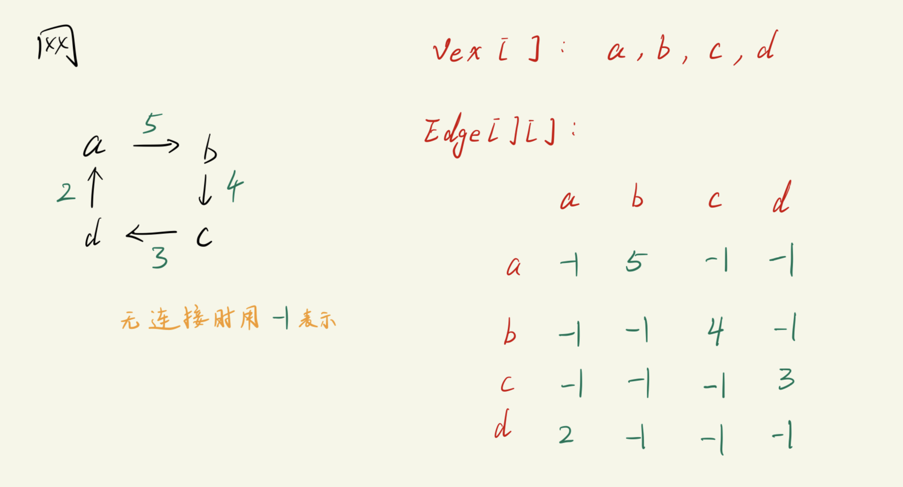

# 图 -- 使用邻接矩阵的表示方法

图的存储结构
1. 顺序存储
   - 邻接矩阵
2. 链式存储
   - 邻接表
   - 十字链表
   - 邻接多重表


## 邻接矩阵 (Adjacency Matrix)
邻接矩阵表示的是`顶点之间的关系`. 需要使用`两个数组`进行表示.
```txt
一维数组: 存放顶点信息
二维数组: 存放顶点之间的`邻接`关系      (重点)
```

### 无向图的邻接矩阵实现


对于邻接矩阵部分
```txt
1. 有边直接相连时值为1, 无边直接相连值为0
2. 由于是无向图, 故:  M[i][j] = M[j][i]
3. 对称矩阵 -- 沿对角线对称
4. 对于无向图来说, 第i行(或第i列)中非零元素的个数 = 第i个顶点的`度`
```  

代码实现 -- `undirected_graph.c`
```c
#include <stdio.h>
#include <stdlib.h>

#define MAX 100

struct AMG_Graph      // Adjacency Matrix Graph
{
    int vex_num, edge_num;

    char Vex[MAX];
    int Edge[MAX][MAX];
};

struct AMG_Graph * create_AMG(void);
void Show_AMG(struct AMG_Graph * graph);
int search_vex(struct AMG_Graph * graph, char ch);

int main(void)
{
    struct AMG_Graph * ud;      // 无向图指针
    ud = create_AMG();
    Show_AMG(ud);

    return 0;
}

struct AMG_Graph * create_AMG(void)
{
    struct AMG_Graph * graph = NULL;
    int i = 0, j = 0;
    char u,v;

    graph = (struct AMG_Graph *)malloc(sizeof(struct AMG_Graph));

    printf("Please enter the number of vertex: ");
    scanf("%d", &graph->vex_num);

    printf("Please enter the number of edges: ");
    scanf("%d", &graph->edge_num);

    while(getchar() != '\n');           // 清掉回车
    printf("Please enter the vertex:\n");
    for(i = 0; i < graph->vex_num; i++){
        graph->Vex[i] = getchar();
        while(getchar() != '\n');       // 清掉回车
    }

    // 初始化二维数组, 防止垃圾信息影响结果
    for(i = 0; i < graph->vex_num; i++){
        for(j = 0; j < graph->vex_num; j++){
            graph->Edge[i][j] = 0;
        }
    }

    while(graph->edge_num--){           // 图有几条边, 就录入几次
        printf("Please enter the vex that connect each other by edge:\n");
        u = getchar();
        while(getchar() != '\n');
        v = getchar();
        while(getchar() != '\n');

        // 确认输入字符的节点编号
        i = search_vex(graph, u);
        j = search_vex(graph, v); 

        if(i != -1 && j != -1){
            graph->Edge[i][j] = graph->Edge[j][i] = 1;
        }
        else{
            printf("You've enter a wrong vex, please enter again.");
            graph->edge_num++;      // 重置一下当前减掉的次数
        }
    }

    return graph;
}

void Show_AMG(struct AMG_Graph * graph)
{
    int i,j;
    printf("Show the vex: ");
    for(i = 0; i < graph->vex_num; i++){
        printf("%c", graph->Vex[i]);
    }
    printf("\n");

    printf("Show the Adjacency matrices:\n");
    for(i = 0; i < graph->vex_num; i++){
        for(j = 0; j < graph->vex_num; j++){
            printf("%d\t", graph->Edge[i][j]);
        }
        printf("\n");
    }
    printf("\n");
}

int search_vex(struct AMG_Graph * graph, char ch)
{
    int i;
    for(i = 0; i < graph->vex_num; i++){
        if (ch == graph->Vex[i]){
            return i;
        }
    }
    return -1;
}
```

### 有向图的邻接矩阵实现

对于邻接矩阵部分
```txt
1. 有边直接相连时值为1, 无边直接相连值为0
2. 由于是有向图, 邻接矩阵不一定是对称阵
3. 对于有向图来说:
    第i行`非零元素的个数` = 第i个节点的`出度`
    第j列`非零元素的个数` = 第j个节点的`入度`
```  

代码实现 -- `directed_graph.c`
```c
#include <stdio.h>
#include <stdlib.h>

#define MAX 100

struct AMG_Graph      // Adjacency Matrix Graph
{
    int vex_num, edge_num;

    char Vex[MAX];
    int Edge[MAX][MAX];
};

struct AMG_Graph * create_AMG(void);
void Show_AMG(struct AMG_Graph * graph);
int search_vex(struct AMG_Graph * graph, char ch);

int main(void)
{
    struct AMG_Graph * ud;      // 无向图指针
    ud = create_AMG();
    Show_AMG(ud);

    return 0;
}

struct AMG_Graph * create_AMG(void)
{
    struct AMG_Graph * graph = NULL;
    int i = 0, j = 0;
    char u,v;

    graph = (struct AMG_Graph *)malloc(sizeof(struct AMG_Graph));

    printf("Please enter the number of vertex: ");
    scanf("%d", &graph->vex_num);

    printf("Please enter the number of edges: ");
    scanf("%d", &graph->edge_num);

    while(getchar() != '\n');           // 清掉回车
    printf("Please enter the vertex:\n");
    for(i = 0; i < graph->vex_num; i++){
        graph->Vex[i] = getchar();
        while(getchar() != '\n');       // 清掉回车
    }

    // 初始化二维数组, 防止垃圾信息影响结果
    for(i = 0; i < graph->vex_num; i++){
        for(j = 0; j < graph->vex_num; j++){
            graph->Edge[i][j] = 0;
        }
    }

    while(graph->edge_num--){           // 图有几条边, 就录入几次
        printf("Please enter the vex that connect each other by edge:\n");
        u = getchar();
        while(getchar() != '\n');
        v = getchar();
        while(getchar() != '\n');

        // 确认输入字符的节点编号
        i = search_vex(graph, u);
        j = search_vex(graph, v); 

        if(i != -1 && j != -1){
            graph->Edge[i][j] = 1;       // 无向图和有向图邻接矩阵代码的唯一区别
        }
        else{
            printf("You've enter a wrong vex, please enter again.");
            graph->edge_num++;      // 重置一下当前减掉的次数
        }
    }

    return graph;
}

void Show_AMG(struct AMG_Graph * graph)
{
    int i,j;
    printf("Show the vex: ");
    for(i = 0; i < graph->vex_num; i++){
        printf("%c", graph->Vex[i]);
    }
    printf("\n");

    printf("Show the Adjacency matrices:\n");
    for(i = 0; i < graph->vex_num; i++){
        for(j = 0; j < graph->vex_num; j++){
            printf("%d\t", graph->Edge[i][j]);
        }
        printf("\n");
    }
    printf("\n");
}

int search_vex(struct AMG_Graph * graph, char ch)
{
    int i;
    for(i = 0; i < graph->vex_num; i++){
        if (ch == graph->Vex[i]){
            return i;
        }
    }
    return -1;
}
```

### 网的邻接矩阵实现


代码实现就不写了, 和有向图很像, 不同的就是边的权重需要手动输入.

---
# 邻接矩阵的优劣
优点:
```txt
- 可以通过邻接矩阵迅速判断两个顶点是否有边.
- 方便计算各个顶点的度.
```

缺点:
```txt
1. 不方便新/删节点.
    改变图 -> 改变邻接矩阵
    增/删  -> 邻接矩阵size发生变化, 基本得重建

2. 不方便访问所有邻接节点.
```
