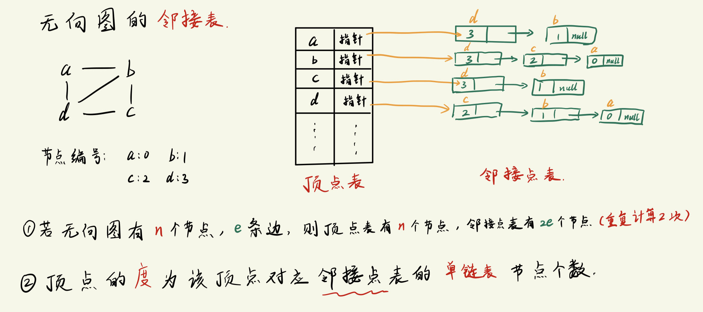
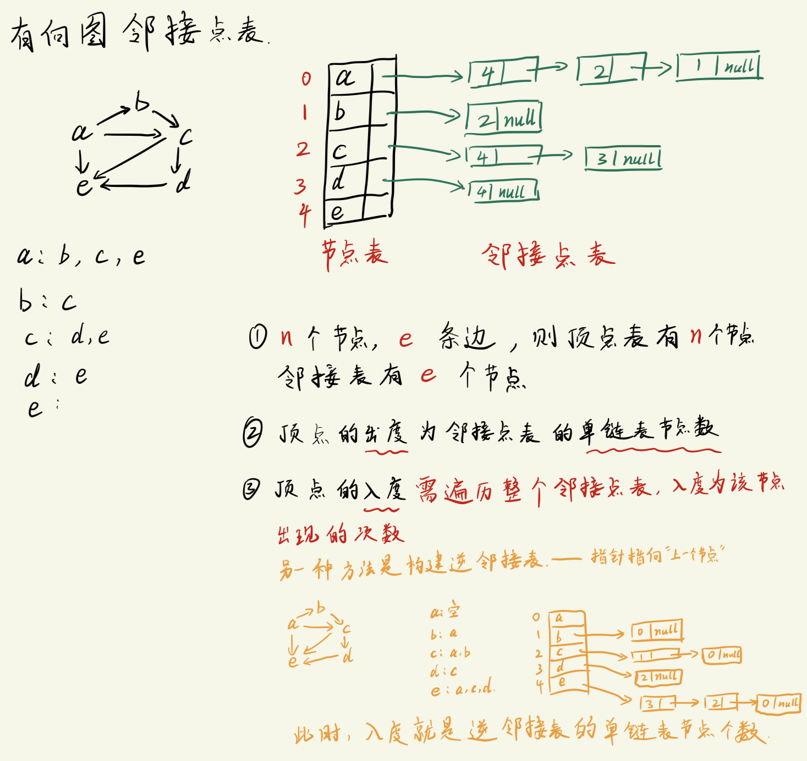

# 图的存储结构 -- 邻接表
邻接表是一种`链式存储`结构.

## 无向图的邻接表

```txt
邻接表分成 2个部分 存储(邻接矩阵也是):
- 顶点表
    存放顶点信息 + 第一个邻接点的指针
- 邻接点表
    存放邻接点的`存储下标` + 指向下一个邻接点的指针
        邻接点中的单链表节点顺序是`节点编号的逆序`
            如果节点为 0,1,2,3,... 的顺序; 则邻接点表的存储顺序是邻接着的节点按照从大到小的编号排序

- 若无向图有n个节点, e条边, 则顶点表共有n个节点, 邻接点表共有 2e 个节点

- 顶点表`某个顶点的度`为该顶点对应邻接点表的`单链表节点`个数.
```

## 有向图的邻接表


```txt
与无向图的情况相同, 分为定点表和邻接表, 表的构造逻辑也相同.

此时:
    - 如果有n个节点, e条边, 则顶点表一共有n个节点, 邻接表一共有 e个节点
    - 顶点的`出度`为邻接表对应的单链表节点个数
    - 顶点的`入度`则比较麻烦, 需要遍历整个邻接表, 并统计每个节点出现的次数, 此时, 某个节点 vi 的入度就是统计出来的 vi节点出现的次数.
```

- 为了方便获得**有向图中顶点**的`入度`信息, 我们还可以构建一个`逆邻接表`
  - 逆邻接表存放`前一个邻接点的下标` + `指向前一个邻接点的指针`, 链表中存储的顺序按照`邻接点编号的逆序`构建.
    - 即逆邻接表的构造方式与邻接表仅有一个不同之处: 邻接表的指针指向`图中连接方向的终点`, 而逆邻接表的指针指向`图中连接方向的起点`.
  - 在逆邻接表中, 某个节点 vi 的入度等于节点 vi 对应在逆邻接表里单链表的节点数量.


