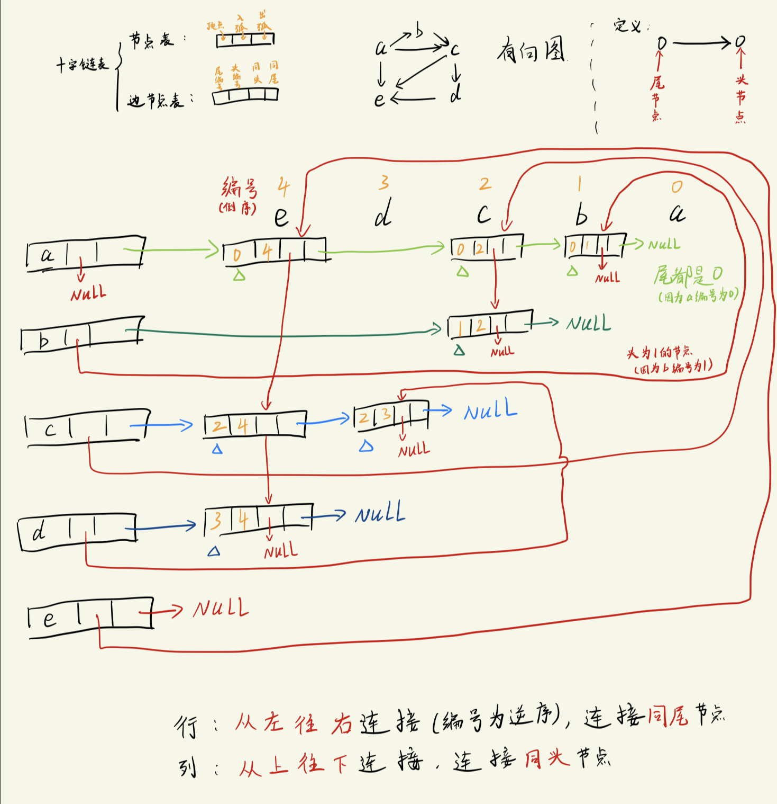

# 十字链表与邻接多重表
实际中用的并不是很频繁(十字链表仅用于`有向图`和`有向网`, 邻接多重表多用于`无向图`), 只介绍一些简单原理, 暂无代码实现.

## 十字链表(侧重于顶点)
多用于存储`有向图/有向网`.
- 在[邻接表笔记](/5图/Lec_34/邻接表.md#有向图的邻接表-与-逆邻接表)里分析过对于有向图的`出度和入度`怎么求
  - 在邻接点表中, `某个节点vi的出度 = vi在邻接点表中的节点个数`, 但是入度就无法简单求得, 而是需要**遍历整个邻接点表**, 然后统计节点 vi 出现的总次数, 这个总次数才是 vi 的入度.
  - 对于`逆邻接表`, 也是相似的情况, 入度变得很容易求(vi在逆邻接点表中的节点个数); 而出度则需要遍历整个逆邻接点表, 同样也是需要统计出现的次数.
  - 十字链表在这里就是为了简化有向图的出度/入度的计算.


十字链表的结构:
```txt
十字链表整体分成两个部分:
节点表 + 边节点表
-------------------------------------------------
节点表:
顶点(data) + 入弧指针(firstin) + 出弧指针(firstout)
-------------------------------------------------
边节点表:
尾编号(tailvex) + 头编号(headvex) + 同头指针(hlink) + 同尾指针(tlink) + 顶点相关信息(如有向网中的权重)
```
- 十字链表实质上就是为`每个顶点建立两个链表`，分别存储**以该顶点为弧头**的所有顶点和**以该顶点为弧尾**的所有顶点。

节点表:

边节点表:


十字链表构建图示(简单起见, 不画顶点信息部分):

- 图中左侧 abcde 为节点表 (3个格子)
- 图中右侧为边节点表 (4个格子)
  - 行箭头 与 列箭头 构成十字形, 故称十字链表

从图中可总结出:
```txt
出弧所指向链表的节点个数对应该节点的`出度`:
    横向相连的链表节点个数就是对应最左侧节点的`出度`

入弧所指向链表的节点个数对应节点的`入度`:
    纵向相连的链表节点个数就是对应最左侧节点的`入度`
```

注:
1. 上面的各个部分的命名方式在不同书籍叫法不一致
2. 在构建链表的时候, 这里使用了`逆序`的方式, 有些书籍使用的是正序, 但是原理/思想是相同的, 不同的仅在于代码实现上.


---

## 邻接多重表(侧重于连接边)
用于`无向图`中.


邻接多重表的组成:
```txt
顶点表 + 邻接点表
---------------------------------------
顶点表:
顶点 + 指向第一条连接边的指针
---------------------------------------
邻接点表
顶点i + 指向包含顶点i的边的指针  + 顶点j + 指向包含顶点j的边的指
```


对比邻接矩阵:
1. 邻接矩阵虽然容易看出连接边, 并且计算出度/入度也简单, 但它不便于新增节点
2. 邻接表是针对顶点进行优化的结构, 它方便增删节点, 但是它不便于查看两个顶点之间是否有边, 入度和出度也不容易计算.


注:
- 这里使用的术语并不统一, 可能与其他书本有出入, 这里仅关注原理/思想.

