# 图的遍历
图的遍历方式主要分为两种: `深度优先`和`广度优先`.

---

## 广度优先 (Breadth First Search, BFS)
访问逻辑:
```txt
起点 -> 找所有邻接点(直接相连的点)
邻接点 -> 继续找与之直接相连的邻接点
```


广度优先的核心思想:
```txt
先被访问的节点, 其`邻接点`也先被访问.
```


### 邻接矩阵的广度优先遍历
遍历过程图示:

- 在代码中, 入队列的是`节点编号`.

邻接矩阵广度优先 -- 实现步骤:
```txt
1. 创建数组 visited, 用于表示顶点是否被访问过, 并将数组元素全部置零.
    使用时, 若节点被访问过, 则 visited 对应位置为1, 未访问过则为0
2. 创建空队列, 队列中存放的是`顶点编号`
3. 从图的起点(编号为0的点)出发, 标记该点已访问过, 并将该点入队列
4. 若队列不为空, 则继续访问; 否则遍历直接结束.
5. 顶点出队列后, 依次访问`该顶点未被访问过的邻接点`. 标记这些邻接点为已访问, 并将对应编号入队列
```

#### 代码实现 -- 有向图邻接矩阵的BFS
核心代码:
```c
void BFS_AMG(struct AMG_Graph * graph)
{
    int visited[MAX] = {0};             // 辅助数组, 标记当前节点是否被访问过: 0未访问, 1已访问
    int u;                              // 出队列的节点编号
    int i;                              // 控制循环的变量i
    int j;

    for(j = 0; j < graph->vex_num; j++){
        if(visited[j] == 0){
            printf("%c ", graph->Vex[j]);       // 图的起始节点
            visited[j] = 1;                     // 标记起点已访问
            enqueue(j);                         // 将起点入队列

            while(!isEmpty()){
                u = dequeue();                          // 将队列第一个元素出队
                for(i = 0; i < graph->vex_num; i++){    // 遍历邻接矩阵中的第u行(其实等价于查询一次所有顶点), 找到该元素的"未被访问的邻接点", 并将他们入队
                    if((graph->Edge[u][i] == 1) && (visited[i] == 0)){  // i是邻接点, 并且i没有被访问过时
                        visited[i] = 1;                 // 标记为已访问
                        enqueue(i);                     // 将该邻接点入队列
                        printf("%c ", graph->Vex[i]);   // 输出当前节点
                    }
                }
            }
        }
    }
    printf("\n");
}
```
- 为了兼容非连通图, 这里粗暴地使用了一个for循环, 遍历了每一个顶点, 并对顶点是否已经遍历过进行了判断.

完整代码:
头文件`queue.h`
```c
#ifndef __GRAPH_QUEUE_H__
#define __GRAPH_QUEUE_H__

#include <stdio.h>
#define SIZE 512
void enqueue(int n);
int dequeue(void);
int isEmpty();
int isFull();

extern int queue[SIZE];     // 如果没有extern, 在 queue.c 中会找不到这个全局变量

#endif //! __GRAPH_QUEUE_H__
```


源文件`queue.c`
```c
#include <stdio.h>
#include "queue.h"

int queue[SIZE];

int head = 0, tail = 0;     // 空队列头尾指针相同

void enqueue(int n)
{
    queue[tail] = n;
    tail = (tail + 1) % SIZE;
}

int dequeue(void)
{
    int n;
    n = queue[head];
    head = (head + 1) % SIZE;
    return n;
}

int isEmpty()
{
    return head == tail;
}

int isFull()
{
    return (tail+1) % SIZE == head;
}
```


测试文件`directed_graph.c`
```c
#include <stdio.h>
#include <stdlib.h>
#include "queue.h"

#define MAX 100

struct AMG_Graph      // Adjacency Matrix Graph
{
    int vex_num, edge_num;

    char Vex[MAX];
    int Edge[MAX][MAX];
};

struct AMG_Graph * create_AMG(void);
void Show_AMG(struct AMG_Graph * graph);
int search_vex(struct AMG_Graph * graph, char ch);
void BFS_AMG(struct AMG_Graph * graph);             // 广度优先遍历

int main(void)
{
    struct AMG_Graph * d_graph;      // 无向图指针
    d_graph = create_AMG();
    Show_AMG(d_graph);

    printf("Traverse the graph through BFS:\n");
    BFS_AMG(d_graph);

    return 0;
}

struct AMG_Graph * create_AMG(void)
{
    struct AMG_Graph * graph = NULL;
    int i = 0, j = 0;
    char u,v;

    graph = (struct AMG_Graph *)malloc(sizeof(struct AMG_Graph));

    printf("Please enter the number of vertex: ");
    scanf("%d", &graph->vex_num);

    printf("Please enter the number of edges: ");
    scanf("%d", &graph->edge_num);

    while(getchar() != '\n');           // 清掉回车
    printf("Please enter the vertex:\n");
    for(i = 0; i < graph->vex_num; i++){
        graph->Vex[i] = getchar();
        while(getchar() != '\n');       // 清掉回车
    }

    // 初始化二维数组, 防止垃圾信息影响结果
    for(i = 0; i < graph->vex_num; i++){
        for(j = 0; j < graph->vex_num; j++){
            graph->Edge[i][j] = 0;
        }
    }

    while(graph->edge_num--){           // 图有几条边, 就录入几次
        printf("Please enter the vex that connect each other by edge:\n");
        u = getchar();
        while(getchar() != '\n');
        v = getchar();
        while(getchar() != '\n');

        // 确认输入字符的节点编号
        i = search_vex(graph, u);
        j = search_vex(graph, v); 

        if(i != -1 && j != -1){
            graph->Edge[i][j] = 1;       // 无向图和有向图邻接矩阵代码的唯一区别
        }
        else{
            printf("You've enter a wrong vex, please enter again.");
            graph->edge_num++;      // 重置一下当前减掉的次数
        }
    }

    return graph;
}

void Show_AMG(struct AMG_Graph * graph)
{
    int i,j;
    printf("Show the vex: ");
    for(i = 0; i < graph->vex_num; i++){
        printf("%c", graph->Vex[i]);
    }
    printf("\n");

    printf("Show the Adjacency matrices:\n");
    for(i = 0; i < graph->vex_num; i++){
        for(j = 0; j < graph->vex_num; j++){
            printf("%d\t", graph->Edge[i][j]);
        }
        printf("\n");
    }
    printf("\n");
}

int search_vex(struct AMG_Graph * graph, char ch)
{
    int i;
    for(i = 0; i < graph->vex_num; i++){
        if (ch == graph->Vex[i]){
            return i;
        }
    }
    return -1;
}

void BFS_AMG(struct AMG_Graph * graph)
{
    int visited[MAX] = {0};             // 辅助数组, 标记当前节点是否被访问过: 0未访问, 1已访问
    int u;                              // 出队列的节点编号
    int i;                              // 控制循环的变量i

    printf("%c ", graph->Vex[0]);       // 图的起始节点
    visited[0] = 1;                     // 标记起点已访问

    enqueue(0);                         // 将起点入队列

    while(!isEmpty()){
        u = dequeue();                          // 将队列第一个元素出队
        for(i = 0; i < graph->vex_num; i++){    // 遍历邻接矩阵中的第u行(其实等价于查询一次所有顶点), 找到该元素的"未被访问的邻接点", 并将他们入队
            if((graph->Edge[u][i] == 1) && (visited[i] == 0)){  // i是邻接点, 并且i没有被访问过时
                visited[i] = 1;                 // 标记为已访问
                enqueue(i);                     // 将该邻接点入队列
                printf("%c ", graph->Vex[i]);   // 输出当前节点
            }
        }
    }

    printf("\n");
}
```

运行结果:
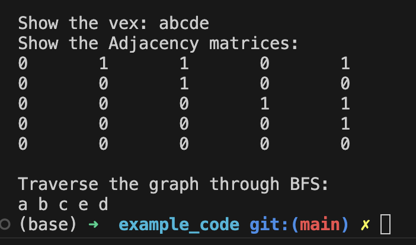

有向非连通图:
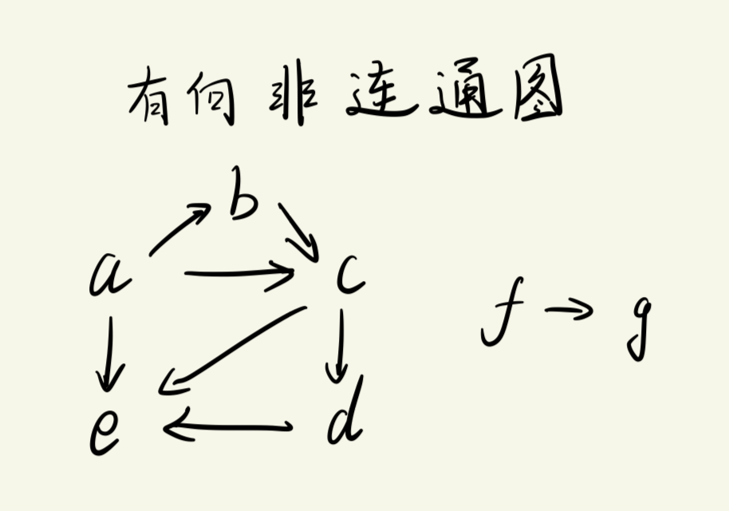

非连通图的运行结果:
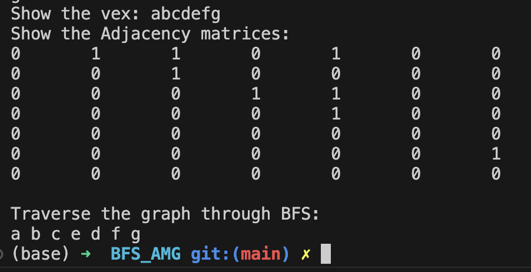

----

#### 代码实现 -- 无向图BFS
无向图与有向图的BFS实现的区别:
- 区别在于`邻接矩阵`的构建, BFS的操作逻辑/代码实现都没有区别.
  - 无向图的邻接矩阵是`对称的`: `vex[i][j] = vex[j][i] = 1`

故只需要将构建邻接矩阵的赋值语句修改一下即可:
```c
struct AMG_Graph * create_AMG(void)
{
    struct AMG_Graph * graph = NULL;
    int i = 0, j = 0;
    char u,v;

    graph = (struct AMG_Graph *)malloc(sizeof(struct AMG_Graph));

    printf("Please enter the number of vertex: ");
    scanf("%d", &graph->vex_num);

    printf("Please enter the number of edges: ");
    scanf("%d", &graph->edge_num);

    while(getchar() != '\n');           // 清掉回车
    printf("Please enter the vertex:\n");
    for(i = 0; i < graph->vex_num; i++){
        graph->Vex[i] = getchar();
        while(getchar() != '\n');       // 清掉回车
    }

    // 初始化二维数组, 防止垃圾信息影响结果
    for(i = 0; i < graph->vex_num; i++){
        for(j = 0; j < graph->vex_num; j++){
            graph->Edge[i][j] = 0;
        }
    }

    while(graph->edge_num--){           // 图有几条边, 就录入几次
        printf("Please enter the vex that connect each other by edge:\n");
        u = getchar();
        while(getchar() != '\n');
        v = getchar();
        while(getchar() != '\n');

        // 确认输入字符的节点编号
        i = search_vex(graph, u);
        j = search_vex(graph, v); 

        if(i != -1 && j != -1){
            graph->Edge[i][j] = graph->Edge[j][i] = 1;       // 无向图和有向图邻接矩阵代码的唯一区别
        }
        else{
            printf("You've enter a wrong vex, please enter again.");
            graph->edge_num++;      // 重置一下当前减掉的次数
        }
    }

    return graph;
}
```

其余函数与有向图代码实现一样.
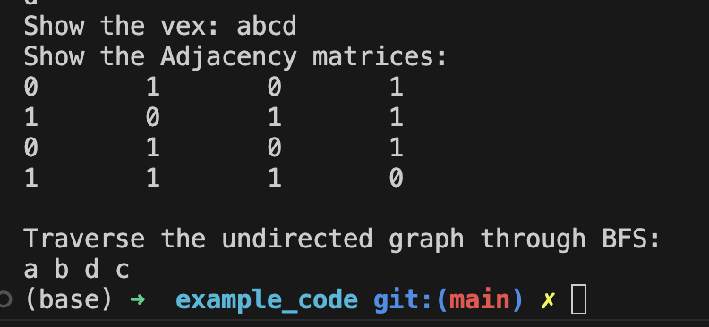


测试用的非连通图:
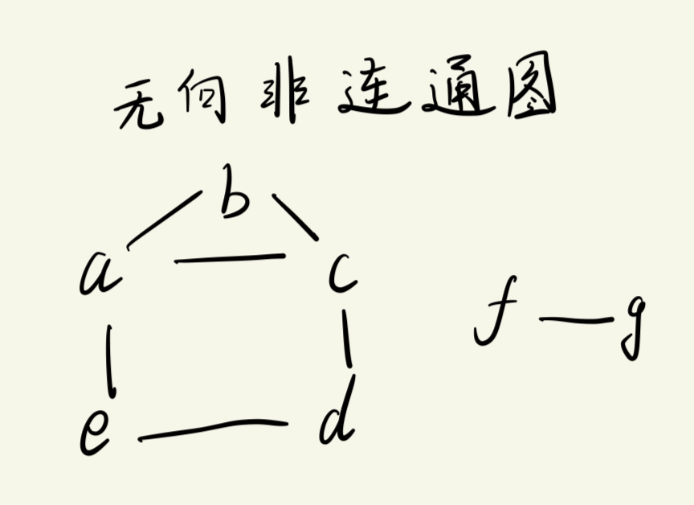

对于非连通图的遍历结果
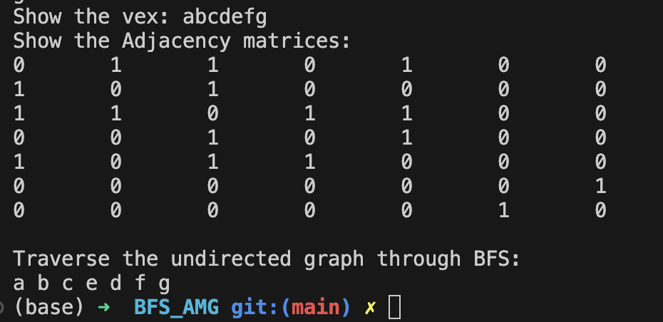

---

### 邻接表的广度优先遍历
这里用有向图的邻接表作为示例.

邻接表广度优先 -- 实现步骤:
```txt
1. 创建数组 visited, 用于表示顶点是否被访问过, 并将数组元素全部置零.
    使用时, 若节点被访问过, 则 visited 对应位置为1, 未访问过则为0
2. 创建空队列, 队列中存放的是`顶点编号`
3. 从图的起点(编号为0的点)出发, 标记该点已访问过, 并将该点入队列
4. 若队列不为空, 则继续访问; 否则遍历直接结束.
5. 顶点出队列后, 依次访问`该顶点未被访问过的不为空的邻接点`. 标记这些邻接点为已访问, 并将对应编号入队列
    - 与邻接矩阵相比, 这里不同的仅仅是邻接点不能为空.
```

代码实现 -- 有向图(非连通图)
- 为了确保非连通图也能完整遍历, 一个简单粗暴的做法是遍历每一个节点, 并对节点是否访问过进行一次判断.


核心代码:
```c
void BFS_ALG(struct ALG_Graph * graph)
{
    int visited[MAX] = {0};                 // 创建辅助数组, 用于标记是否访问过, 并初始化为0, 这里用MAX只是偷懒的做法, 实际上应该按照节点的个数进行创建.
    int u;                                  // 临时存放出队列节点编号
    struct AdjNode * temp;                  // 指向邻接点表单链表(链表头)的指针
    int n;                                  // 邻接点表对应的链表节点里存放的index
    int i;

    for (i = 0; i < graph->vex_num; i++){   // 简单粗暴的做法: 防止遍历 "非连通图" 时, 不连通部分直接被忽略
        if(visited[i] == 0){
            visited[i] = 1;                         // 标记访问过的节点
            enqueue(i);                             // 访问过的节点入队列
            printf("%c ", graph->Vex[i].node);      // 与邻接矩阵不同, 这里的node才是节点数据

            while(!isEmpty()){
                u = dequeue();
                temp = graph->Vex[u].first;         // 获取邻接点表对应的单链表

                // 遍历邻接点表对应的单链表
                while(temp != NULL){
                    n = temp->index;                // 邻接点表的单链表节点存放的编号
                    
                    if(visited[n] == 0){            // 当前节点没访问过
                        visited[n] = 1;
                        enqueue(n);
                        printf("%c ", graph->Vex[n].node);
                    }
                    temp = temp->next; 
                }
            }
        }
    }
    printf("\n");
}
```

完整代码:
```c
#include <stdio.h>
#include <stdlib.h>
#include "queue.h"

#define MAX 100

// ====================== 结构体定义 =======================
struct AdjNode                  // Adjacency Node, 邻接点表里的节点
{
    int index;
    struct AdjNode * next;      // 指向下一个邻接点
};

struct VexNode
{
    char node;                   // 存放顶点信息(数据部分)
    struct AdjNode * first;      // 指向下一个邻接点的指针(邻接点表里的东西)
};

struct ALG_Graph      // Adjacency List Graph
{
    int vex_num, edge_num;      // 顶点个数, 边的数量

    struct VexNode Vex[MAX];    // 顶点表, 这是一个结构体数组, 每一个元素都是一个单链表
};


// ====================== 函数声明 ======================
struct ALG_Graph * Create_ALG(void);                                    // 创建邻接表
int search_vex(struct ALG_Graph * graph, char ch);                      // 在顶点表中索引直接节点编号
void create_adj_node_list(struct ALG_Graph * graph, int i, int j);      // 创建邻接点表
void Show_ALG(struct ALG_Graph *graph);
void BFS_ALG(struct ALG_Graph * graph);


// =================== main ====================
int main(void)
{
    struct ALG_Graph * d_graph;
    d_graph = Create_ALG();

    Show_ALG(d_graph);

    printf("Traverse the graph through BFS:\n");
    BFS_ALG(d_graph);
    return 0;
}

struct ALG_Graph * Create_ALG(void)
{
    struct ALG_Graph *graph;
    int i, j;
    char u, v;

    graph = (struct ALG_Graph*) malloc(sizeof(struct ALG_Graph));       // 分配空间, 创建邻接表

    // --------------- 创建 & 初始化 "节点表" 部分 --------------------------
    printf("Please enter the number of vertex: ");
    scanf("%d", &graph->vex_num);

    printf("Please enter the number of edges: ");
    scanf("%d", &graph->edge_num);

    while(getchar() != '\n');           // 清掉回车
    printf("Please enter the vertex:\n");
    for(i = 0; i < graph->vex_num; i++){
        graph->Vex[i].node = getchar();
        while(getchar() != '\n');       // 清掉回车
    }

    // 初始化graph的邻接点指针为NULL, 方便后续赋值
    for(i = 0; i < graph->vex_num; i++){
        graph->Vex[i].first = NULL;
    }

    // ---------------- 创建 & 完善 "邻接点表" 部分 ----------------------------
    while(graph->edge_num--){           // 图有几条边, 就录入几次
        printf("Please enter the vex that connect each other by edge:\n");
        u = getchar();
        while(getchar() != '\n');
        v = getchar();
        while(getchar() != '\n');

        // 在节点表中确认输入字符的节点编号
        i = search_vex(graph, u);
        j = search_vex(graph, v); 

        if(i != -1 && j != -1){
            // 构建邻接点表
            create_adj_node_list(graph, i, j);

        }
        else{
            printf("You've enter a wrong vex, please enter again.");
            graph->edge_num++;      // 重置一下当前减掉的次数
        }
    }

    return graph;
}

int search_vex(struct ALG_Graph * graph, char ch)
{
    int i;
    for(i = 0; i < graph->vex_num; i++){
        if (ch == graph->Vex[i].node){          // 匹配节点数据
            return i;
        }
    }
    return -1;
}

void create_adj_node_list(struct ALG_Graph * graph, int i, int j)
{
    // 创建 & 初始化 新节点 (这是在图结构中, 顶点 i 指向的下一个节点)
    struct AdjNode * s = (struct AdjNode *) malloc(sizeof(struct AdjNode));
    s->index = j;                   // 注意: i 是出发点, j 是到达点
    s->next = graph->Vex[i].first;  // 初始化节点

    graph->Vex[i].first = s;        // 将i节点的 first指针 指向 编号为j 的节点

    /*
    过程解析:
        假设现在的节点是a, 与a连接的节点有 b, c, e 三个. (abcd 对应编号 01234)
            录入的顺序为: 
                a,b   (编号 0,1)
                a,c   (编号 0,2)
                a,e   (编号 0,4)
                需要特别注意: 我们在录入图信息的时候, 已经规定是"从a开始录入, 并且连接的节点按照编号从小到大"的顺序 (顺序输入)
            
        那么此时有如下过程:
            首次调用函数时, i为0, j为1; 
                创建节点s, s的index设置为1, s的next初始化为 NULL(因为此时graph->Vex[i].first为NULL)
                    然后 graph->Vex[i].first指向 节点s  (完成了 a->b 这个连接)       
                    此时邻接点表的单链表为 a->b
            
            第二次调用函数时, i为0, j为2;
                创建节点s, s的index设置为2, s的next初始化为 "编号为1的节点的地址" (指向节点b)
                    然后 graph->Vex[i].first指向 节点s (完成 a->c 这个连接)
                    此时邻接点表的单链表为 a->c->b
            
            第三次调用函数时, i为0, j为4
                创建节点s, s的index设置为1, s的next初始化为 "编号为2的节点的地址" (指向节点c)
                    然后 graph->Vex[i].first指向 节点s (完成 a->e 这个连接)
                    此时邻接点表的单链表为 a->e->c->b
            
            不难发现, 此时创建的邻接点表符合了 "按照节点编号的逆序存放" 的规则.
                即: 顺序输入, 逆序存放.
    */      
}

void Show_ALG(struct ALG_Graph *graph)
{
    int i = 0;
    struct AdjNode * temp;     // 用来遍历邻接点表(单链表节点)
    printf("Show the ALG Graph:\n");

    for(i = 0; i < graph->vex_num; i++){
        // 打印节点
        printf("%c: ", graph->Vex[i].node);

        // 打印邻接点表内的节点(遍历单链表)
        temp = graph->Vex[i].first;
        while(temp != NULL){
            printf("%d ", temp->index);
            temp = temp->next;
        }

        printf("\n");
    }
}

void BFS_ALG(struct ALG_Graph * graph)
{
    int visited[MAX] = {0};                 // 创建辅助数组, 用于标记是否访问过, 并初始化为0, 这里用MAX只是偷懒的做法, 实际上应该按照节点的个数进行创建.
    int u;                                  // 临时存放出队列节点编号
    struct AdjNode * temp;                  // 指向邻接点表单链表(链表头)的指针
    int n;                                  // 邻接点表对应的链表节点里存放的index
    int i;

    for (i = 0; i < graph->vex_num; i++){   // 简单粗暴的做法: 防止遍历 "非连通图" 时, 不连通部分直接被忽略
        if(visited[i] == 0){
            visited[i] = 1;                         // 标记访问过的节点
            enqueue(i);                             // 访问过的节点入队列
            printf("%c ", graph->Vex[i].node);      // 与邻接矩阵不同, 这里的node才是节点数据

            while(!isEmpty()){
                u = dequeue();
                temp = graph->Vex[u].first;         // 获取邻接点表对应的单链表

                // 遍历邻接点表对应的单链表
                while(temp != NULL){
                    n = temp->index;                // 邻接点表的单链表节点存放的编号
                    
                    if(visited[n] == 0){            // 当前节点没访问过
                        visited[n] = 1;
                        enqueue(n);
                        printf("%c ", graph->Vex[n].node);
                    }
                    temp = temp->next; 
                }
            }
        }
    }
    printf("\n");
}
```
- 队列部分的代码与前面邻接矩阵一样, 这里不作重复粘贴.


测试使用的有向图为:


代码输出:
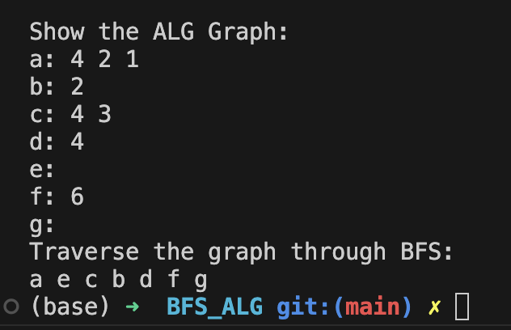


---

## 深度优先(Depth First Search, DFS)
核心思想:
```txt
后被访问的节点, 其邻接点先被访问.
    -- 类似栈, 后进先出 
```

常用`栈`来辅助实现 DFS.

深度优先遍历的例子:
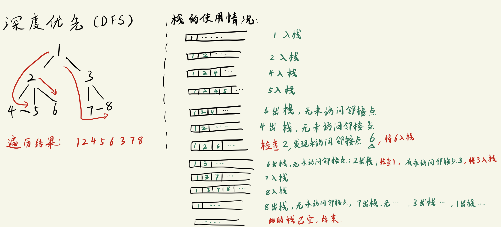

### 邻接矩阵的深度优先遍历
有向图邻接矩阵的深度遍历过程图解:
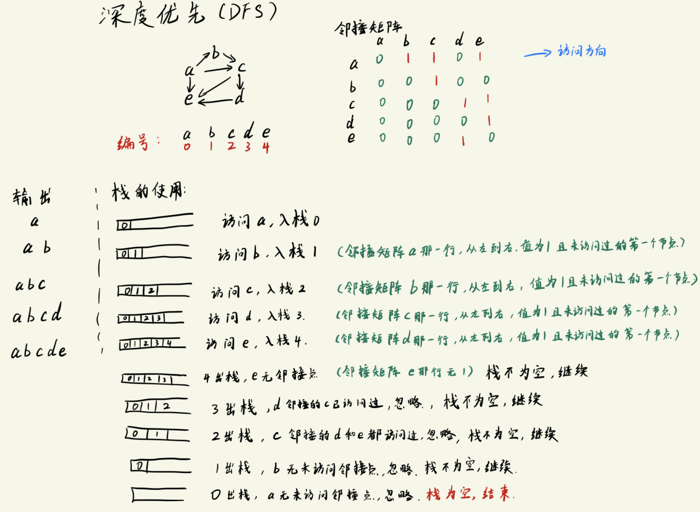


#### 有向图的邻接矩阵DFS代码实现
核心部分:
```c
void DFS_AMG(struct AMG_Graph * graph)
{
    int visited[MAX] = {0};         // 初始化辅助数组, 用于标记节点是否已经访问
    int i,j;                        // i用于遍历所有节点; j用于遍历邻接矩阵的某一行
    int u;                          // 存放栈顶元素(节点编号)

    // 考虑非连通情况: 遍历一次所有节点
    for (i = 0; i < graph->vex_num; i++){
        if(visited[i] == 0){
            // 处理第一个节点
            printf("%c ", graph->Vex[i]);
            visited[i] = 1;         // 标记为已访问
            push(i);

            // 循环处理后续节点
            while(!isEmpty()){
                // 检查栈顶元素对应的节点(只是检查, 并没有出栈!)
                u = stack[top -1];  // top -1 是因为 "top指向栈顶的下一个位置"

                // 遍历邻接矩阵中节点编号为 u 的那行, 找出 "第一个值为1 且 没有访问过的节点"
                for (j = 0; j < graph->vex_num; j++){
                    if((graph->Edge[u][j] == 1) && (visited[j] == 0)){
                        visited[j] = 1;     // 标记访问过
                        push(j);            // 入栈
                        printf("%c ", graph->Vex[j]);
                        break;              // 结束遍历邻接矩阵中当前行
                    }
                }

                // 访问到最深处时, 开始往回退 (关键代码!!!)
                if(j == graph->vex_num){    // j一定要走完邻接矩阵的一行才出栈, 这意味着: 如果节点 u 仍有未访问的邻接点时, u 不会出栈.
                    pop(); 
                }
            }
        }
    }
    printf("\n");
}
```

完整代码:
- 栈部分
    - 头文件`stack.h`
    ```c
    #ifndef __DFS_STACK_H__
    #define __DFS_STACK_H__

    #include <stdio.h>

    extern int stack[512];     // 用数组实现栈
    extern int top;            // 栈顶指针

    void push(int c);
    int pop(void);
    int isEmpty(void);
    int isFull(void);

    #endif //!__DFS_STACK_H__
    ```

  - 源文件`stack.c`
    ```c
    #include "stack.h"

    int stack[512];        // 用数组实现栈
    int top = 0;            // 栈顶指针

    void push(int c)
    {
        if (!isFull()){
            stack[top++] = c;   // top++ 表示在执行完这行代码后自增1
        }
    }

    int pop(void)
    {
        return stack[--top];    // --top 表示先自减1, 然后执行这行代码
    }

    int isEmpty(void)
    {
        return top == 0;
    }

    int isFull(void)
    {
        return top == 512;
    }
    ```

- 图的部分 -- `direct_graph.c`
    ```c
    #include <stdio.h>
    #include <stdlib.h>

    #include "stack.h"

    #define MAX 100

    // =============== 定义结构体 ===============
    struct AMG_Graph      // Adjacency Matrix Graph
    {
        int vex_num, edge_num;

        char Vex[MAX];
        int Edge[MAX][MAX];
    };

    // ================ 函数声明 ================
    struct AMG_Graph * create_AMG(void);
    void Show_AMG(struct AMG_Graph * graph);
    int search_vex(struct AMG_Graph * graph, char ch);
    void DFS_AMG(struct AMG_Graph * graph);

    // ================ main ==================
    int main(void)
    {
        struct AMG_Graph * d;      // 无向图指针
        d = create_AMG();
        Show_AMG(d);

        printf("Traverse the graph through DFS:\n");
        DFS_AMG(d);


        return 0;
    }

    // ================ 函数实现 ===================
    struct AMG_Graph * create_AMG(void)
    {
        struct AMG_Graph * graph = NULL;
        int i = 0, j = 0;
        char u,v;

        graph = (struct AMG_Graph *)malloc(sizeof(struct AMG_Graph));

        printf("Please enter the number of vertex: ");
        scanf("%d", &graph->vex_num);

        printf("Please enter the number of edges: ");
        scanf("%d", &graph->edge_num);

        while(getchar() != '\n');           // 清掉回车
        printf("Please enter the vertex:\n");
        for(i = 0; i < graph->vex_num; i++){
            graph->Vex[i] = getchar();
            while(getchar() != '\n');       // 清掉回车
        }

        // 初始化二维数组, 防止垃圾信息影响结果
        for(i = 0; i < graph->vex_num; i++){
            for(j = 0; j < graph->vex_num; j++){
                graph->Edge[i][j] = 0;
            }
        }

        while(graph->edge_num--){           // 图有几条边, 就录入几次
            printf("Please enter the vex that connect each other by edge:\n");
            u = getchar();
            while(getchar() != '\n');
            v = getchar();
            while(getchar() != '\n');

            // 确认输入字符的节点编号
            i = search_vex(graph, u);
            j = search_vex(graph, v); 

            if(i != -1 && j != -1){
                graph->Edge[i][j] = 1;       // 无向图和有向图邻接矩阵代码的唯一区别
            }
            else{
                printf("You've enter a wrong vex, please enter again.");
                graph->edge_num++;      // 重置一下当前减掉的次数
            }
        }

        return graph;
    }

    void Show_AMG(struct AMG_Graph * graph)
    {
        int i,j;
        printf("Show the vex: ");
        for(i = 0; i < graph->vex_num; i++){
            printf("%c", graph->Vex[i]);
        }
        printf("\n");

        printf("Show the Adjacency matrices:\n");
        for(i = 0; i < graph->vex_num; i++){
            for(j = 0; j < graph->vex_num; j++){
                printf("%d\t", graph->Edge[i][j]);
            }
            printf("\n");
        }
        printf("\n");
    }

    int search_vex(struct AMG_Graph * graph, char ch)
    {
        int i;
        for(i = 0; i < graph->vex_num; i++){
            if (ch == graph->Vex[i]){
                return i;
            }
        }
        return -1;
    }

    void DFS_AMG(struct AMG_Graph * graph)
    {
        int visited[MAX] = {0};         // 初始化辅助数组, 用于标记节点是否已经访问
        int i,j;                        // i用于遍历所有节点; j用于遍历邻接矩阵的某一行
        int u;                          // 存放栈顶元素(节点编号)

        // 考虑非连通情况: 遍历一次所有节点
        for (i = 0; i < graph->vex_num; i++){
            if(visited[i] == 0){
                // 处理第一个节点
                printf("%c ", graph->Vex[i]);
                visited[i] = 1;         // 标记为已访问
                push(i);

                // 循环处理后续节点
                while(!isEmpty()){
                    // 检查栈顶元素对应的节点(只是检查, 并没有出栈!)
                    u = stack[top -1];  // top -1 是因为 "top指向栈顶的下一个位置"

                    // 遍历邻接矩阵中节点编号为 u 的那行, 找出 "第一个值为1 且 没有访问过的节点"
                    for (j = 0; j < graph->vex_num; j++){
                        if((graph->Edge[u][j] == 1) && (visited[j] == 0)){
                            visited[j] = 1;     // 标记访问过
                            push(j);            // 入栈
                            printf("%c ", graph->Vex[j]);
                            break;              // 结束遍历邻接矩阵中当前行
                        }
                    }

                    // 访问到最深处时, 开始往回退 (关键代码!!!)
                    if(j == graph->vex_num){    // j一定要走完邻接矩阵的一行才出栈, 这意味着: 如果节点 u 仍有未访问的邻接点时, u 不会出栈.
                        pop(); 
                    }
                }
            }
        }
        printf("\n");
    }
    ```

测试图:

程序输出:
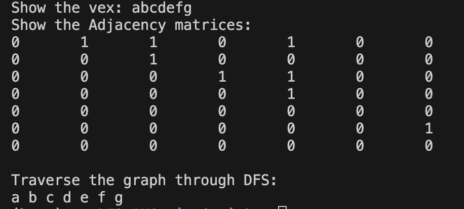

----

### 邻接表的深度优先遍历
邻接表的深度优先的遍历过程与邻接矩阵几乎一致, 不太一样的地方是邻接表操作的是`链表`.

#### 邻接表DFS的代码实现
核心代码:
```c
void DFS_ALG(struct ALG_Graph * graph)
{
    int visited[MAX] = {0};                 // 创建辅助数组, 用于标记是否访问过, 并初始化为0, 这里用MAX只是偷懒的做法, 实际上应该按照节点的个数进行创建.
    int u;                                  // 临时存放出队列节点编号
    struct AdjNode * temp;                  // 指向邻接点表单链表(链表头)的指针
    int n;                                  // 邻接点表对应的链表节点里存放的index
    int i;

    for (i = 0; i < graph->vex_num; i++){   // 简单粗暴的做法: 防止遍历 "非连通图" 时, 不连通部分直接被忽略
        if(visited[i] == 0){
            visited[i] = 1;                         // 标记访问过的节点
            push(i);                                // 第一个节点入栈
            printf("%c ", graph->Vex[i].node);      // 与邻接矩阵不同, 这里的node才是节点数据

            while(!isEmpty()){
                u = stack[i];                       // 栈顶元素编号
                temp = graph->Vex[u].first;         // 获取邻接点表对应的单链表

                // 遍历邻接点表对应的单链表
                while(temp != NULL){
                    n = temp->index;                // 邻接点表的单链表节点存放的编号

                    if(visited[n] == 0){            // 当前节点没访问过
                        visited[n] = 1;
                        push(n);                    // 将当前遍历的邻接点入栈
                        printf("%c ", graph->Vex[n].node);

                        // 指针移动到邻接点表中n对应的单链表, 并指向这个单链表的第一个元素
                        temp = graph->Vex[n].first;
                    }
                    else{
                        temp = temp->next;          // 如果当前邻接点已经访问过, 就将指针移动到链表的下一个节点
                    }
                }

                // 当邻接点表中u节点对应链表中已经没有"未访问的邻接点"时, 就将u出栈
                pop();
            }
        }
    }
    printf("\n");
}
```
- 在访问顶点 u 在邻接点表中的链表时:
  - 如果遍历该链表的第 n 个节点没有访问过, 则将这个节点输出, 标记该节点已访问, 并`将遍历节点的指针 temp 指向 n 节点在邻接表中对应的链表头`, 即`temp = graph->Vex[n].first`.
  - 如果遍历该链表的第 n 个节点已经访问过, 则继续移动到链表的下一个节点, 即`temp = temp.next`.
- 仅当遍历的顶点 u 在邻接点表的链表为NULL时, 才将 u 出栈.


完整代码:
- 栈的部分:
  - 头文件`stack.h`
    ```c
    #ifndef __DFS_STACK_H__
    #define __DFS_STACK_H__

    #include <stdio.h>

    extern int stack[512];     // 用数组实现栈
    extern int top;            // 栈顶指针

    void push(int c);
    int pop(void);
    int isEmpty(void);
    int isFull(void);

    #endif //!__DFS_STACK_H__
    ```

  - 源文件`stack.c`
    ```c
    #include "stack.h"

    int stack[512];        // 用数组实现栈
    int top = 0;            // 栈顶指针

    void push(int c)
    {
        if (!isFull()){
            stack[top++] = c;   // top++ 表示在执行完这行代码后自增1
        }
    }

    int pop(void)
    {
        return stack[--top];    // --top 表示先自减1, 然后执行这行代码
    }

    int isEmpty(void)
    {
        return top == 0;
    }

    int isFull(void)
    {
        return top == 512;
    }
    ```

- 测试部分 -- `directed_graph.c`
```c
#include <stdio.h>
#include <stdlib.h>
#include "stack.h"

#define MAX 100

// ====================== 结构体定义 =======================
struct AdjNode                  // Adjacency Node, 邻接点表里的节点
{
    int index;
    struct AdjNode * next;      // 指向下一个邻接点
};

struct VexNode
{
    char node;                   // 存放顶点信息(数据部分)
    struct AdjNode * first;      // 指向下一个邻接点的指针(邻接点表里的东西)
};

struct ALG_Graph      // Adjacency List Graph
{
    int vex_num, edge_num;      // 顶点个数, 边的数量

    struct VexNode Vex[MAX];    // 顶点表, 这是一个结构体数组, 每一个元素都是一个单链表
};


// ====================== 函数声明 ======================
struct ALG_Graph * Create_ALG(void);                                    // 创建邻接表
int search_vex(struct ALG_Graph * graph, char ch);                      // 在顶点表中索引直接节点编号
void create_adj_node_list(struct ALG_Graph * graph, int i, int j);      // 创建邻接点表
void Show_ALG(struct ALG_Graph *graph);
void DFS_ALG(struct ALG_Graph * graph);


// =================== main ====================
int main(void)
{
    struct ALG_Graph * d_graph;
    d_graph = Create_ALG();

    Show_ALG(d_graph);

    printf("Traverse the graph through DFS:\n");
    DFS_ALG(d_graph);
    return 0;
}

struct ALG_Graph * Create_ALG(void)
{
    struct ALG_Graph *graph;
    int i, j;
    char u, v;

    graph = (struct ALG_Graph*) malloc(sizeof(struct ALG_Graph));       // 分配空间, 创建邻接表

    // --------------- 创建 & 初始化 "节点表" 部分 --------------------------
    printf("Please enter the number of vertex: ");
    scanf("%d", &graph->vex_num);

    printf("Please enter the number of edges: ");
    scanf("%d", &graph->edge_num);

    while(getchar() != '\n');           // 清掉回车
    printf("Please enter the vertex:\n");
    for(i = 0; i < graph->vex_num; i++){
        graph->Vex[i].node = getchar();
        while(getchar() != '\n');       // 清掉回车
    }

    // 初始化graph的邻接点指针为NULL, 方便后续赋值
    for(i = 0; i < graph->vex_num; i++){
        graph->Vex[i].first = NULL;
    }

    // ---------------- 创建 & 完善 "邻接点表" 部分 ----------------------------
    while(graph->edge_num--){           // 图有几条边, 就录入几次
        printf("Please enter the vex that connect each other by edge:\n");
        u = getchar();
        while(getchar() != '\n');
        v = getchar();
        while(getchar() != '\n');

        // 在节点表中确认输入字符的节点编号
        i = search_vex(graph, u);
        j = search_vex(graph, v); 

        if(i != -1 && j != -1){
            // 构建邻接点表
            create_adj_node_list(graph, i, j);

        }
        else{
            printf("You've enter a wrong vex, please enter again.");
            graph->edge_num++;      // 重置一下当前减掉的次数
        }
    }

    return graph;
}

int search_vex(struct ALG_Graph * graph, char ch)
{
    int i;
    for(i = 0; i < graph->vex_num; i++){
        if (ch == graph->Vex[i].node){          // 匹配节点数据
            return i;
        }
    }
    return -1;
}

void create_adj_node_list(struct ALG_Graph * graph, int i, int j)
{
    // 创建 & 初始化 新节点 (这是在图结构中, 顶点 i 指向的下一个节点)
    struct AdjNode * s = (struct AdjNode *) malloc(sizeof(struct AdjNode));
    s->index = j;                   // 注意: i 是出发点, j 是到达点
    s->next = graph->Vex[i].first;  // 初始化节点

    graph->Vex[i].first = s;        // 将i节点的 first指针 指向 编号为j 的节点

    /*
    过程解析:
        假设现在的节点是a, 与a连接的节点有 b, c, e 三个. (abcd 对应编号 01234)
            录入的顺序为: 
                a,b   (编号 0,1)
                a,c   (编号 0,2)
                a,e   (编号 0,4)
                需要特别注意: 我们在录入图信息的时候, 已经规定是"从a开始录入, 并且连接的节点按照编号从小到大"的顺序 (顺序输入)
            
        那么此时有如下过程:
            首次调用函数时, i为0, j为1; 
                创建节点s, s的index设置为1, s的next初始化为 NULL(因为此时graph->Vex[i].first为NULL)
                    然后 graph->Vex[i].first指向 节点s  (完成了 a->b 这个连接)       
                    此时邻接点表的单链表为 a->b
            
            第二次调用函数时, i为0, j为2;
                创建节点s, s的index设置为2, s的next初始化为 "编号为1的节点的地址" (指向节点b)
                    然后 graph->Vex[i].first指向 节点s (完成 a->c 这个连接)
                    此时邻接点表的单链表为 a->c->b
            
            第三次调用函数时, i为0, j为4
                创建节点s, s的index设置为1, s的next初始化为 "编号为2的节点的地址" (指向节点c)
                    然后 graph->Vex[i].first指向 节点s (完成 a->e 这个连接)
                    此时邻接点表的单链表为 a->e->c->b
            
            不难发现, 此时创建的邻接点表符合了 "按照节点编号的逆序存放" 的规则.
                即: 顺序输入, 逆序存放.
    */      
}

void Show_ALG(struct ALG_Graph *graph)
{
    int i = 0;
    struct AdjNode * temp;     // 用来遍历邻接点表(单链表节点)
    printf("Show the ALG Graph:\n");

    for(i = 0; i < graph->vex_num; i++){
        // 打印节点
        printf("%c: ", graph->Vex[i].node);

        // 打印邻接点表内的节点(遍历单链表)
        temp = graph->Vex[i].first;
        while(temp != NULL){
            printf("%d ", temp->index);
            temp = temp->next;
        }

        printf("\n");
    }
}

void DFS_ALG(struct ALG_Graph * graph)
{
    int visited[MAX] = {0};                 // 创建辅助数组, 用于标记是否访问过, 并初始化为0, 这里用MAX只是偷懒的做法, 实际上应该按照节点的个数进行创建.
    int u;                                  // 临时存放出队列节点编号
    struct AdjNode * temp;                  // 指向邻接点表单链表(链表头)的指针
    int n;                                  // 邻接点表对应的链表节点里存放的index
    int i;

    for (i = 0; i < graph->vex_num; i++){   // 简单粗暴的做法: 防止遍历 "非连通图" 时, 不连通部分直接被忽略
        if(visited[i] == 0){
            visited[i] = 1;                         // 标记访问过的节点
            push(i);                                // 第一个节点入栈
            printf("%c ", graph->Vex[i].node);      // 与邻接矩阵不同, 这里的node才是节点数据

            while(!isEmpty()){
                u = stack[i];                       // 栈顶元素编号
                temp = graph->Vex[u].first;         // 获取邻接点表对应的单链表

                // 遍历邻接点表对应的单链表
                while(temp != NULL){
                    n = temp->index;                // 邻接点表的单链表节点存放的编号

                    if(visited[n] == 0){            // 当前节点没访问过
                        visited[n] = 1;
                        push(n);                    // 将当前遍历的邻接点入栈
                        printf("%c ", graph->Vex[n].node);

                        // 指针移动到邻接点表中n对应的单链表, 并指向这个单链表的第一个元素
                        temp = graph->Vex[n].first;
                    }
                    else{
                        temp = temp->next;          // 如果当前邻接点已经访问过, 就将指针移动到链表的下一个节点
                    }
                }

                // 当邻接点表中u节点对应链表中已经没有"未访问的邻接点"时, 就将u出栈
                pop();
            }
        }
    }
    printf("\n");
}
```

测试使用图:


程序输出
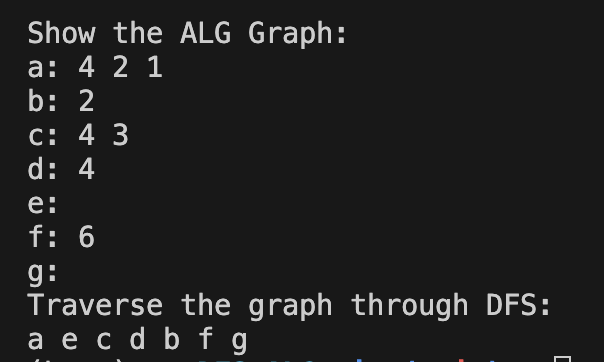
