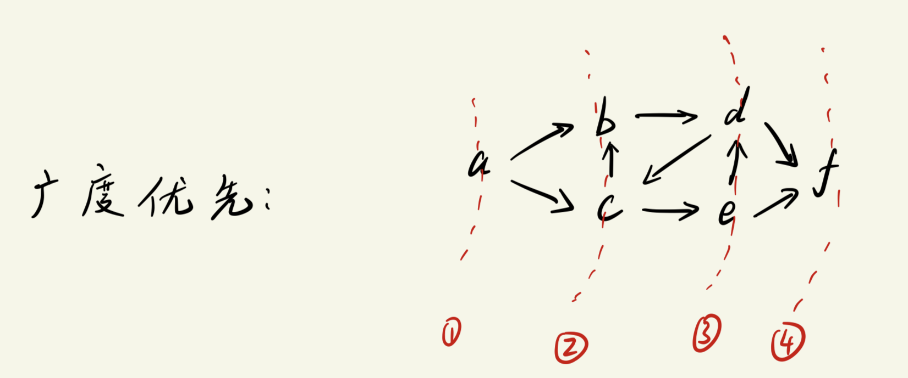

# 图的遍历
图的遍历方式主要分为两种: `深度优先`和`广度优先`.

---

## 广度优先 (Breadth First Search, BFS)
访问逻辑:
```txt
起点 -> 找所有邻接点(直接相连的点)
邻接点 -> 继续找与之直接相连的邻接点
```


广度优先的核心思想:
```txt
先被访问的节点, 其`邻接点`也先被访问.
```


### 邻接矩阵的广度优先
遍历过程图示:

- 在代码中, 入队列的是`节点编号`.

邻接矩阵广度优先 -- 实现步骤:
```txt
1. 创建数组 visited, 用于表示顶点是否被访问过, 并将数组元素全部置零.
    使用时, 若节点被访问过, 则 visited 对应位置为1, 未访问过则为0
2. 创建空队列, 队列中存放的是`顶点编号`
3. 从图的起点(编号为0的点)出发, 标记该点已访问过, 并将该点入队列
4. 若队列不为空, 则继续访问; 否则遍历直接结束.
5. 顶点出队列后, 依次访问`该顶点未被访问过的邻接点`. 标记这些邻接点为已访问, 并将对应编号入队列
```

#### 代码实现 -- 有向图邻接矩阵的BFS
核心代码:
```c
void BFS_AMG(struct AMG_Graph * graph)
{
    int visited[MAX] = {0};             // 辅助数组, 标记当前节点是否被访问过: 0未访问, 1已访问
    int u;                              // 出队列的节点编号
    int i;                              // 控制循环的变量i

    printf("%c ", graph->Vex[0]);       // 图的起始节点
    visited[0] = 1;                     // 标记起点已访问

    enqueue(0);                         // 将起点入队列

    while(!isEmpty()){
        u = dequeue();                          // 将队列第一个元素出队
        for(i = 0; i < graph->vex_num; i++){    // 遍历邻接矩阵中的第u行(其实等价于查询一次所有顶点), 找到该元素的"未被访问的邻接点", 并将他们入队
            if((graph->Edge[u][i] == 1) && (visited[i] == 0)){  // i是邻接点, 并且i没有被访问过时
                visited[i] = 1;                 // 标记为已访问
                enqueue(i);                     // 将该邻接点入队列
                printf("%c ", graph->Vex[i]);   // 输出当前节点
            }
        }
    }

    printf("\n");
}
```


完整代码:
头文件`queue.h`
```c
#ifndef __GRAPH_QUEUE_H__
#define __GRAPH_QUEUE_H__

#include <stdio.h>
#define SIZE 512
void enqueue(int n);
int dequeue(void);
int isEmpty();
int isFull();

extern int queue[SIZE];     // 如果没有extern, 在 queue.c 中会找不到这个全局变量

#endif //! __GRAPH_QUEUE_H__
```


源文件`queue.c`
```c
#include <stdio.h>
#include "queue.h"

int queue[SIZE];

int head = 0, tail = 0;     // 空队列头尾指针相同

void enqueue(int n)
{
    queue[tail] = n;
    tail = (tail + 1) % SIZE;
}

int dequeue(void)
{
    int n;
    n = queue[head];
    head = (head + 1) % SIZE;
    return n;
}

int isEmpty()
{
    return head == tail;
}

int isFull()
{
    return (tail+1) % SIZE == head;
}
```


测试文件`directed_graph.c`
```c
#include <stdio.h>
#include <stdlib.h>
#include "queue.h"

#define MAX 100

struct AMG_Graph      // Adjacency Matrix Graph
{
    int vex_num, edge_num;

    char Vex[MAX];
    int Edge[MAX][MAX];
};

struct AMG_Graph * create_AMG(void);
void Show_AMG(struct AMG_Graph * graph);
int search_vex(struct AMG_Graph * graph, char ch);
void BFS_AMG(struct AMG_Graph * graph);             // 广度优先遍历

int main(void)
{
    struct AMG_Graph * d_graph;      // 无向图指针
    d_graph = create_AMG();
    Show_AMG(d_graph);

    printf("Traverse the graph through BFS:\n");
    BFS_AMG(d_graph);

    return 0;
}

struct AMG_Graph * create_AMG(void)
{
    struct AMG_Graph * graph = NULL;
    int i = 0, j = 0;
    char u,v;

    graph = (struct AMG_Graph *)malloc(sizeof(struct AMG_Graph));

    printf("Please enter the number of vertex: ");
    scanf("%d", &graph->vex_num);

    printf("Please enter the number of edges: ");
    scanf("%d", &graph->edge_num);

    while(getchar() != '\n');           // 清掉回车
    printf("Please enter the vertex:\n");
    for(i = 0; i < graph->vex_num; i++){
        graph->Vex[i] = getchar();
        while(getchar() != '\n');       // 清掉回车
    }

    // 初始化二维数组, 防止垃圾信息影响结果
    for(i = 0; i < graph->vex_num; i++){
        for(j = 0; j < graph->vex_num; j++){
            graph->Edge[i][j] = 0;
        }
    }

    while(graph->edge_num--){           // 图有几条边, 就录入几次
        printf("Please enter the vex that connect each other by edge:\n");
        u = getchar();
        while(getchar() != '\n');
        v = getchar();
        while(getchar() != '\n');

        // 确认输入字符的节点编号
        i = search_vex(graph, u);
        j = search_vex(graph, v); 

        if(i != -1 && j != -1){
            graph->Edge[i][j] = 1;       // 无向图和有向图邻接矩阵代码的唯一区别
        }
        else{
            printf("You've enter a wrong vex, please enter again.");
            graph->edge_num++;      // 重置一下当前减掉的次数
        }
    }

    return graph;
}

void Show_AMG(struct AMG_Graph * graph)
{
    int i,j;
    printf("Show the vex: ");
    for(i = 0; i < graph->vex_num; i++){
        printf("%c", graph->Vex[i]);
    }
    printf("\n");

    printf("Show the Adjacency matrices:\n");
    for(i = 0; i < graph->vex_num; i++){
        for(j = 0; j < graph->vex_num; j++){
            printf("%d\t", graph->Edge[i][j]);
        }
        printf("\n");
    }
    printf("\n");
}

int search_vex(struct AMG_Graph * graph, char ch)
{
    int i;
    for(i = 0; i < graph->vex_num; i++){
        if (ch == graph->Vex[i]){
            return i;
        }
    }
    return -1;
}

void BFS_AMG(struct AMG_Graph * graph)
{
    int visited[MAX] = {0};             // 辅助数组, 标记当前节点是否被访问过: 0未访问, 1已访问
    int u;                              // 出队列的节点编号
    int i;                              // 控制循环的变量i

    printf("%c ", graph->Vex[0]);       // 图的起始节点
    visited[0] = 1;                     // 标记起点已访问

    enqueue(0);                         // 将起点入队列

    while(!isEmpty()){
        u = dequeue();                          // 将队列第一个元素出队
        for(i = 0; i < graph->vex_num; i++){    // 遍历邻接矩阵中的第u行(其实等价于查询一次所有顶点), 找到该元素的"未被访问的邻接点", 并将他们入队
            if((graph->Edge[u][i] == 1) && (visited[i] == 0)){  // i是邻接点, 并且i没有被访问过时
                visited[i] = 1;                 // 标记为已访问
                enqueue(i);                     // 将该邻接点入队列
                printf("%c ", graph->Vex[i]);   // 输出当前节点
            }
        }
    }

    printf("\n");
}
```

运行结果:


----

#### 代码实现 -- 无向图BFS
无向图与有向图的BFS实现的区别:
- 区别在于`邻接矩阵`的构建, BFS的操作逻辑/代码实现都没有区别.
  - 无向图的邻接矩阵是`对称的`: `vex[i][j] = vex[j][i] = 1`

故只需要将构建邻接矩阵的赋值语句修改一下即可:
```c
struct AMG_Graph * create_AMG(void)
{
    struct AMG_Graph * graph = NULL;
    int i = 0, j = 0;
    char u,v;

    graph = (struct AMG_Graph *)malloc(sizeof(struct AMG_Graph));

    printf("Please enter the number of vertex: ");
    scanf("%d", &graph->vex_num);

    printf("Please enter the number of edges: ");
    scanf("%d", &graph->edge_num);

    while(getchar() != '\n');           // 清掉回车
    printf("Please enter the vertex:\n");
    for(i = 0; i < graph->vex_num; i++){
        graph->Vex[i] = getchar();
        while(getchar() != '\n');       // 清掉回车
    }

    // 初始化二维数组, 防止垃圾信息影响结果
    for(i = 0; i < graph->vex_num; i++){
        for(j = 0; j < graph->vex_num; j++){
            graph->Edge[i][j] = 0;
        }
    }

    while(graph->edge_num--){           // 图有几条边, 就录入几次
        printf("Please enter the vex that connect each other by edge:\n");
        u = getchar();
        while(getchar() != '\n');
        v = getchar();
        while(getchar() != '\n');

        // 确认输入字符的节点编号
        i = search_vex(graph, u);
        j = search_vex(graph, v); 

        if(i != -1 && j != -1){
            graph->Edge[i][j] = graph->Edge[j][i] = 1;       // 无向图和有向图邻接矩阵代码的唯一区别
        }
        else{
            printf("You've enter a wrong vex, please enter again.");
            graph->edge_num++;      // 重置一下当前减掉的次数
        }
    }

    return graph;
}
```

其余函数与有向图代码实现一样.


