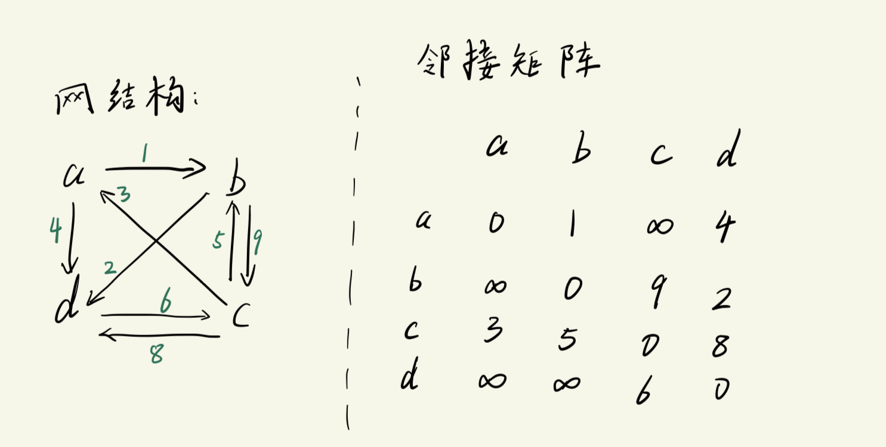
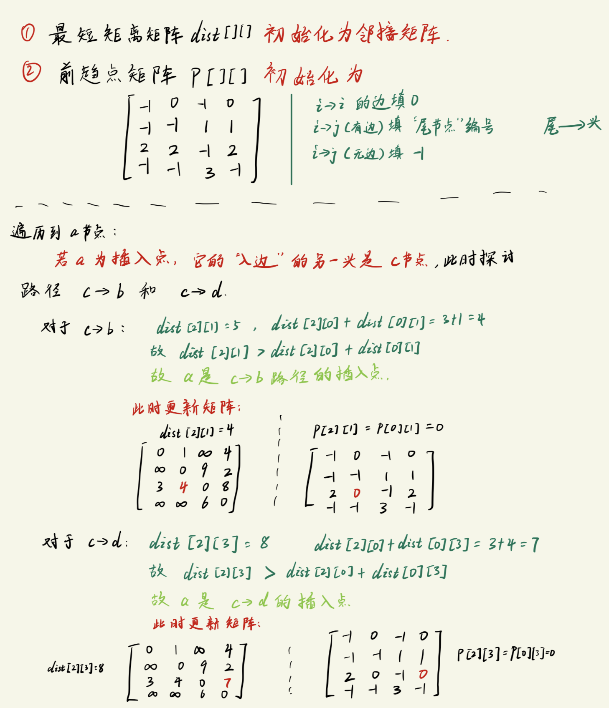

# 图的应用 -- Floyd 算法(插点法)
这个算法的目的是求`最短路径`.


## 算法分析

假设有如下`网结构`:


对于这个`网`, 它的邻接矩阵构造规则如下: 
- 节点i -> 节点i (自到自己)在邻接矩阵中的值为0.
  - 即: `Edge[i][i] = 0`
- 有邻接边的位置填入边的`权值`
  - 即: `Edge[i][j] = 权值`
- 无邻接边的位置, 填入`无穷大`
  - 即: `Edge[i][j] = inf`, i, j无邻接边

算法需要借助如下"工具"
1. 最短路径矩阵 `dist`
    ```txt
    最短路径矩阵的每一个值是这个路径对应的最短距离.
    ```
2. 插入点
    ```txt
    插入点的定义:
        定义1:
            比如 a,b 两个节点没有路径可以直接抵达, 他们可以通过节点c来构成一条通路, 此时c就是 ab之间的 "插入点".

        定义2: 
            现在有节点i 和 节点j, 如果 
                dist[i][j] > dist[i][k] + dist[k][j]
            则 k节点 就是 i和j 之间的插入点.

            定义2 与 定义1其实是等价的, 定义1中无直接路径的两个点, 对应 disk[a][b] = inf, 为无穷大, 故一定有 dist[a][b] > dist[a][k] + dist[k][b]
        
        简单描述就是: 插入点可以让 "原有路径" 的距离变短.
    ```
3. 前趋点矩阵 `p`
    ```txt
    前趋点 在这里指的是路径的起始位置(也是箭头的"尾").

    前趋点矩阵的构造规则:
        i -> i (自己指向自己): 矩阵的对应位置填 0

        i -> j (有路径/有边): 矩阵的对应位置填 "尾结点编号"
            尾和头的定义是: 尾 -> 头  
    
        i -> j (无路径/无边): 矩阵的对应位置填 -1
    
    算法开始时, 前趋点矩阵里的值是 "当前路径的尾结点".
        如 c->b 这个路径, 矩阵中对应 p[2][1] 的值就应该为 2 (对应节点c)

    算法结束时, 前趋点矩阵里的值是 "使得这个路径最短" 的插入点或尾结点.
        如 c,b 这两个节点之间的所有路径中, 通过计算可以知道, 走 c->a->b 比 c->b 的距离要短, 
        因此 前趋点矩阵在算法结束时有 p[2][1] = 0(对应a节点), 而不是2(对应c节点).
    ```

Floyd算法的过程是:
```txt
遍历每一个节点, 判断它是是否可以成为某个路径的插入点, 如果能作为插入点, 则更新前趋点矩阵和最短路径矩阵, 直到所有节点遍历结束.
    此时通过查询最短路径矩阵就能知道从 节点i 出发到图结构的哪个节点的路径最短.
```

算法在执行过程时, 判断 `某个节点是否可作为插入点` 并 `更新最短路径矩阵` 的过程:
```txt
使用插入点的定义2: dist[i][j] > dist[i][k] + dist[k][j]

以上面的图结构为例, 寻找a节点是插入点的路径, 有如下过程:
k = 0: 
    此时寻找a节点的 "入边", 发现是 c->a, 因此c必定是"箭头尾", 所以此时需要观察的路径是 c->b 和 c->d
使用插入点的定义进行比较(假设当前dist矩阵被初始化为邻接矩阵):
    对于路径 c->b:
        dist[2][1] = 5;  
        dist[2][0] + dist[0][1] = 3 + 1 = 4;
        故: dist[2][1] > dist[2][0] + dist[0][1]
        
        因此 a 是 c->b 路径的插入点 ===> 此时路径 c->b 的"前趋点"应变成 "节点a", 最短路径矩阵中 dist[2][1] 也应更新为 4
    
    对于路径 c->d:
        dist[2][3] = 8
        dist[2][0] + dist[0][3] = 3 + 4 = 7
        故: dist[2][3] > dist[2][0] + dist[0][3]

        因此 a 也是 c->d 路径的插入点 ====> 此时路径 c->d 的"前趋点" 应变为 "节点a", 最短路径矩阵中 dist[2][3] 也应更新为 7
```
- 上述过程图示为:
    


