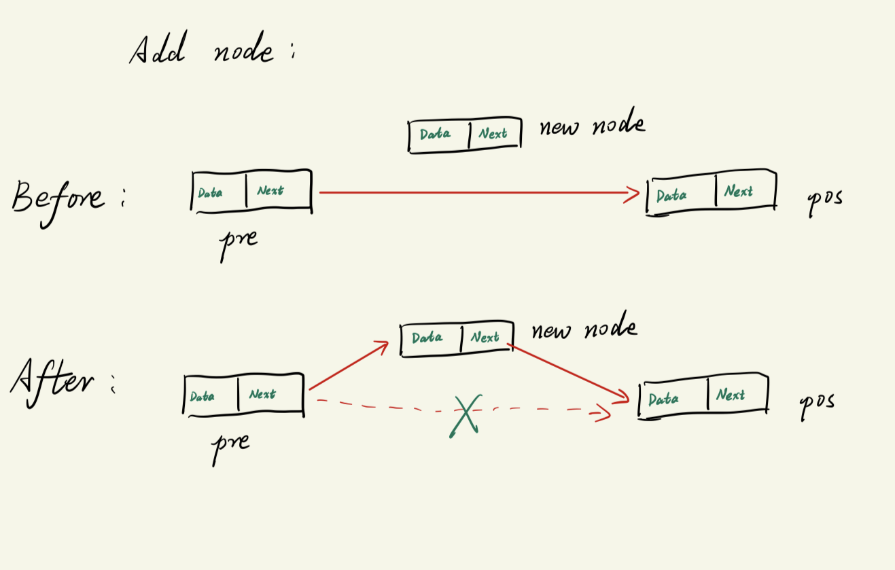
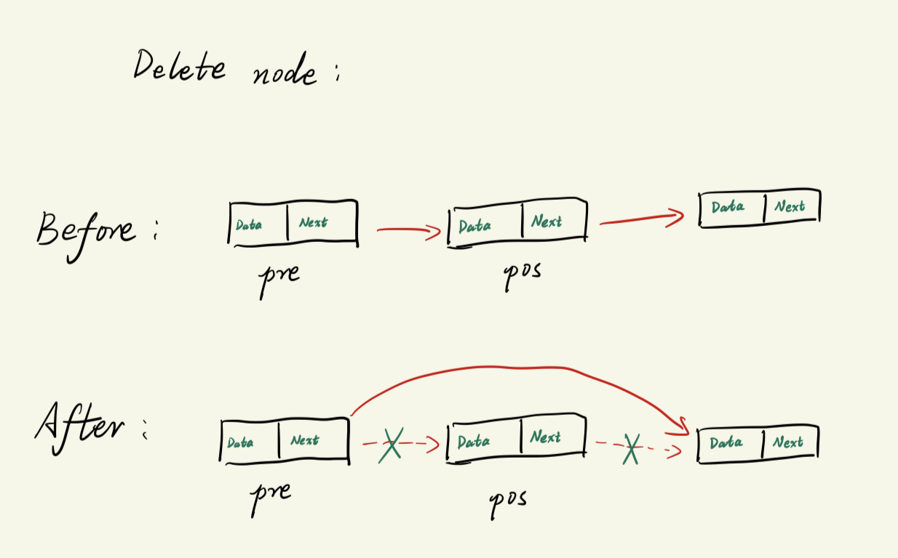

# 单链表原理及基本操作实现
回顾一下栈和队列, 他们的实现都是`基于数组`和循环得到的, 由于`数组在内存中是连续排布`的, 故`栈 和 队列 在内存中也是连续排布`的.

链表与数组不同, 链表是`离散排布`的, 他的每个元素都是一个独立的对象, 他们通过`指针`相连.
- 劣势:
  - 访问元素很麻烦
    - 由于**不是连续分布**的, 所以链表`不支持随机访问`(只能从头开始遍历才能找到某个指定的节点).
- 优势:
  - 具有优秀的数据重排能力
    - 也由于链表**不是连续分布**, 插入/删除元素的时候无需挪动其他元素, 直接将新节点加入/删除链中即可, 故链表的`插入和删除`操作比数组`高效`.

--- 

链表的组成:
- 节点
- 头指针 head
  - 通过头指针可以找到链表的第一个元素
- 尾指针 tail
  - 尾指针永远指向 NULL

---

对于节点(`node`):
- 本质上是一个`结构体`, 包含两个部分:
  - 数据域
    - 用于存储数据
  - 指针域
    - 必须是一个结构体指针, 结构体类型就是节点的类型
    - 用于指向下一个节点的起始地址
    - 最后一个节点的指针域指向空(NULL 或 nullptr)


---

链表基本操作:
- 创建链表(create linklist)
```txt
  1. 创建新节点
    假设已经存在链表的 head 和 tail 指针 (若没有, 则手动创建一下, 并都初始化为 NULL).
        1) 开辟一段内存空间作为新节点, 并划分出数据域以及指针域, 然后返回当前内存空间的起始地址;
            - C 语言使用 malloc 函数, 但是注意 malloc 函数返回的是 void* 类型, 需要**强制转换为节点类型**.
            - C++ 语言直接使用 new 即可
        2) 填充数据域, 指针域设置为 NULL
  2. 将节点接入链表
    - 可简单分为 头插法 和 尾插法.
        - 对于 尾插法: 除了head固定指向链表第一个节点之外, 需要定义一个 tail 指针, 让它永远指向最后一个节点
            1) 先检查头指针, 将某个指针指向新增节点(以下情况只会发生一种, 用if-else): 
                - 如果新增的节点是链表的第一个节点, 则直接让 head 指向加入的加点; 
                - 如果新增的节点不是链表的第一个节点, 则先将尾节点的next指针指向新增节点.
            2) 更新尾结点: 由于是尾插法, 新加入的节点一定是链表最末尾的节点, 故尾结点**最终**一定指向新加入的节点.
```

- 插入节点图解
```txt
输入: 
  1. 插入链表的哪个位置
  2. 插入的节点 (或者提供节点的数据, 此时需要在函数内完成节点的创建)

操作:
  在指定位置插入新节点:
      如果插入的位置**是头结点**:
          1. 直接将新增节点的 next指针 指向 head 所指向的位置 ==> 效果就是 新增节点 位于链表的头部
          2. 将head指向的位置改为 新增节点 ==> 坐实新增节点的地位
      如果插入的位置**不是头结点**
          1. 遍历链表找到 pos位置 的前一个节点(前趋点)
              建立一个 pre指针 指向前趋点节点
          2. 将 pre指针 指向新增节点, 然后将 新增节点 的 next指针 指向原来pos位置的节点.
              - 为了防止 指向pos位置的节点指针丢失, 需要先将这个指针先存入 "新插入节点的指针域(将它的next设置为指向原来pos位置的节点)" 
              - 然后再将pre的 next指针 指向新增节点
          3. (不能忘记!!!!) 检查插入位置是否为末尾位置 ==> 坐实新增节点的地位
```


- 删除节点
```txt
与 "插入节点" 一样, 删除节点也需要 "前趋点" pre.

如果删除的**是头结点**
    1. 把 pre 设置为 head 
    2. 将 head 存放的地址更新为 原来head的指针域里存放的地址 (head直接挪到下一个位置)
    3. 释放被删除的节点空间, 防止内存泄露
如果删除的**不是头结点**
    1. 遍历链表, 找到前趋点(index 为 pos - 1 的位置)
    2. 将准备删除的节点指针 p 赋值为 pre->next (也就是 p 指向了 pos 位置)
    3. 将 pre指针 指向 pos 的下一个节点 (此时链表将绕开 pos 节点)
    4. 检查 pos 指向的节点是否为 "尾结点", 特征是 p->next 为 NULL
    5. 释放被删除的节点空间, 防止内存泄露
```


- 遍历链表
  - 只能从头开始(head开始)遍历
- 查找节点
  - 注意要从头开始遍历
- 输出链表
  - 从头开始遍历, 依次输出每个节点的数据域

--- 
代码例子:
- C语言版
  - 头文件`linklist.h`
    ```c
    #ifndef __LINKLIST_H__
    #define __LINKLIST_H__

    #include <stdio.h>

    struct node
    {
        unsigned char elem;
        struct node * next;     // 下一个节点的指针类型是 "struct node"
    };

    void create_linklist(unsigned char elem);
    void insert_node(int pos, char elem);
    void delete_node(int pos);
    void print_linklist();
    int search(unsigned char elem);

    #endif
    ```

  - 源文件`linklist.c`
    ```c
    #include "linklist.h"
    #include <stdlib.h>

    struct node *head = NULL;
    struct node *tail = NULL;           // 由于使用了尾插法, 这里定义一个 尾指针

    // 链表基本操作--创建链表
    void create_linklist(unsigned char elem)
    {
        /*
            创建一个链表分为两步:
                1. 创建节点:
                    1) 开辟一段内存空间作为新节点, 并划分出数据域以及指针域, 然后返回当前内存空间的起始地址;
                    2) 填充数据域, 指针域设置为 NULL
                2. 将节点接入链表
                    - 可简单分为 头插法 和 尾插法.
                        - 对于 尾插法: 除了head固定指向链表第一个节点之外, 需要定义一个 tail 指针, 让它永远指向最后一个节点
                            1) 先检查头指针, 将某个指针指向新增节点(以下情况只会发生一种, 用if-else): 
                                - 如果新增的节点是链表的第一个节点, 则直接让 head 指向加入的加点; 
                                - 如果新增的节点不是链表的第一个节点, 则先将尾节点的next指针指向新增节点.
                            2) 更新尾结点: 由于是尾插法, 新加入的节点一定是链表最末尾的节点, 故尾结点**最终**一定指向新加入的节点.

        */
        
        // 1. 创建节点
        struct node *p = (struct node *)malloc(sizeof(struct node));     // malloc 返回的类型是 (void *), 所以需要强制类型转换
        p->elem = elem;     // 节点的数据域赋值
        p->next = NULL;     // 节点的指针域先初始化为 NULL, 因为还没有开始连接进链表中

        // 2. 将新建的节点接入链表中, 让原 链表的某个指针 指向新增节点(这里使用尾插法)
        if (head == NULL){      // 先检查头指针
            head = p;           // 尾插法: 如果链表还没有任何节点, 则将当前节点作为第一个节点 ==> head 指针指向新增节点
        }
        else{
            tail->next = p;     // 尾插法: 如果链表已经有节点, 则将当前的尾结点的 next 指针指向新增节点
        }

        tail = p;               // 更新 tail 指针指向的节点: 将新增的 p 节点成为新的尾结点, 故 tail 指针移动到 p 的起始地址.
    }

    void insert_node(int pos, char elem)    // pos 为插入新节点的位置, elem 为待插入节点的数据域所存放的值
    {
        /*
        在指定位置插入新节点:
            如果插入的位置**是头结点**:
                1. 直接将新增节点的 next指针 指向 head 所指向的位置 ==> 效果就是 新增节点 位于链表的头部
                2. 将head指向的位置改为 新增节点 ==> 坐实新增节点的地位
            如果插入的位置**不是头结点**
                1. 遍历链表找到 pos位置 的前一个节点(前趋点)
                    建立一个 pre指针 指向前趋点节点
                2. 将 pre指针 指向新增节点, 然后将 新增节点 的 next指针 指向原来pos位置的节点.
                    - 为了防止 指向pos位置的节点指针丢失, 需要先将这个指针先存入 "新插入节点的指针域(将它的next设置为指向原来pos位置的节点)" 
                    - 然后再将pre的 next指针 指向新增节点
                3. (不能忘记!!!!) 检查插入位置是否为末尾位置 ==> 坐实新增节点的地位
        */

        struct node * p = (struct node *) malloc(sizeof(struct node));      // 为准备插入的节点开辟空间
        struct node * pre = head;   // 从 head 开始遍历, 所以pre初始化为 head
        int i = 0;
        if (0 == pos){
            p->next = head;
            p->elem = elem;
            head = p;
        }
        else{
            // 遍历链表, 使用 pre 作为 "前趋点"
            while(i < pos -1){      // 解析: 遍历的节点序号从0开始, 如果要找 index 为5对应的pre位置, 则需要走4次循环; 要找 6对应的pre位置, 就需要走5次循环, 因此这里条件为 pos - 1
                pre = pre->next;
                i++;
            }

            // 新开辟一个新节点, 并赋值
            p->elem = elem;
            p->next = pre->next;        // 一定要先将插入节点的next指针指向pos位置的节点, 否则指向pos位置的指针会丢失! (pre->next 就是 pos 位置的节点)
            pre->next = p;              // 将pre的next指针指向新插入的节点

            // 检查插入的节点是否为尾节点, 如果是, 则需要更新 tail指针, 坐实新增节点在链表的地位
            if (p->next == NULL){        // 假如 pre 刚好是末尾节点, 则新插入的节点的 next指针 就会恰好为 NULL
                tail = p;
            }
        }
    } 

    void delete_node(int pos)
    {
        /*
        删除节点:
            与 "插入节点" 一样, 删除节点也需要 "前趋点" pre.
            如果删除的**是头结点**
                1. 把 pre 设置为 head 
                2. 将 head 存放的地址更新为 原来head的指针域里存放的地址 (head直接挪到下一个位置)
                3. 释放被删除的节点空间, 防止内存泄露
            如果删除的**不是头结点**
                1. 遍历链表, 找到前趋点(index 为 pos - 1 的位置)
                2. 将准备删除的节点指针 p 赋值为 pre->next (也就是 p 指向了 pos 位置)
                3. 将 pre指针 指向 pos 的下一个节点 (此时链表将绕开 pos 节点)
                4. 检查 pos 指向的节点是否为 "尾结点", 特征是 p->next 为 NULL
                5. 释放被删除的节点空间, 防止内存泄露
        */
        struct node * pre = head;       // 用于遍历链表, 找到 index 为 pos - 1 的位置 (前趋点), 遍历时从第一个节点开始, 故初始化为 head
        struct node * p;                // 指向待删除节点的指针
        int i;

        if(0 == pos){                   // 删除的是头结点
            pre = head;                 // 虽然前面定义 pre 的时候已经把 head 里面存放的 **地址拷贝到 pre**, 但是为了思路清晰, 这里也可以再写一次.
            head = head->next;          // head 里存放的地址直接替换为下一个节点的起始地址 (注意此时并不会影响到 pre)
            free(pre);                  // pre 初始化的时候已经是head
        }
        else{
            // 遍历链表, 找到 pos 的前一个节点(前趋点), 跳出循环时, i 的位置就是前趋点的位置
            while(i < pos - 1){
                pre = pre->next;
                i++;
            }
            p = pre->next;                  // 确定待删除节点

            // 更新 pre节点的 next指针 
            pre->next = p->next;            // 将 pre指针 指向 pos 的下一个节点

            // 检查删除的是不是尾结点
            if(p->next == NULL){            // 如果删除的是尾结点
                tail = pre;                 // 坐实 当前删除的节点是尾结点, 此时 尾结点 就变成前一个节点.
            }

            // 释放被删除的节点, 防止内存泄露
            free(p);                        // 释放被删除的节点
        }
    }

    void print_linklist()
    {
        // 遍历并打印节点内容, 注意只能从 head 开始遍历
        struct node * p;
        for (p = head; p != NULL; p = p->next){
            printf("%c", p->elem);
        }
        printf("\n"); 
    }

    int search(unsigned char elem)
    {
        struct node *p;
        for (p = head; p != NULL; p = p->next){
            if (p->elem == elem){
                return 1;
            }
        }
        return 0;
    }
    ```

  - 测试程序`main.c`
    ```c
    #include <stdio.h>
    #include "linklist.h"

    int main(void)
    {
        create_linklist('A');
        create_linklist('B');
        create_linklist('C');
        create_linklist('D');
        print_linklist();

        printf("-----\n");
        delete_node(0);
        print_linklist();

        printf("-----\n");
        insert_node(0, 'F');
        insert_node(2, 'Z');
        print_linklist();

        if(search('C')){
            printf("The element is found in the linklist.\n");
        }
        else{
            printf("Cannot find it.\n");
        }

        return 0;
    }
    ```


---

C++版
- 头文件`linklist_cpp.h`
  ```cpp
  #ifndef __CPP_VERSION_LINKLIST_H__
  #define __CPP_VERSION_LINKLIST_H__

  #include <iostream>

  using namespace std;

  template <class T>
  class linklist
  {
      // 节点结构体
      struct node
      {
          T elem;
          struct node *next;
      };

      public:
          struct node * head;
          struct node * tail;
          int len;

      public:
          void create_linklist(T elem);
          void insert_node(int pos, T elem);
          void delete_node(int pos);
          void print_linklist();
          bool search(T elem);

      public:
          linklist() : head(NULL), tail(NULL), len(0){}
          ~linklist()
          {
              struct node * p;
              // 直接从头节点开始删
              while(head->next != nullptr){
                  p = head->next;
                  head->next = p->next;       // 注意是谁的指针赋给谁, 不能搞混
                  delete(p);
                  len--;
              }
              delete head;    // 别忘了还有个头节点没删(其实剩下的那个也是尾节点)
              len --;
              // cout << "There are " << len << " nodes left in your linklist." << endl;
              // cout << "Finish deconstruction!" << endl;
          }
  };

  template <class T>
  void linklist<T>::create_linklist(T elem)
  {
      struct node *p = new struct node;
      p->elem = elem;
      p->next = NULL;
      
      if(head == nullptr){
          head = p;
      }
      else{
          tail->next = p;
      }

      tail = p;
      len += 1;
  }

  template<class T>
  void linklist<T>::insert_node(int pos, T elem)
  {
      struct node *p = new struct node;       // 新增节点指针
      struct node * pre;
      
      // 如果在头结点位置新增: 无需使用 pre, 直接插入新节点即可.
      if(0 == pos){
          // 完善新节点
          p->elem = elem;
          p->next = head;

          // 确认指向新节点的指针
          head = p;
      }
      else{
          pre = head;
          for (int i  = 0; i < pos -1; i++){     // 移动 pre指针 到 pos 的前一个节点
              pre = pre->next;
          }

          // 完善新节点 & 确认指向新节点的指针
          p->elem = elem;
          p->next = pre->next;
          pre->next = p;

          if (nullptr == p->next){
              tail = p;
          }
      }

      len += 1;
  }

  template <class T>
  void linklist<T>::delete_node(int pos){
      struct node * p;        // 待删除节点
      struct node * pre;      // 待删除节点 的 前一个节点

      if (len != 0){
          if (0 == pos){          // 如果删除的是头节点
              pre = head;
              head = head->next;
              cout << "delete element: " << pre->elem << endl;
              delete(pre);
          }
          else{
              // 遍历链表, 找到pos的前一个节点
              for (int i = 0; i < pos -1; i++){
                  pre = pre->next;
                  i++;
              }
              p = pre->next;

              pre->next = p->next;        // 从链表中断开待删除节点

              // 检查删除的是否为尾结点
              if (p->next == nullptr){
                  tail = pre;
              }
              
              // 释放内存
              delete p;
          }
          len -= 1;
      }
      else{
          cout << "There is nothing to delete!" << endl;
      }
  }

  template<class T>
  void linklist<T>::print_linklist()
  {
      struct node *p;         // 遍历过程中滑动的节点指针
      cout << "You have " << len << " nodes in total." << endl;
      for (p = head; p != nullptr; p = p->next){
          cout << p->elem;
      }
      cout << endl;
  }

  template<class T>
  bool linklist<T>::search(T elem)
  {
      struct node *p;
      for (p = head; p != nullptr; p = p->next){
          if(p->elem == elem){
              return true;
          }
      }
      return false;
  }

  #endif //!__CPP_VERSION_LINKLIST_H__
  ```

- 测试程序`linklist.cpp`
  ```cpp
  #include <string>
  #include "linklist_cpp.h"

  int main(void)
  {
      linklist<char> list;
      list.create_linklist('A');
      list.create_linklist('B');
      list.create_linklist('C');
      list.create_linklist('D');
      list.print_linklist();
      cout << "----------" << endl;

      list.delete_node(0);
      list.print_linklist();

      cout << "-----\n";
      list.insert_node(0, 'F');
      list.insert_node(2, 'Z');
      list.print_linklist();

      cout << "------" << endl;
      if(list.search('C')){
          cout << "The element is found in the linklist." << endl;
      }
      else{
          cout << "Cannot find it." << endl;
      }

      cout << "-------------------------" << endl;
      cout << "-------------------------" << endl;

      linklist<string> list_str;          // 换个类型试试
      list_str.create_linklist("A");
      list_str.create_linklist("B");
      list_str.create_linklist("C");
      list_str.create_linklist("D");
      list_str.print_linklist();
      cout << "----------" << endl;

      list_str.delete_node(0);
      list_str.print_linklist();

      cout << "-----\n";
      list_str.insert_node(0, "F");
      list_str.insert_node(2, "Z");
      list_str.print_linklist();

      cout << "------" << endl;
      if(list_str.search("C")){
          cout << "The element is found in the linklist." << endl;
      }
      else{
          cout << "Cannot find it." << endl;
      }
      return 0;
  }
  ```


