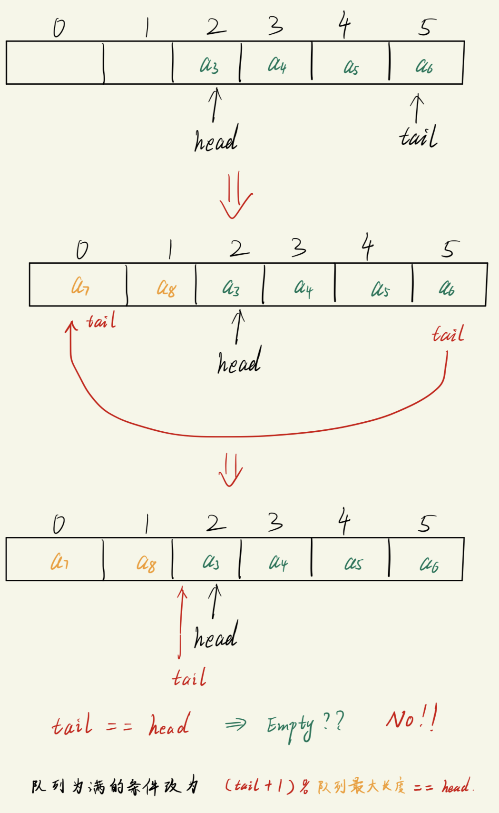

# 队列
队列一般分为两种:
1. 顺序队列
2. 链队列
   - 涉及指针 与 链 的概念.

队列的特点:
- 先进先出 (First In First Out, FIFO), 或 后进后出


队列包含:
- 头(head)
  - 指向`队列中第一个元素`, 或者说, 指向`队列中第一个可用的元素`
  - 元素出队列时, 头指针向后移动
  - **空队列**中, 头尾指针相等

- 尾(tail)
  - 指向`即将存放下一个元素的位置` ==> 超尾指针
  - 元素存入队列时, 尾指针向后移动
  - **空队列**中, 头尾指针相等


# 顺序队列 (循环队列)
从头到尾(从左到右)顺序存放元素的队列.

## 队列经常会遇到的问题 -- 假溢出

- 队列head前面是有可用空间的, 但是tail已经到了最大下标位置.
- 解决办法是改用`循环`的样式:
  - 将 tail 重新指向 0 的位置
  - 浪费一个空间, 用于判断队列是否已满, 此时:
    - 空队列条件: `head == tail`
    - 满队列条件: `(tail + 1) % Q_MAX == head`.  (Q_MAX 是队列的最大长度)
      - 取余的核心思想: `一个不大于 Q_MAX 的数, 与 Q_MAX 取余, 结果一定在 [0, Q_MAX) 之间`, 注意是`左闭右开`区间.

代码例子
C语言版本
```c
#include <stdio.h>

#define SIZE 512
char queue[SIZE];
int head = 0, tail = 0;     // 空队列头尾指针相同

void enqueue(char c);
char dequeue(void);
int isEmpty();
int isFull();

int main(void)
{
    char c = 'A';
    int i;

    // 入队列
    for (i = 0; i < 3; i++)
    {
        if(!isFull()){
            enqueue(c);
            c++;            // 编程 ASCII 码之后, ++ 操作就会顺延一个字符, 变成 B
        }
    }

    // 出队列
    while(!isEmpty()){
        printf("%c", dequeue());
    }
    printf("\n");

    return 0;
}

void enqueue(char c)
{
    queue[tail] = c;
    tail = (tail + 1) % SIZE;
}

char dequeue(void)
{
    char ch;
    ch = queue[head];
    head = (head + 1) % SIZE;
    return ch;
}

int isEmpty()
{
    return head == tail;
}

int isFull()
{
    return (tail+1) % SIZE == head;
}
```

C++版本
头文件
```cpp
#ifndef __QUEUE_H__
#define __QUEUE_H__

#include <iostream>
using namespace std;

template<class T>
class Queue
{
    private:
        int head;
        int tail;
        int maxSIZE;
        T * items;
    public:
        Queue()
        {
            maxSIZE = 512;
            head = tail = 0;
            items = new T[maxSIZE];
        }
        Queue(int m) : maxSIZE(m)
        {
            items = new T[maxSIZE];
            head = tail = 0;
        }
        ~Queue(){delete [] items;}

        bool isFull();
        bool isEmpty();
        void enqueue(const T &t);
        T dequeue(void);
};

template< class T>
bool Queue<T>::isEmpty()
{
    return head == tail;
}

template <class T>
bool Queue<T>::isFull()
{
    return (tail+1) % maxSIZE == head;
}

template <class T>
void Queue<T>::enqueue(const T &t)
{
    if(!isFull()){
        items[tail] = t;
        tail = (tail+1) % maxSIZE;
    }
    else{
        cout << "Your Queue is FULL!" << endl;
    }
}

template <class T>
T Queue<T>::dequeue()
{
    T res;
    if (!isEmpty()){
        res = items[head];
        head = (head + 1) % maxSIZE;
    }
    else{
        cout << "Your Queue is EMPTY!" << endl;
    }
    return res;
}

#endif // !__QUEUE_H__
```

主程序
```cpp
#include "queue.h"

int main(void)
{
    // test full
    Queue<int> q1(1);
    cout << "isFull: " << (q1.isFull() == true ? "true" : "false") << ": ";
    q1.enqueue(1);

    // test empty
    Queue<char> q2(100);
    cout << "isEmpty: " << (q2.isEmpty() == true ? "true" : "false") << ": ";
    q2.dequeue();

    // 出入队列
    char c = 'A';
    for (int i = 0; i < 3; i++)
    {
        if(!q2.isFull()){
            q2.enqueue(c);
            c++;            // 编程 ASCII 码之后, ++ 操作就会顺延一个字符, 变成 B
        }
    }

    while(!q2.isEmpty()){
        cout << q2.dequeue();
    }
    cout << endl;

    return 0;
}
```