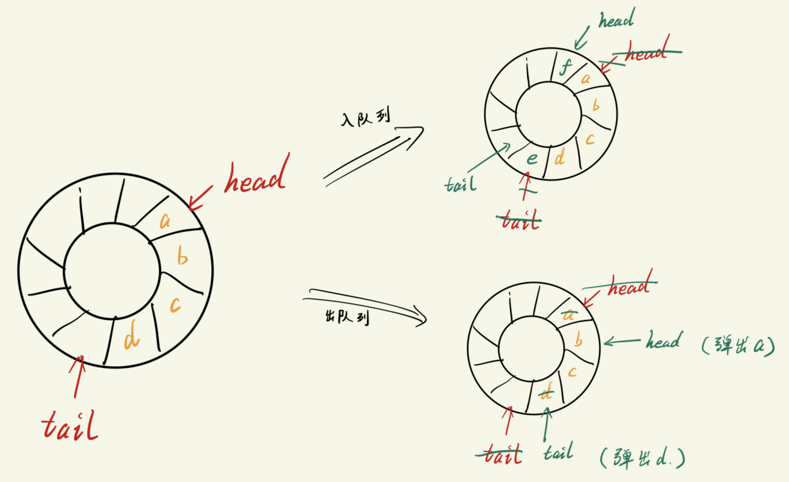
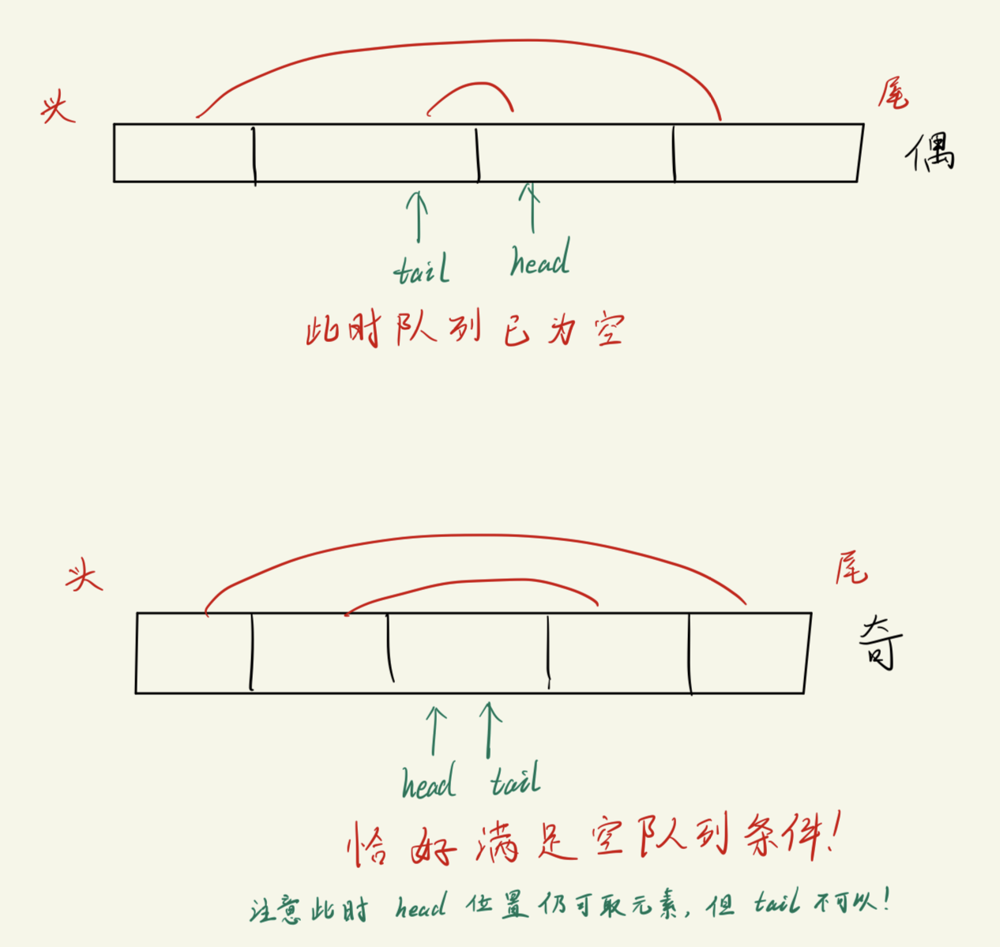

# 双端队列
一种 `head` 和 `tail` 都可以进出队列的数据表示形式.
- 普通队列是: head 负责出队列, tail 负责入队列
- 双端队列则是 head 和 tail 都可以出, 入元素.

循环队列的操作:
- head 端**出**队列
  - head = (head + 1) % max_len
- tail 端**入**队列
  - tail = (tail + 1) % max_len
- 队列是否为满: (tail + 1) % max_len == head
- 队列是否为空: head == tail


双端循环队列操作:
- head 端**出**队列
  ```cpp
    ch = queue[head];                       // 假设 ch 存放了弹出的元素 
    head = (head + 1) % max_len;
  ```
- head 端**入**队列
    ```cpp
    // 增加一个 max_len 是为了获得最末尾的 index
    head = (head -1 + max_len) % max_len;   // 先移动指针
    // 假设将 ch 放入队列
    queue[head] = ch;                       // 在将元素放入队列
    ``` 
- tail 端**出**队列
    ```cpp
    tail = (tail - 1 + max_len) % max_len;  // 先移动指针
    c = queue[tail];                        // 再弹出元素
    ```
- tail 端**入**队列
    ```cpp
    queue[tail] = ch;                       // 先放入元素
    tail = (tail + 1 + max_len) % max_len;  // 再调整指针
    ```
- 队列是否为满
    ```cpp
    // 判断条件与循环队列相同
    head == (tail + 1) % max_len;       
    /*
        (tail + 1) 的原因:
            为了实现 "环" 牺牲掉了一个存放元素的空间.
                主要是为了防止移动 tail 指针时出现 tail == head 的情况, 导致判断条件与判断队列为空相同.
    */ 
    ```
- 队列是否为空
    ```cpp
    // 判断条件与循环队列相同
    head == tail;
    ```


- 主要注意的位置有三个:
  - tail 一直指向一个**空位置** (超尾指针)
  - head 一直指向**有元素的位置**, 并且是队列头
  - 为了获得正确的 index, 在计算时一定记得**加上max_len**, 再取余.

代码实现查看下面的应用例子.

# 应用 -- 判断回文串
使用双端环形队列来实现, 此时只需要`不断将头尾元素出队列并比进行比较`是否相等即可. 但是需要分成两种情况讨论:
1. 对于偶数个字符的情况: 
   - 当判断完中间的一对元素时, 队列将为空; 
     - 注意: 取完元素后, tail 已经落在原来 head 的位置, 而 head 则 移动到了 tail 后面一格.
       - 此时可以发现(看下面的图解), 如果head方向再出队1个元素, 此时会出现 head == tail
         - 注意: 只有head出队是合法的, 而tail不合法, 因为tail本身是一个**超尾指针**.
2. 对于奇数个字符:
   - 当中间一对元素比较完后, 此时队列中剩下1个元素, 并且取完元素后, head 指针将移动到这个元素的所在位置, 而 tail 也是移动到这个元素上.
     - 即: head == tail;



代码实现:
C语言版本:
```c
#include <stdio.h>
#include <string.h>

#define SIZE 512
char queue[SIZE];
int head = 0, tail = 0;     // 空队列头尾指针相同

void tail_enqueue(char c);
char tail_dequeue(void);
void head_enqueue(char c);
char head_dequeue(void);
int isEmpty();
int isFull();

int is_palindrom(char *pt);

int main(void)
{
    char str[100];
    printf("Please enter a string: ");
    gets(str);

    if (is_palindrom(str)){
        printf("str is a palindrom.");
    }
    else{
        printf("str is NOT a palindrom.");
    }
    printf("\n");

    return 0;
}

void tail_enqueue(char c)
{
    queue[tail] = c;
    tail = (tail + 1) % SIZE;
}

char tail_dequeue(void)
{
    tail = (tail - 1 + SIZE) % SIZE;    // 先移动指针, 确保指针指向的位置有元素
    return queue[tail];                 // 取出元素
}

void head_enqueue(char c)
{
    head = (head - 1 + SIZE) % SIZE;   // 先将指针移动到可以存放元素的位置
    queue[head] = c;                   // 存入队列
}

char head_dequeue(void)
{
    char ch = queue[head];              // 先取出元素
    head = (head + 1) % SIZE;           // 再移动指针
    return ch;
}

int isEmpty()
{
    return head == tail;
}

int isFull()
{
    return (tail+1) % SIZE == head;
}

int is_palindrom(char *pt)
{
    int i, len;
    char c1, c2;        // 用于存储待比较的字符
    len = strlen(pt);
    // 所有元素入队列
    for (i = 0; i < len; i++){
        if(!isFull()){
            tail_enqueue(pt[i]);
        }
    }

    // 出队列 & 比较
    while(!isEmpty()){          // 偶数个元素会在这一步退出
        c1 = head_dequeue();    
        if(!isEmpty()){         // 奇数个元素会在一步退出
            c2 = tail_dequeue();
        }
        else{
            break;
        }

        // 判断当前字符
        if (c1 == c2){
            continue;
        }
        else{
            return 0;
        }
    }
    return 1;
}
```

C++版本:
```cpp
#include <string>
#include "double_queue.h"

bool is_palindrom(const string &str)
{
    char c1, c2;
    Queue<char> q1(100);

    // 所有元素入队列
    for (int i = 0; i < str.size(); i++){
        if(!q1.isFull()){
            q1.tail_enqueue(str[i]);
        }
    }

    // 出队 & 比较
    while(!q1.isEmpty()){           // 个数为偶数时, 从这里退出
        c1 = q1.head_dequeue();
        if(!q1.isEmpty()){          // 个数为奇数时, 从这里退出
            c2 = q1.tail_dequeue();
        }
        else{
            break;
        }

        // 判断读取的字符
        if (c1 == c2){
            continue;
        }
        else{
            return false;
        }
    }
    return true;
}

int main(void)
{
    string str;
    cout << "Please enter a string:" << endl;
    getline(cin, str);

    if (is_palindrom(str)){
        cout << str << " is a palindrom." << endl;
    }
    else{
        cout << str << " is NOT a palindrom." << endl;
    }

    return 0;
}
```
