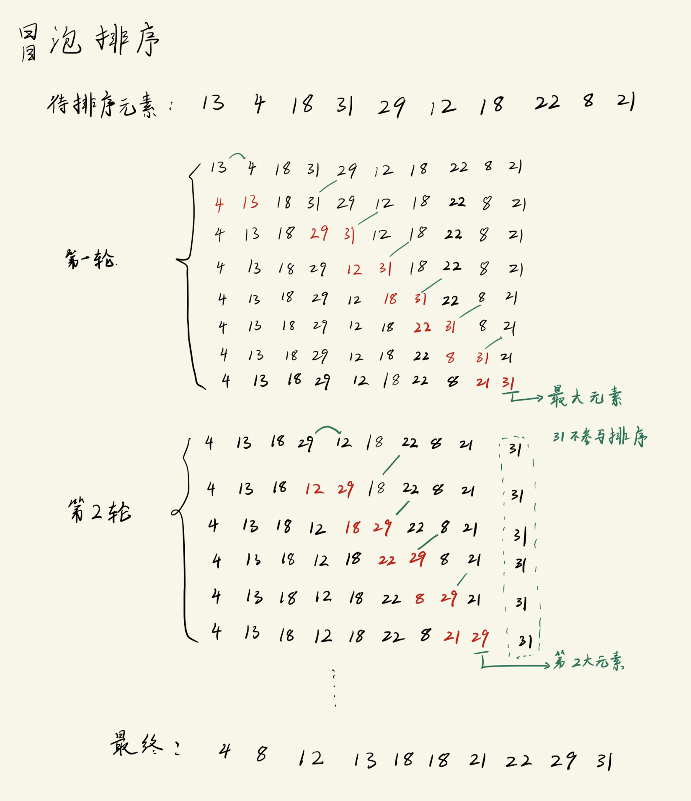

# 冒泡排序
通过两两比较, 如果这两个元素是逆序, 则交换这两个元素. 如果按照从小到大的排序, 则每次处理都会将最大的元素放到末尾.




## 代码实现
```c
#include <stdio.h>
#define SIZE 10 

void BubbleSort(int array[], int n);

int main(void)
{
    int arr[SIZE] = {13, 4, 18, 31, 29, 12, 18, 22, 8, 21};

    printf("Original array: ");
    for (int i = 0; i < SIZE; i++){
        printf("%d ", arr[i]);
    }
    printf("\n");

    // 排序
    BubbleSort(arr, SIZE);

    printf("After sort: ");
    for (int i = 0; i < SIZE; i++){
        printf("%d ", arr[i]);
    }
    printf("\n");
    return 0;
}

void BubbleSort(int array[], int n)
{
    int i,j;
    int temp;

    for (i = 0; i < n-1; i++){              // n个元素只需要比较n-1次
        for (j = 0; j < n-1-i; j++){        // 内层循环要比外层少1次
            if(array[j] > array[j+1]){
                // 交换元素
                temp = array[j+1];
                array[j+1] = array[j];
                array[j] = temp;
            }
        }
    }
}
```


-----------------------

# 快速排序
冒泡排序的缺陷是: 
- 移动的次数很多, 效率低.

核心思想:
```txt
1. 选取数组中的一个元素num, 将数组划分为两个部分, 一个部分的元素全都 "大于等于num", 另一个部分元素都 "小于num"
2. 然后用递归, 对这两部分再次进行划分(在每一个部分里再选一个num进行划分), 直到不能再划分为止
```

操作难点:
```txt
如何选取用于划分的元素num, 选取标准是什么?
- 如果这个元素num选得不好 
    ==> 划分之后, 左半部分有 0 个元素, 右半部分有 n-1 个元素 (n为数组大小)
    ==> 快速排序 退化为 冒泡排序 
```

分组基准元素选取方法:
```txt
1. 取第一个元素
2. 取最后一个元素
3. 取中间元素
4. 取第一个, 最后一个, 中间值的 "中位数"
...

因为是无序数组, 这几种方式并不能直接看出优劣.
```
- 下面用`取第一个元素`的方式进行分析.
    
    - 一开始的时候, 因为i是基准元素, 所以肯定从j开始移动, 移动&交换之后, 此时基准元素跑到了右侧, 并且j指向基准元素, 这时候肯定是移动i才能完成与基准元素的比较, 然后再进行交换, 所以执行的时候是`右->左->右->左...`的规律.

## 代码实现
```c
#include <stdio.h>
#define SIZE 10 

void QuickSort(int array[], int start, int end);

int main(void)
{
    int arr[SIZE] = {13, 4, 18, 31, 29, 12, 18, 22, 8, 21};

    printf("Original array: ");
    for (int i = 0; i < SIZE; i++){
        printf("%d ", arr[i]);
    }
    printf("\n");

    // 排序
    QuickSort(arr, 0, SIZE-1);

    printf("After sort\t: ");
    for (int i = 0; i < SIZE; i++){
        printf("%d ", arr[i]);
    }
    printf("\n");
    return 0;
}

void QuickSort(int array[], int start, int end)
{
    int i = start, j = end;     // i在左, j在右; 基准元素是 start 位置的元素
    int temp;

    while(i < j){
        /* 划分效果: 左测元素 < 基准元素     右侧元素 >= 基准元素 */

        // 移动j, 寻找比i元素小的元素位置
        while(array[i] < array[j] && i < j){
            j--;
        }
        // 交换 array[i] 和 array[j]
        temp = array[j];
        array[j] = array[i];
        array[i] = temp;

        // 移动i, 找出比j元素大的元素位置
        while(array[i] <= array[j] && i < j){
            i++;
        }
        // 交换 array[i] 和 array[j]
        temp = array[j];
        array[j] = array[i];
        array[i] = temp;
    }

    /* 此时i指向基准元素, 递归处理左, 右两个部分 */
    // 递归结束条件
    if(i-1 > start){        // 保证基准点左侧还有元素
        QuickSort(array, start, i-1);
    }

    if(i+1 < end){          // 保证基准点右侧还有元素
        QuickSort(array, i+1, end);
    }
}
```
