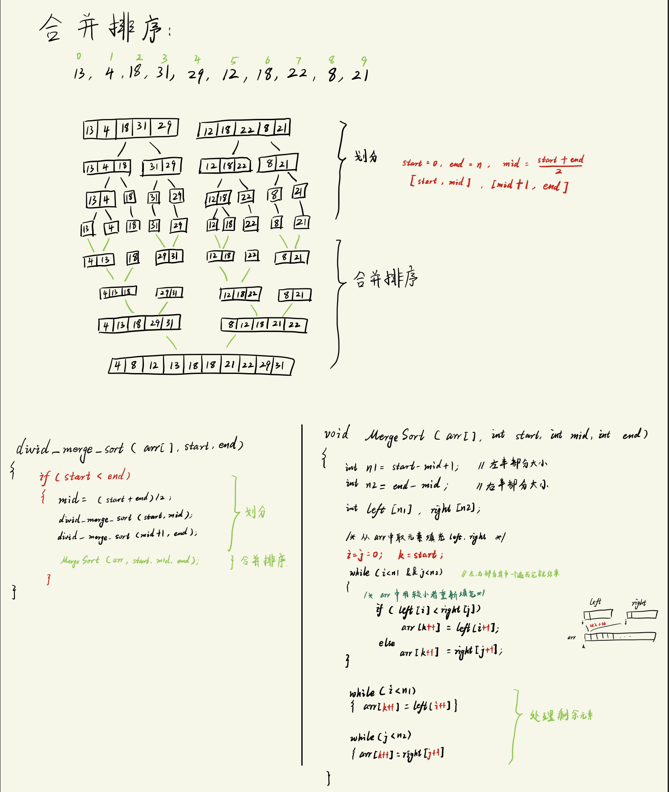

# 合并排序
关键思想在于`分治`.
- 不断把"大问题"拆分成"小问题", 直到小问题能轻松解决, 然后`合并`回去.
  - 在排序问题中, 把整个未排序数组拆成单个元素, 单个元素一定是有序的序列, 然后在合并的过程中边排序边合并.

步骤:
```txt
1. 分解:
    将待排序序列分成 "大小相当" 的两个子序列
        包含分解之后再分解的步骤 ==> 直到每组只有1个元素.
2. 治理:
    对两个子序列进行合并排序
        排序的时候每个部分只有1个元素
3. 将排好序的 有序子序列 进行合并, 最终得到有序序列.
```

过程图解:



## 代码实现
```c
#include <stdio.h>
#define SIZE 10 

void Divid_Merge_Sort(int array[], int start, int end);
void MergeSort(int array[], int start, int min, int end);

int main(void)
{
    int arr[SIZE] = {13, 4, 18, 31, 29, 12, 18, 22, 8, 21};

    printf("Original array\t: ");
    for (int i = 0; i < SIZE; i++){
        printf("%d ", arr[i]);
    }
    printf("\n");

    // 排序
    Divid_Merge_Sort(arr, 0, SIZE-1);

    printf("After sort\t: ");
    for (int i = 0; i < SIZE; i++){
        printf("%d ", arr[i]);
    }
    printf("\n");
    return 0;
}

void Divid_Merge_Sort(int array[], int start, int end)
{
    int mid;
    if(start < end){        // 说明当前数组不止1个元素, 可以细分
        // step1: 分解
        mid = start/2 + end/2;
        Divid_Merge_Sort(array, start, mid);
        Divid_Merge_Sort(array, mid+1, end);

        // step: 合并排序
        MergeSort(array, start, mid, end);
    }
}

void MergeSort(int array[], int start, int mid, int end)
{
    int i, j, k;                 // i指向左半部分, j指向右半部分, k指向结果数组.
    int n1 = mid - start + 1;    // 左半部分元素个数
    int n2 = end - mid;          // 右半部分元素个数: end - (mid+1) + 1
    int left[n1];
    int right[n2];

    // 初始化临时数组
    for(int i = 0; i < n1; i++){
        left[i] = array[start + i];
    }
    for(int j = 0; j < n2; j++){
        right[j] = array[mid+1 + j];
    }

    // 分别比较左右两个部分的元素, 然后重新填入array的k位置中.
    i = j = 0;
    k = start;        // 由于在进行递归, 这里 k 一定不能写错!
    while(i < n1 && j < n2){
        if(left[i] < right[j]){
            array[k++] = left[i++];
        }
        else{
            array[k++] = right[j++];
        }
    }

    // 放入剩余内容
    while(i < n1){          // case: 左半部分还没放完
        array[k++] = left[i++];
    }
    while(j < n2){          // case: 右半部分还没放完
        array[k++] = right[j++];
    }
}
```