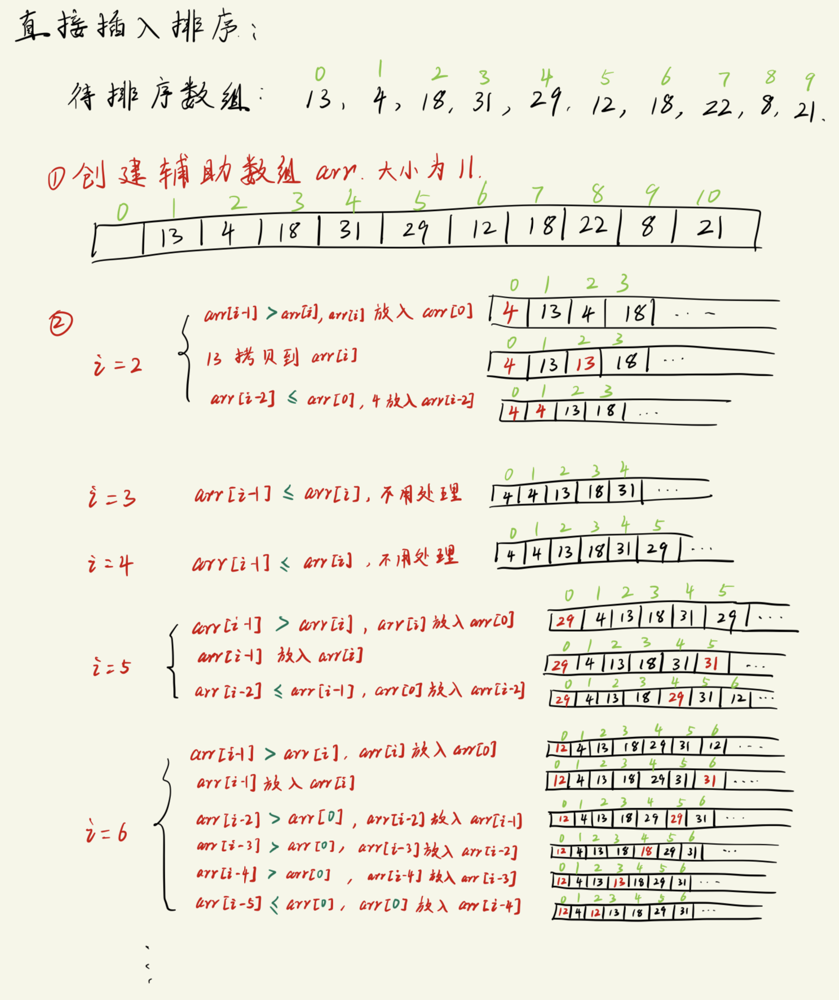
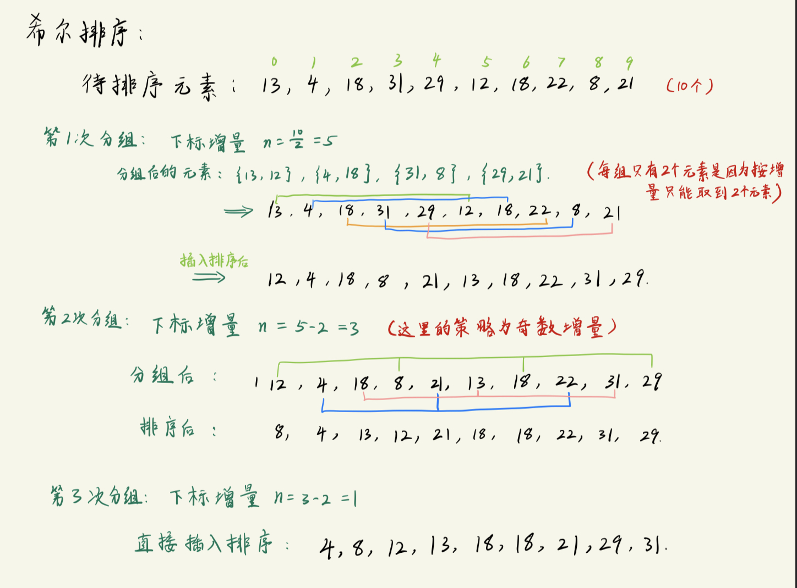

# 直接插入排序(最简单的排序)
适用于:
- 待排序`元素较少`(数据量比较少)
- 整体来说, 数据本身`大部分都有一定的顺序`(数据里面存在一块块的有序数据)

过程分析:
```txt
关键操作: 
    由于数组在内存中是连续存放的, 故当新元素插入时, 插入位置之后的所有元素都需要进行移动.
        元素插入数组的过程可以想象为 "打麻将摸到新牌, 然后往自己的牌序列中放入的过程".

目标: 
    将一个乱序的数组进行 "从小到大" 的排序.

排序逻辑:
    对数组中的第i个元素进行调整时, 若0到i-1位置的元素都已经完成从小到大的排序, 此时只需要将i插入到前面的有序序列中即可. 

操作步骤:
    1. 创建一个辅助数组arr, 辅助数组元素的个数 = 原数组元素个数 + 1 
        因为需要一个位置进行挪移(临时存放需要交换的元素), 故辅助数组大小比原数组多1个.
    2. 现在对辅助数组进行操作:
        假定i为数组arr的遍历下标(且i为当前要插入有序序列新元素), 假定用于交换元素的位置下标为0, 因为要将i插入到i之前的有序序列, 故i应从2开始
            元素i每次要与 i-1 位置的元素进行比较, 如果 arr[i] < arr[i-1], 则将 arr[i] 暂存至 arr[0] 位置, 并继续下列步骤:
                将 arr[i-1] 移动到 arr[i] 位置   (i-1位置的元素往数组后面挪)
                比较 arr[i-2] 和 arr[0], 如果 arr[i-2] > arr[0], 则将 arr[i-2] 挪到 arr[i-1] 位置 (i-2位置的元素往数组后面挪)
                ...
                当 arr[j] < arr[0] 时, 将arr[0]元素放入arr[j+1]位置   (找到适合元素i的位置)
            
            重复以上步骤, 直到 i 遍历到 arr末尾.

            每次遍历的i都往数组的前面找适合的位置放入, 且i之前的元素全部都确保已经排序过, 故i遍历到末尾时, 整个数组都已经排序完成, 此时 arr[1]~arr[end] 就是排序后的答案.
```
操作过程图示:


## 代码实现
核心代码:
```c
void StraightInsertSort(int array[], int n)
{
    // 从 sort[2] 开始进行遍历, 与前面的所有元素进行比较, 由于数组是连续存放的, 故插入元素时需要挪动后面的所有元素
    int i, j;
    for (i = 2; i <= n; i++){        // array 的 0位置 预留出来用于暂存插入元素, 故 i<=n
        if (array[i] < array[i-1]){     // 如果 当前遍历的元素i 比前一个元素小, 则将 array[i] 放入 array[0], 并将 i-1元素 往后移动一位
            array[0] = array[i];
            array[i] = array[i-1];

            // 依次判断前面已排序好的元素(如果存在)是否需要往后挪动
            for(j = i - 2; array[j] > array[0]; j--){    // 注意是往数组的开头方向遍历, 故j--
                array[j+1] = array[j];  // 把元素j数组末尾方向移动一位
            }

            // 已经找到正确的插入位置, 将待插入元素丢进去即可
            array[j+1] = array[0];
        }
    }
}
```

完整代码:
```c
#include <stdio.h>
#define SIZE 10 
#define MAX 100

void StraightInsertSort(int array[], int n);


int main(void)
{
    int arr[SIZE] = {13, 4, 18, 31, 29, 12, 18, 22, 8, 21};

    printf("Original array: ");
    for (int i = 0; i < SIZE; i++){
        printf("%d ", arr[i]);
    }
    printf("\n");

    int sort[MAX +1];       // sort数组是一个辅助数组, 用来做中间排序的转换, 插入排序中需要预留多一个位置用来交换元素, 故+1
    // 拷贝数组
    for(int i = 0; i < SIZE; i++){
        sort[i+1] = arr[i];
    }

    // 执行排序
    StraightInsertSort(sort, SIZE);

    // 把排序结果放回原数组
    for(int i = 0; i < SIZE; i++){
        arr[i] = sort[i+1];
    }

    printf("After sort: ");
    for (int i = 0; i < SIZE; i++){
        printf("%d ", arr[i]);
    }
    printf("\n");

    return 0;
}

void StraightInsertSort(int array[], int n)
{
    // 从 sort[2] 开始进行遍历, 与前面的所有元素进行比较, 由于数组是连续存放的, 故插入元素时需要挪动后面的所有元素
    int i, j;
    for (i = 2; i <= n; i++){        // array 的 0位置 预留出来用于暂存插入元素, 故 i<=n
        if (array[i] < array[i-1]){     // 如果 当前遍历的元素i 比前一个元素小, 则将 array[i] 放入 array[0], 并将 i-1元素 往后移动一位
            array[0] = array[i];
            array[i] = array[i-1];

            // 依次判断前面已排序好的元素(如果存在)是否需要往后挪动
            for(j = i - 2; array[j] > array[0]; j--){    // 注意是往数组的开头方向遍历, 故j--
                array[j+1] = array[j];  // 把元素j数组末尾方向移动一位
            }

            // 已经找到正确的插入位置, 将待插入元素丢进去即可
            array[j+1] = array[0];
        }
    }
}
```

---------------------------------------

# 希尔排序
希尔排序又称为`缩小增量排序`, 核心思想:
1. 按下标增量进行`分组`
2. 对**每一组数据**使用`直接插入排序`.
3. `缩小增量`, 重复步骤1和步骤2, 直到增量为1
    ```txt
    分组: 减少了待排序的数据量.
    对每一组数据数据进行直接插入排序: 数据基本有序, 直接插入排序的执行效率高.
    ```



## 代码实现
核心代码:
```c
void ShellSort(int array[], int n)
{
    int count;      // 一共使用多少个增量
    printf("Please enter the number of increment:\n");
    scanf("%d", &count);

    // 具体增量由用户指定
    int inc[count];
    printf("Please enter %d increment:\n", count);
    for(int i = 0; i < count; i++){
        scanf("%d", &inc[i]);
    }

    // 希尔排序: 按不同增量使用直接插入排序
    for(int i = 0; i < count; i++){
        ShellInsertSort(array, n, inc[i]);

        // debug: 检查一下完成一轮排序之后数组长啥样
        printf("第%d轮排序结果: ", i);
        for(int i = 1; i <= n; i++){
            printf("%d ", array[i]);
        }
        printf("\n");
    }

}

// "希尔增量排序": 本质上也是直接插入排序, 但是这里可以指定增量
void ShellInsertSort(int array[], int n, int inc)
{
    // 从array[1+inc] 开始进行遍历, 与前面的所有元素进行比较, 由于数组是连续存放的, 故插入元素时需要挪动后面的所有元素
    int i, j;
    for (i = 1+inc; i <= n; i++){       // 考虑了增量问题, 故从 1+inc 开始; array 的 0位置 预留出来用于暂存插入元素, 故 i<=n
        if (array[i] < array[i-inc]){   // 考虑增量问题, 相当于进行了分组, 故比较的元素应该是 i-inc
            array[0] = array[i];
            array[i] = array[i-inc];

            // 依次判断前面已排序好的元素(如果存在)是否需要往后挪动
            for(j = i - inc - inc; (j > 0) && (array[j] > array[0]); j -= inc){    // 考虑增量问题, 注意进行排序的元素位置, 防止越界, j要大于0
                array[j+inc] = array[j];                         // 把元素j往数组中后面移动, 且注意是移动后后面的分组元素上
            }

            // 已经找到正确的插入位置, 将待插入元素丢进去即可
            array[j+inc] = array[0];
        }
    }
}
```

完整代码:
```c
#include <stdio.h>
#define SIZE 10 
#define MAX 100

void ShellSort(int array[], int n);
void StraightInsert_Sort(int array[], int n);
void ShellInsertSort(int array[], int n, int inc);

int main(void) 
{
    int arr[SIZE] = {13, 4, 18, 31, 29, 12, 18, 22, 8, 21};

    printf("Original array: ");
    for (int i = 0; i < SIZE; i++){
        printf("%d ", arr[i]);
    }
    printf("\n");

    int sort[MAX +1];       // sort数组是一个辅助数组, 用来做中间排序的转换, 插入排序中需要预留多一个位置用来交换元素, 故+1
    // 拷贝数组
    for(int i = 0; i < SIZE; i++){
        sort[i+1] = arr[i];
    }

    // 执行排序
    ShellSort(sort, SIZE);

    // 把排序结果放回原数组
    for(int i = 0; i < SIZE; i++){
        arr[i] = sort[i+1];
    }

    printf("After sort: ");
    for (int i = 0; i < SIZE; i++){
        printf("%d ", arr[i]);
    }
    printf("\n");

    return 0;
}

// 直接插入排序: 这个函数只能以1为增量, 即直接对整个数组进行排序
void StraightInsert_Sort(int array[], int n)
{
    // 从 array[2] 开始进行遍历, 与前面的所有元素进行比较, 由于数组是连续存放的, 故插入元素时需要挪动后面的所有元素
    int i, j;
    for (i = 2; i <= n; i++){           // i = 2, 本质上就是 (1+增量), 由于这里增量为1, 故i从2开始; array 的 0位置 预留出来用于暂存插入元素, 故 i<=n
        if (array[i] < array[i-1]){     // 如果 当前遍历的元素i 比前一个元素小, 则将 array[i] 放入 array[0], 并将 i-1元素 往后移动一位
            array[0] = array[i];
            array[i] = array[i-1];

            // 依次判断前面已排序好的元素(如果存在)是否需要往后挪动
            for(j = i - 2; array[j] > array[0]; j--){    // 注意是往数组的开头方向遍历, 故j--
                array[j+1] = array[j];                   // 把元素j往数组末尾方向移动一位
            }

            // 已经找到正确的插入位置, 将待插入元素丢进去即可
            array[j+1] = array[0];
        }
    }
}

void ShellSort(int array[], int n)
{
    int count;      // 一共使用多少个增量
    printf("Please enter the number of increment:\n");
    scanf("%d", &count);

    // 具体增量由用户指定
    int inc[count];
    printf("Please enter %d increment:\n", count);
    for(int i = 0; i < count; i++){
        scanf("%d", &inc[i]);
    }

    // 希尔排序: 按不同增量使用直接插入排序
    for(int i = 0; i < count; i++){
        ShellInsertSort(array, n, inc[i]);

        // debug: 检查一下完成一轮排序之后数组长啥样
        printf("第%d轮排序结果: ", i);
        for(int i = 1; i <= n; i++){
            printf("%d ", array[i]);
        }
        printf("\n");
    }

}

// "希尔增量排序": 本质上也是直接插入排序, 但是这里可以指定增量
void ShellInsertSort(int array[], int n, int inc)
{
    // 从array[1+inc] 开始进行遍历, 与前面的所有元素进行比较, 由于数组是连续存放的, 故插入元素时需要挪动后面的所有元素
    int i, j;
    for (i = 1+inc; i <= n; i++){       // 考虑了增量问题, 故从 1+inc 开始; array 的 0位置 预留出来用于暂存插入元素, 故 i<=n
        if (array[i] < array[i-inc]){   // 考虑增量问题, 相当于进行了分组, 故比较的元素应该是 i-inc
            array[0] = array[i];
            array[i] = array[i-inc];

            // 依次判断前面已排序好的元素(如果存在)是否需要往后挪动
            for(j = i - inc - inc; (j > 0) && (array[j] > array[0]); j -= inc){    // 考虑增量问题, 注意进行排序的元素位置, 防止越界, j要大于0
                array[j+inc] = array[j];                         // 把元素j往数组中后面移动, 且注意是移动后后面的分组元素上
            }

            // 已经找到正确的插入位置, 将待插入元素丢进去即可
            array[j+inc] = array[0];
        }
    }
}
```
