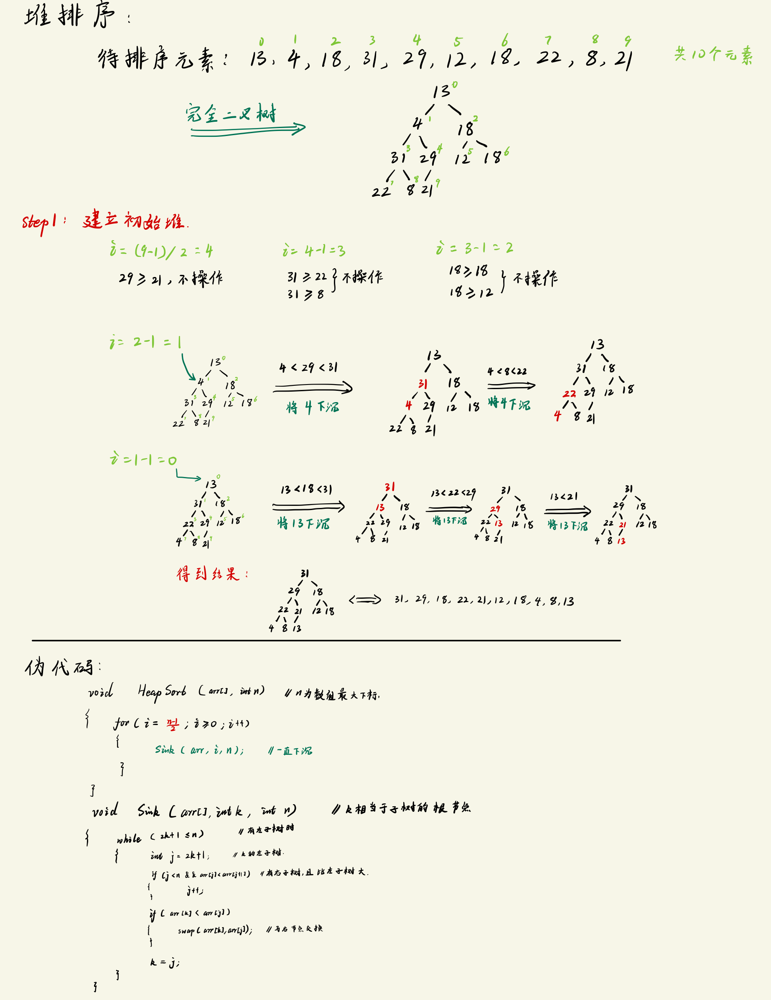
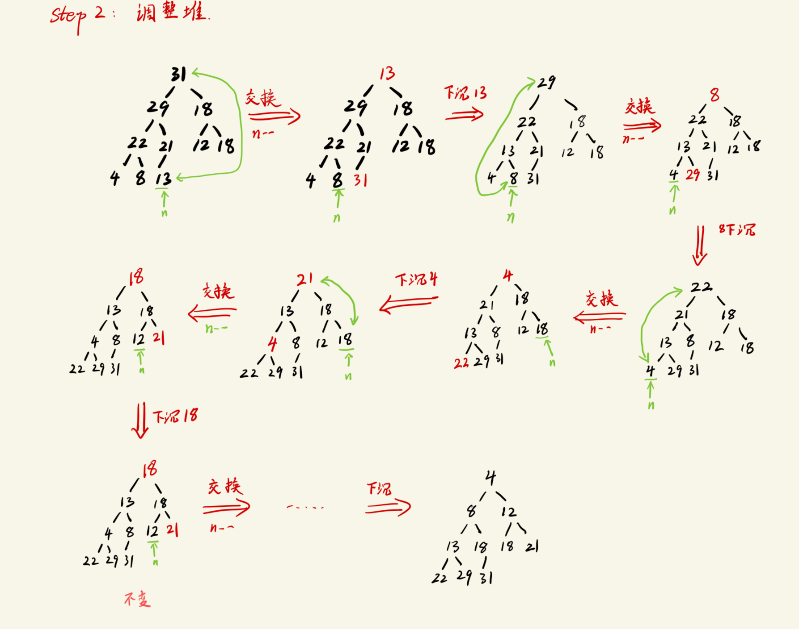

# 简单选择排序
核心思想:
```txt
1. 在 **未排序的序列** 中, 找到最小(或最大)的元素, 放到排序序列的起始位置
2. 再从剩余未排序元素中继续寻找最小(或最大)的元素, 然后放到已排序序列的末尾
3. 重复1和2, 直到所有元素排序结束.

注: 
    从小到大排序 ==> 每次取最小的元素
    从大到小排序 ==> 每次取最大的元素

    一共 n 个元素的话, 只需要循环 n-1 次
```

## 代码实现
```c
#include <stdio.h>
#define SIZE 10 

void SimpleSelectSort(int array[], int n);

int main(void)
{
    int arr[SIZE] = {13, 4, 18, 31, 29, 12, 18, 22, 8, 21};

    printf("Original array\t: ");
    for (int i = 0; i < SIZE; i++){
        printf("%d ", arr[i]);
    }
    printf("\n");

    // 排序
    SimpleSelectSort(arr, SIZE);

    printf("After sort\t: ");
    for (int i = 0; i < SIZE; i++){
        printf("%d ", arr[i]);
    }
    printf("\n");
    return 0;
}

void SimpleSelectSort(int array[], int n)
{
    int i;          // 指向已排序序列的末尾, 也指向当前遍历的元素
    int j;          // 指向未排序序列的起始位置.
    int min;        // 存放每一轮循环中最小元素的下标 
    int temp;

    for(i = 0; i < n-1; i++){
        min = i;                        // 假设一开始 i 就是最小的元素
        for(j = i+1; j < n; j++){       // 从i后一个开始比较, 找符合条件的元素
            if(array[j] < array[min]){
                min = j;
            }
        }

        // 将最小的元素放到已排序序列末尾
        if(i != min){                   // i如果是最小元素, 就没必要交换了
            temp = array[i];
            array[i] = array[min];
            array[min] = temp;
        }
    }
}
```

------------------------------------------

# 堆排序
堆 -> 类似一个金字塔的形状 -> 二叉树 -> 属于使用图结构的排序方法.

## 原理
### 辅助概念
- 完全二叉树
    ```txt
    除最底层之外, 每一层都的节点都有左子树和右子树(都是"满"的), 且最后一层的节点是"从左到右"依次放满的.

    如:
        待排序的数组是: 13, 4, 18, 31, 29, 12, 18, 22, 8, 21

        构建出来的完全二叉树为:
                   13
                /     \
              4       18
            /   \     /  \
          31    29  12  18
         /  \  / 
       22   8 21   

        此时, 如果按照 "从上到下, 从左到右" 的顺序编号, 这个完全二叉树的 index 与 待排序数组的 index 是完全对应的.

        - 故, 在进行排序的时候, 我们理解它的执行过程时使用完全二叉树的样子去理解, 但是代码中并不需要创建二叉树(代码操作的时候直接对数组进行操作即可).

        - 此时, 经过分析可以发现:
            - 节点 n 对应的根节点下标的计算方式为: 
                index = (n-1)/2    // 取整
    ```

- 大顶堆(最大堆)
    ```txt
    二叉树根节点的元素比左右子树的节点都要大.
    - 在这里也就是完全二叉树的根节点最大.
    ```

- 小顶堆(最小堆)
    ```txt
    二叉树根节点的元素比左右子树的节点都要小.
    - 在这里也就是完全二叉树的根节点最小.
    ```

### 排序过程
排序采用`从小到大`的顺序.

1. 建立初始堆(这里**以大顶堆进行分析**)
   - 最大的元素放到整个完全二叉树的根节点位置. (数组第一个元素) 
     - 涉及概念 -- `下沉`
       - 对于每一个子二叉树, 如果**左右子树的元素比根节点小**, 则将较小的元素与根节点交换.
     - 操作:
       - 判断哪些顶点元素比左右子树小 然后 对该节点进行`下沉`: 
         - 如果待排序元素`最后一个元素下标为n`, 则从 `(n-1)/2` 开始遍历(此时i位于最末尾元素的对应子树的根节点位置)
         - 如果 i 对应元素比左右子树大, 则 i--, 并继续比较 i 与左右子树元素的大小, 当遇到根节点较小的情况时, 将根节点不断进行`下沉`, 直到没有满足条件的子树为止.

    - 处理流程图示:
    

2. 调整初始堆
   - 将`堆顶元素(index 为 0)`与`堆底元素(index 为 n)`互换, 并将堆底元素设置为不可操作
     - 实现了当前最大元素放到数组末尾, 此时不应该再动这个元素
       - 锁定的方式可以是将可操作元素的最大下标设置为 n-1
   - 将`堆顶元素`下沉
   - 重复上述两个步骤, 直到`n = 0`为止 
     - 每次循环将确定一个当前可操作范围内的最大元素
   - 处理流程图示:
    

## 代码实现

- 建立初始堆部分
    ```c
    void Sink(int array[], int k, int n)
    {
        while( 2*k + 1 <= n){                       // 检查有没有左子树, 如有, 则进入循环
            int j = 2*k + 1;                        // j此时表示当前遍历到的左子树节点

            // 找左右子树中最大的节点下标
            if( j < n && array[j] < array[j+1]){    // j < n 说明一定有右子树; 右子树比左子树大
                j++;                                // j此时改为右子树节点
            }

            // 根节点与左右子树最大者进行比较
            if(array[k] > array[j]){                // 根节点比左右子树都大, 此时不需要下沉
                break;
            }
            else{
                Swap(&array[k], &array[j]);         // 交换节点元素, 注意传入的是地址! 
            }

            // 更新当前遍历的根节点
            k = j;
        }
    }

    void Swap(int * a, int *b)
    {
        int temp = *a;
        *a = *b;
        *b = temp;
    }
    ```

- 调整堆结构
    ```c
    void HeapkSort(int array[], int n)
    {
        // step1: 创建初始堆
        for(int i = (n-1)/2; i >=0; i--){
            Sink(array, i, n);          // 对每一个遍历的节点都调用下沉函数(只有满足条件的节点才会下沉)
        }

        // step2: 调整堆结构
        while(n > 0){
            // 交换: 堆顶元素 与 堆底元素 交换
            Swap(&array[0], &array[n]);
            // 将刚操作的元素锁定 (已排序不能再操作)
            n--;
            // 下沉: 此时的堆顶元素下沉
            Sink(array, 0, n);

        }
    }
    ```


完整代码:
```c
#include <stdio.h>
#define SIZE 10 

void HeapkSort(int array[], int n);     // n 是数组最大下标
void Sink(int array[], int k, int n);   // 将节点k进行下沉(k是子二叉树根节点), n表示数组最大下标
void Swap(int * a, int *b);             // 交换节点元素


int main(void)
{
    int arr[SIZE] = {13, 4, 18, 31, 29, 12, 18, 22, 8, 21};

    printf("Original array\t: ");
    for (int i = 0; i < SIZE; i++){
        printf("%d ", arr[i]);
    }
    printf("\n");

    // 排序
    HeapkSort(arr, SIZE-1);

    printf("After sort\t: ");
    for (int i = 0; i < SIZE; i++){
        printf("%d ", arr[i]);
    }
    printf("\n");
    return 0;
}

void HeapkSort(int array[], int n)
{
    // step1: 创建初始堆
    for(int i = (n-1)/2; i >=0; i--){
        Sink(array, i, n);          // 对每一个遍历的节点都调用下沉函数(只有满足条件的节点才会下沉)
    }

    // step2: 调整堆结构
    while(n > 0){
        // 交换: 堆顶元素 与 堆底元素 交换
        Swap(&array[0], &array[n]);
        // 将刚操作的元素锁定 (已排序不能再操作)
        n--;
        // 下沉: 此时的堆顶元素下沉
        Sink(array, 0, n);

    }
}

void Sink(int array[], int k, int n)
{
    while( 2*k + 1 <= n){                       // 检查有没有左子树, 如有, 则进入循环
        int j = 2*k + 1;                        // j此时表示当前遍历到的左子树节点

        // 找左右子树中最大的节点下标
        if( j < n && array[j] < array[j+1]){    // j < n 说明一定有右子树; 右子树比左子树大
            j++;                                // j此时改为右子树节点
        }

        // 根节点与左右子树最大者进行比较
        if(array[k] > array[j]){                // 根节点比左右子树都大, 此时不需要下沉
            break;
        }
        else{
            Swap(&array[k], &array[j]);         // 交换节点元素, 注意传入的是地址! 
        }

        // 更新当前遍历的根节点
        k = j;
    }
}

void Swap(int * a, int *b)
{
    int temp = *a;
    *a = *b;
    *b = temp;
}
```
