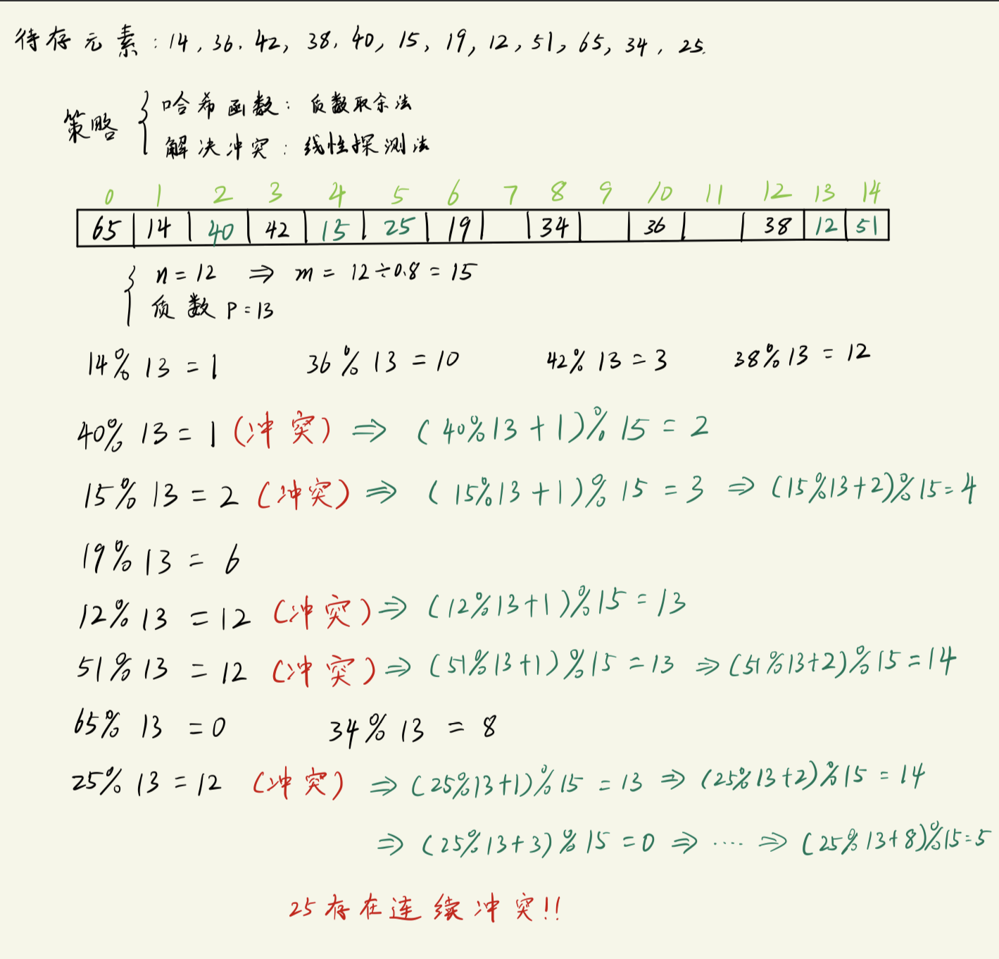
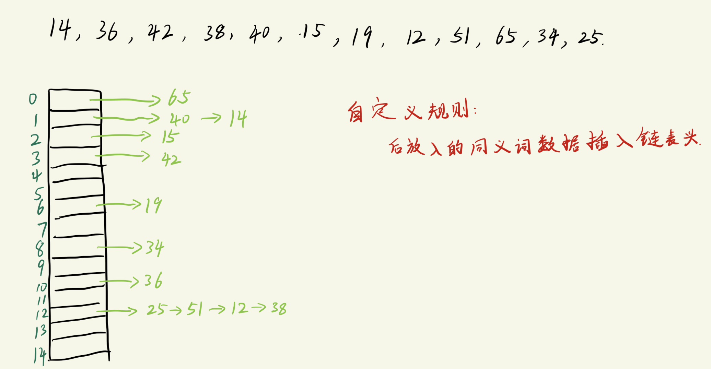
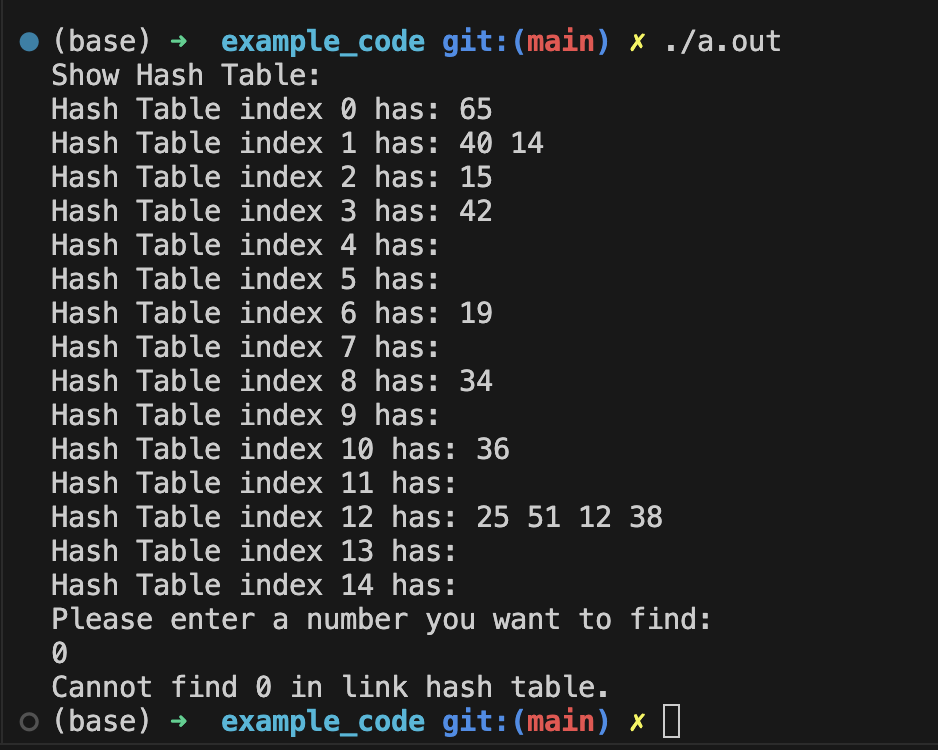

# 哈希表(Hash Table)
哈希表也称为"散列表".

线性查找, 树表查找(包括二叉搜索树/平衡二叉搜索树)都是基于`比较`进行查找的, 每次比较都会有点慢, 故希望找到一种`不基于比较的查找方式` --> 哈希表.
- 哈希表是通过`计算(或映射)进行查找`的.
  - key(待查找值) 与 存储位置 之间存在映射关系.
  - 计算的方式称为`哈希函数 H()`.
    - H(key) ==> 存储位置 ==> 得到查找结果

在使用哈希函数进行计算时, 很可能出现如下情况:
```txt
H(key1) == H(key2)    // 这种情况称为 "冲突", 同时 key1 和 key2 称为 "同义词"
```
- 冲突不可避免, 只能尽可能减少冲突, 一般在使用哈希表时要考虑如下两种操作:
  - 预防措施: 选取适当的哈希函数来减少冲突
  - 解决措施: 冲突发生时, 解决冲突


## 哈希函数的选取
1. 直接地址法
2. 平方取中法
3. 叠加法
4. 保留余数法
   - 最成熟的方法(本笔记主要介绍这种方法)
5. 随机函数法


### 保留余数法 (质数除余法)
```txt
假设有一个Hash空间, 最多可以存放 m个元素, 选取一个 "不大于m" 的 "最大质数p", 做如下操作:
    key % p = 余数
        此时这个余数就是key在哈希表中的存储位置.

此时预防冲突的措施是:
    哈希填充因子为 70% ~ 80%
        
    哈希填充因子的计算公式为: alpha = n/m   (n 为哈希表中填充的元素个数, m为哈希表总的空间大小)

举例:
如果我们有12个元素要存放, 此时根据哈希填充因子的经验值80%, 我们可以知道应该创建能存放15个元素的空间, 
此时, 为了防止冲突, 也是根据选择质数规则得到 p = 13 (此时算出来的余数范围是 0~12)
    那么, 元素5的存放地址就是 5%13 = 5, 因此该元素存放的地址就是5了.
```

----
## 解决哈希冲突的方式
1. 开放地址法
    ```txt
    包含:
        - 线性探测法 (最简单的方法, 本笔记主要介绍这种方法)
        - 二次探测法
        - 随机探测法
    ```
2. 链地址法
3. 建立公共溢出区


### 开放地址法
线性探测法 -- 最简单的方法 
```txt
如果key1 和 key2 冲突, 即 H(key1) == H(key2), 线性探测法的解决方法是:

    ( H(key1) + offset ) % m          // 注意不再是除以质数p, 而是除以整个哈希空间的大小m

    其中, offset 也叫增量步长, 取值范围是 1, 2, 3, ..., (m-1)
```
- 优点是总能找到一个地方放入冲突的元素
  - 因为哈希填充因子的规定, 总是存在空余的位置
- 缺点是可能存在堆积
  - 某些位置堆放很紧凑, 其他位置可能很稀疏; 如果存放很紧凑, 那么在寻找位置的时候就需要计算多次才能找到空的地方, 也就是遇到连续冲突.


二次探测法:
```txt
在线性探测法的基础上, 将 offset 的取值范围改成:
    1^2, (-1)^2, 2^2, (-2)^2, 3^2, (-3)^2 ..., (m-1)^2, (-m+1)^2

    正负号分别表示 往右走 和 往左走
```
- 优点是元素堆积(冲突堆积)的可能性变低


#### 哈希表构建过程 -- 线性探测
使用的哈希函数是`质数取余法`, 解决冲突的方法是`线性探测法`



#### 代码实现 -- 线性探测

线性探测法核心代码:
```c
int line_detect(int HT[], int H0, int key)
{
    int Hi;
    for (int offset = 1; offset <= M; offset++){
        Hi = (H0 + offset) % M;
        if(HT[Hi] == -1){           // 这个分支用来寻找不冲突的位置 ==> 用于插入新元素
            return Hi;
        }
        else if(HT[Hi] == key){     // 这个分支用来寻找key的位置 ==> 用于查找元素
            return Hi;
        }
    }
    return -1;                      // 由于哈希填充因子的存在, 创建的哈希空间总是要多一些的, 所以返回-1的情况几乎不会发生.
}
```

查找元素核心代码:
```c
int search_hashtable(int HT[], int key)
{
    int Hi = -1;                // 存放找到的元素位置
    int H0 = hash(key);

    if(-1 == HT[H0]){           // 不存在这个值
        return -1;
    }
    else if(HT[H0] == key){     // 无冲突
        return H0;
    }
    else{                       // 出现过冲突
        Hi = line_detect(HT, H0, key);       // 使用线性探测法中的查找分支
        if(HT[Hi] == key){
            return Hi;
        }
        else{
            return -1;
        }
    }
}
```

完整代码:
```c
#include <stdio.h>
#include <stdlib.h>

#define SIZE 12         // 欲存放的元素个数
#define M 15            // 哈希空间大小
#define P 13            // 不大于M的最大质数

// ------------- 函数声明 -------------
int hash(int key);                              // 哈希函数
int insert_hashtable(int HT[], int key);        // 往哈希表中插入新元素
int line_detect(int HT[], int H0, int key);     // 线性探测法
void show_hashtable(int HT[], int m);           // 显示哈希表内容
int search_hashtable(int HT[], int key);        // 查找元素

// ------------- main ----------------
int main(void)
{
    int arr[SIZE] = {14, 36, 42, 38, 40, 15, 19, 12, 51, 65, 34, 25};
    int HT[M] = {-1, -1, -1, -1, -1, -1, -1, -1, -1, -1, -1, -1, -1, -1, -1};                   // Hash Table
    int num = 0;
    int result;

    for(int i = 0; i < SIZE; i++){
        if (insert_hashtable(HT, arr[i]) != 1){
            printf("Fail to create Hash Table.\n");
            return 0;
        }
    }

    printf("Show Hash Table:\n");
    show_hashtable(HT, M);

    printf("Please enter a number you want to find in Hash Table: ");
    scanf("%d", &num);
    result = search_hashtable(HT, num);
    if(result != -1){
        printf("Find %d in position %d.\n", num, result);
    }
    else{
        printf("Cannot find %d in hash table.\n", num);
    }

    return 0;
}

// ------------ 函数实现 ----------------
int insert_hashtable(int HT[], int key)
{
    int index = hash(key);
    int Hi;

    if(HT[index] == -1){        // 无冲突
        HT[index] = key;
        return 1;
    }
    else{                       // 有冲突
        Hi = line_detect(HT, index, key);       // 使用线性探测法中的插入新元素分支
        if(-1 != Hi){
            HT[Hi] = key;
            return 1;
        }
    }
    return 0;
}

int hash(int key)
{
    return key % 13;
}

int line_detect(int HT[], int H0, int key)
{
    int Hi;
    for (int offset = 1; offset <= M; offset++){
        Hi = (H0 + offset) % M;
        if(HT[Hi] == -1){           // 这个分支用来寻找不冲突的位置 ==> 用于插入新元素
            return Hi;
        }
        else if(HT[Hi] == key){     // 这个分支用来寻找key的位置 ==> 用于查找元素
            return Hi;
        }
    }
    return -1;                      // 由于哈希填充因子的存在, 创建的哈希空间总是要多一些的, 所以返回-1的情况几乎不会发生.
}

void show_hashtable(int HT[], int m)
{
    for(int i = 0; i < M; i++){
        printf("%d\t", HT[i]);
    }
    printf("\n");
}

int search_hashtable(int HT[], int key)
{
    int Hi = -1;                // 存放找到的元素位置
    int H0 = hash(key);

    if(-1 == HT[H0]){           // 不存在这个值
        return -1;
    }
    else if(HT[H0] == key){     // 无冲突
        return H0;
    }
    else{                       // 出现过冲突
        Hi = line_detect(HT, H0, key);       // 使用线性探测法中的查找分支
        if(HT[Hi] == key){
            return Hi;
        }
        else{
            return -1;
        }
    }
}
```

### 链式地址法 (链式哈希)
链式哈希指的是:
- 当出现冲突时, 将`所有冲突的key存放到同一个链表`中.
  - 查找 & 删除 都在这个链表中完成.



- 新插入的同义词(哈希值冲突的元素)在链表中的插入方式可以根据需要修改.

-------------------------------------

#### 代码实现
完整代码:
```c
#include <stdio.h>
#include <stdlib.h>

#define SIZE 12
#define M 15
#define P 13

// ------ 定义链表结构 -----
struct node
{
    unsigned int elem;
    struct node *next;
};

// -------- 函数声明 ----------
int hash(int key);                                            // 哈希函数
void insert_hashtable(struct node * HT[], int key);           // 插入新节点
void show_hashtable(struct node * HT[], int m);
int search_hashtable(struct node * HT[], int key);

// -------- main ----------
int main(void)
{
    int arr[SIZE] = {14, 36, 42, 38, 40, 15, 19, 12, 51, 65, 34, 25};
    int num, result;

    // 哈希表: 这是一个指针数组, 此时这个数组的每一个元素应该是一个链表节点指针, 指向链表头.
    struct node * HT[M] = {NULL, NULL, NULL, NULL, NULL, NULL, NULL, NULL, NULL, NULL, NULL, NULL, NULL, NULL, NULL}; 

    for(int i = 0; i < SIZE; i++){
        insert_hashtable(HT, arr[i]);
    }

    printf("Show Hash Table:\n");
    show_hashtable(HT, M);

    printf("Please enter a number you want to find:\n");
    scanf("%d", &num);
    result = search_hashtable(HT, num);
    if(result == 1){
        printf("Find %d in link hash table.\n", num);
    }
    else{
        printf("Cannot find %d in link hash table.\n", num);
    }
    return 0;
}

// -------- 函数实现 ------------
void insert_hashtable(struct node * HT[], int key)
{
    int index = hash(key);
    struct node *pt = (struct node *) malloc(sizeof(struct node));   // 开辟节点需要的空间
    pt->elem = key;
    pt->next = HT[index];  // 接入原来的表头

    HT[index] = pt;  // 更新表头
}

int hash(int key)
{
    return key % P;
}

void show_hashtable(struct node * HT[], int m)
{
    struct node * pt;
    for (int i = 0; i < m; i++){
        printf("Hash Table index %d has: ", i);
        // 遍历链表
        for (pt = HT[i]; pt != NULL; pt = pt->next){
            printf("%d ", pt->elem);
        }
        printf("\n");
    }
}

int search_hashtable(struct node * HT[], int key)
{
    int index = hash(key);
    struct node * pt;
    for(pt = HT[index]; pt != NULL; pt = pt->next){
        if(pt->elem == key){
            return 1;
        }
    }
    return 0;
}
```

程序输出:


