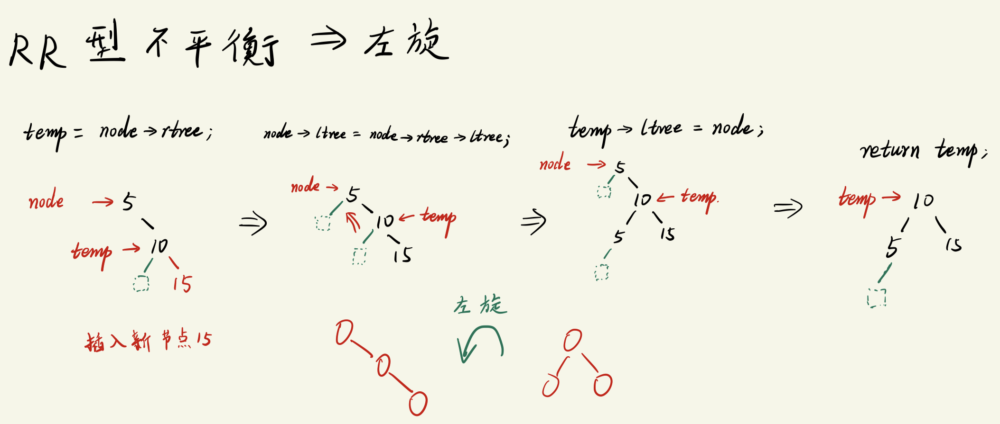
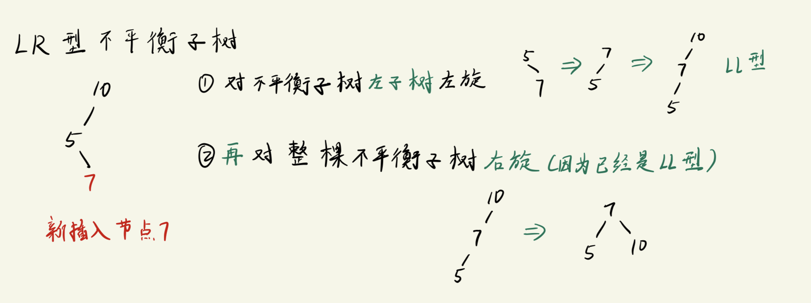
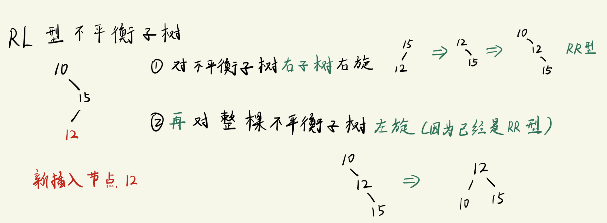
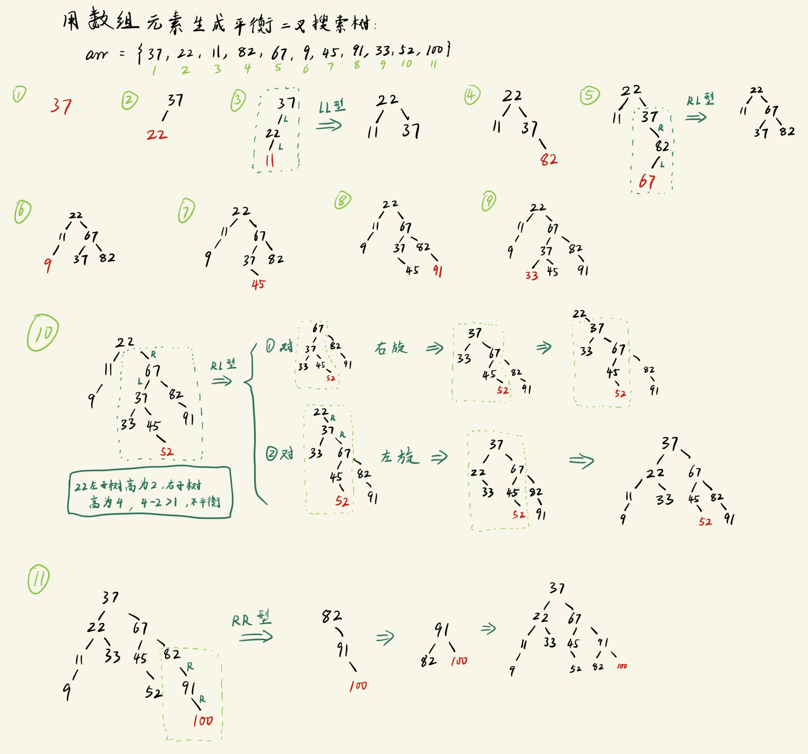
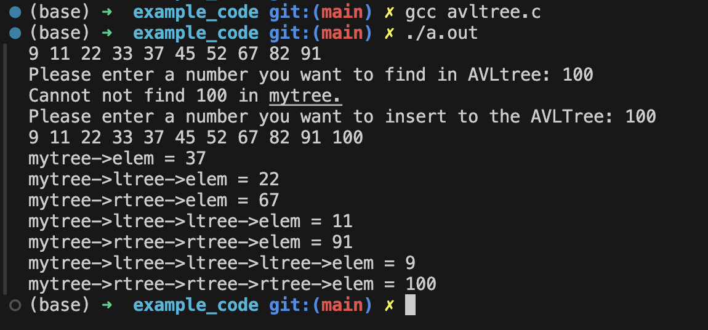
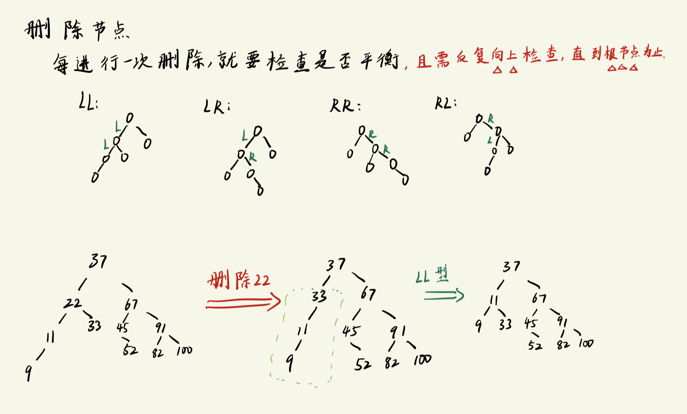
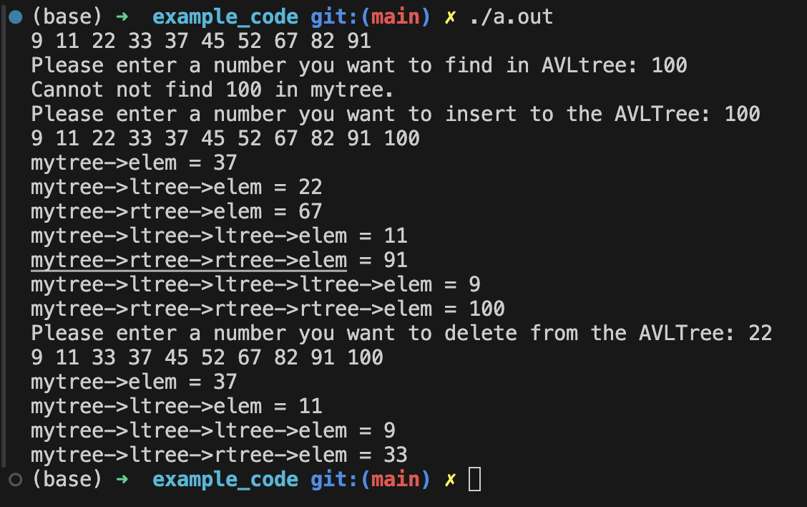

# 平衡二叉搜索树

平衡二叉搜索树: 
- Balance Binary Search Tree, BBST
- 也叫 `AVL`, 这是两个前苏联科学家的名字组合.


背景:
```txt
对于一颗二叉搜索树而言:
    如果它只有左子树或者只有右子树, 此时, 最坏的情况是我们需要遍历所有节点才能找到我们的目标节点, 这时候, 搜索这棵树就等同于 "暴力枚举", 效率极差.

    最好的情况则是, 这棵树刚好等同与二分查找, 此时, 最坏的情况下我们也只需要遍历大约一半的节点.

由此, 我们可以得出一个结论:
    如果二叉搜索的高度越高, 它的检索效率越差. 
        高度指的是它向下延伸的长度.
        
那么, 我们能不能找到一种方法, 将二叉搜索树的高度降低?  ===> 将二叉搜索树变成平衡二叉搜索树. 
```

平衡二叉搜索树:
```txt
二叉树的 "平衡" 概念: 
    二叉树的左右子树的高度接近一致.

    理想的平衡状态(很少, 不常见): 左右子树高度完全一致.

    一般的平衡状态(常见): 任意一个节点的左右子树的 "高度差" 不超过1.

平衡二叉搜索树的特性:
- 左右子树的 高度差不超过1
- 左右子树也分别是 平衡二叉搜索树.
    - 注意: 有时候只有单个子树是平衡二叉搜索树, 此时整棵树 并不是 平衡二叉搜索树
```

最小不平衡子树:
```txt
以 "新插入节点" 出发, 找到使得当前子树不平衡的节点, 以该节点作为根节点, 到新插入节点所形成的子树就是 "最小不平衡子树".
    - 最小不平衡子树 就是我们将一颗二叉树调整为平衡二叉树的处理对象.
```
- 下图为其中一种最小不平衡子树 -- LL型 :


## 调整平衡二叉搜索树
要将一个二叉搜索树调整为平衡二叉搜索树, 有两个关键步骤:
1. 计算**插入新增节点后**的`左右子树高度`, 用来判断是否平衡.
2. 如果新增节点使得树不平衡, 则需要`调整结构, 使得树重新平衡`.


-------------------------------------

### 计算树的高度
```txt
分成以下4种情况:
1. 传入的二叉树为空: 
    返回高度0
2. 传入的二叉树只有根节点:
    返回高度 1
3. 传入的二叉树右子树高度 > 左子树高度:
    返回右子树高度 + 1
4. 传入的二叉树右子树高度 <= 左子树高度:
    返回左子树高度 + 1

    case 3 和 case 4 需要使用递归.
```

代码实现:
```c
// 计算当前输入的树的 "高度"
int GetAVLTreeHeight(struct AVLTree_node * tree)
{
    if(tree != NULL){
        if(tree->ltree == NULL && tree->rtree == NULL){     // 只有根节点
            return 1;
        }
        else if(GetAVLTreeHeight(tree->rtree) > GetAVLTreeHeight(tree->ltree)){
            return  GetAVLTreeHeight(tree->rtree) + 1;      // 如果右子树高度 > 左子树, 则直接返回右子树高度 + 1  (由于采用了递归, 高度会被累计的)
        }
        else{                                               // 右子树高度 <= 左子树高度 
            return  GetAVLTreeHeight(tree->ltree) + 1;
        }
    }
    else{
        return 0;
    }
}
```


---------------------------------------------------

### 调整不平衡二叉树(LL型)
能计算树的高度之后, 接下来就是对树进行调整, 我们调整的目标是`最小不平衡子树`.
- 最小不平衡子树: 从新插入节点到失衡节点之间的子树.

- LL型指的是: 从**失衡点到新插入节点**的`前两个路径`都是**左子树**(如下图) 
    
    - 对于这种子树, 调整时需要进行`右旋`.
    

代码实现 -- 核心代码:
```c
struct AVLTree_node * LL_Rotation(struct AVLTree_node *node)
{
    struct AVLTree_node * temp = NULL;      // temp 是调整后的新树的根节点

    /* 下面将以 temp节点 为轴, 进行右旋 */

    // step1: node的左子树 赋值给 temp (相当于备份了一下节点的地址)
    temp = node->ltree;

    // step2: 将 node的左子树的右子树 挪动到 node的左子树位置(第一步已经备份过地址, 这里可以安全地覆盖)
    node->ltree = node->ltree->rtree;

    // step3: 让 temp的右子树 设置为 node 节点
    temp->rtree = node;

    return temp;
}
```

----------------------------------------------------------------

### 调整不平衡二叉树(RR型)
这里的RR型指的是: 在不平衡二叉树中, 从新插入节点到失衡点之间的最小不平衡子树的`前两个路径都是右子树`.



代码实现 -- 核心代码:
```c
struct AVLTree_node * RR_Rotation(struct AVLTree_node *node)
{
    struct AVLTree_node * temp = NULL;

    // step1: node的右子树赋给 temp
    temp = node->rtree;

    // step2: node的右子树的左子树 挪动到 node的左子树位置
    node->rtree = node->rtree->ltree;

    // step3: temp的左子树 设置为 node 节点
    temp->ltree = node;

    return temp;
}

```

-----------------------------------------------------

### 调整不平衡二叉树(LR型)
这里的LR型指的是: 在不平衡二叉树中, 从新插入节点到失衡点之间的最小不平衡子树的`前两个路径分别是左子树和右子树`.

此时调整的操作为:
```txt
1. 对不平衡子树的 左子树部分(第二个路径) 进行 "左旋"  =====> 此时, 不平衡子树将变成LL型
2. 再对不平衡子树进行一次 "右旋" 
```


- 这个过程可简单理解为: 先将弯折部分捋直, 再整体调整.


代码实现 -- 核心代码:
```c
struct AVLTree_node * LR_Rotation(struct AVLTree_node *node)
{
    // 左子树部分先进行 "左旋"(当做是RR型) ==> 转换为 LL型 
    node->ltree = RR_Rotation(node->ltree);

    // 再对当前最小不平衡子树进行 "右旋"
    node = LL_Rotation(node);

    return node;
}
```

-------------------------------------------------

### 调整不平衡二叉树(RL型)
这里的RL型指的是: 在不平衡二叉树中, 从新插入节点到失衡点之间的最小不平衡子树的`前两个路径分别是右子树和左子树`.


- 这个过程可简单理解为: 先将弯折部分捋直, 再整体调整.

代码实现 -- 核心代码:
```c
struct AVLTree_node * RL_Rotation(struct AVLTree_node *node)
{
    // 右子树部分先进行 "右旋"(当做是LL型) ==> 转换为 RR型 
    node->rtree = LL_Rotation(node->rtree);

    // 再对当前最小不平衡子树进行 "左旋"
    node = RR_Rotation(node);

    return node;
}
```

--------------------------------------------------

#### 创建及搜索平衡二叉树的代码实现 & 测试
测试用的数组为:
```txt
37, 22, 11, 82, 67, 9, 45, 91, 33, 52
```

构建平衡二叉搜素树的过程图解:


完整代码:
```c
#include <stdio.h>
#include <stdlib.h>

#define SIZE 10

// ------- 定义二叉查找树的节点结构体 ----------
struct AVLTree_node
{
    unsigned int elem;
    struct AVLTree_node *ltree, *rtree;
};

// -------------- 函数声明 ----------
struct AVLTree_node * create_avltree(unsigned int arr[], int n);
struct AVLTree_node * insert_avltree(struct AVLTree_node *T, unsigned int elem);
void in_order(struct AVLTree_node *tree);                    // 中序遍历
int search_avltree(struct AVLTree_node *tree, unsigned int num);     // 在二叉搜索树进行搜索

int GetAVLTreeHeight(struct AVLTree_node * tree);            // 统计二叉树高度
struct AVLTree_node * LL_Rotation(struct AVLTree_node *node);// LL型最小不平衡子树 ==> 右旋
struct AVLTree_node * RR_Rotation(struct AVLTree_node *node);// RR型最小不平衡子树 ==> 左旋
struct AVLTree_node * LR_Rotation(struct AVLTree_node *node);// LR型最小不平衡子树 ==> 先左旋, 再右旋
struct AVLTree_node * RL_Rotation(struct AVLTree_node *node);// RL型最小不平衡子树 ==> 先右旋, 再左旋

// ------------- main -------------
int main(void)
{
    unsigned int arr[SIZE] = {37, 22, 11, 82, 67, 9, 45, 91, 33, 52};
    struct AVLTree_node *mytree = NULL;
    unsigned int num;

    mytree = create_avltree(arr, SIZE);

    // 显式一下二叉树 -- 通过中序遍历
    in_order(mytree);
    printf("\n");
    

    // 从二叉搜索树中查找指定元素
    printf("Please enter a number you want to find in AVLtree: ");
    scanf("%d", &num);
    if (search_avltree(mytree, num)){
        printf("Find %d in mytree.\n", num);
    }
    else{
        printf("Cannot not find %d in mytree.\n", num);
    }

    // 往二叉搜索树中添加节点
    printf("Please enter a number you want to insert to the AVLTree: ");
    scanf("%d", &num);
    mytree = insert_avltree(mytree, num);
    in_order(mytree);
    printf("\n");

    printf("mytree->elem = %d\n", mytree->elem);  // 加入前面插入了100, 此时应该为22
    printf("mytree->ltree->elem = %d\n", mytree->ltree->elem);
    printf("mytree->rtree->elem = %d\n", mytree->rtree->elem);
    printf("mytree->ltree->ltree->elem = %d\n", mytree->ltree->ltree->elem);
    printf("mytree->rtree->rtree->elem = %d\n", mytree->rtree->rtree->elem);
    printf("mytree->ltree->ltree->ltree->elem = %d\n", mytree->ltree->ltree->ltree->elem);  // 这个应该为9
    printf("mytree->rtree->rtree->rtree->elem = %d\n", mytree->rtree->rtree->rtree->elem);  // 这个应该为100


    return 0;
}

// ---------- 用数组内的元素创建二叉搜索树 -------------
struct AVLTree_node * create_avltree(unsigned int arr[], int n)
{
    struct AVLTree_node *tree = NULL;
    int i;

    for(i = 0; i < n; i++){
        tree = insert_avltree(tree, arr[i]);       // 往二叉树中插入新节点(按照大小排序插入子树)
    }
    return tree;
}

struct AVLTree_node * insert_avltree(struct AVLTree_node *T, unsigned int elem)
{
    // 如果传进来的是空树, 则: 创建根节点, 然后左右子树设置为空, 再将将它添作为新的树返回
    if(T == NULL){
        T = (struct AVLTree_node *)malloc(sizeof(struct AVLTree_node));       // 先开辟空间
        T->elem = elem;
        T->ltree = T->rtree = NULL;
    }
    else if(elem < T->elem){        // 假如传进来的不是空树, 则比较一下elem与当前(子树)根节点的大小, 从而确定把它放到左子树还是右子树位置
        T->ltree = insert_avltree(T->ltree, elem);      // 利用递归的思想: 此时 ltree 必然是空树, 会直接走上面的if分支

        // 判断插入节点之后是否平衡(注意: 如果不平衡, 此时的T指针恰好指向失衡点)
        if(GetAVLTreeHeight(T->ltree) - GetAVLTreeHeight(T->rtree) > 1){
            if(elem < T->ltree->elem){  // 通过失衡点到新增节点的第二路径节点大小来区分是LL型还是LR型
                // 调整平衡 (LL型) ==> 右旋
                T = LL_Rotation(T);
            }
            else{
                // 调整平衡(LR型) ==> 先左旋, 再右旋
                T = LR_Rotation(T);
            }

        }
    }
    else if(elem > T->elem){        // 假如传进来的不是空树, 则比较一下elem与当前(子树)根节点的大小, 从而确定把它放到左子树还是右子树位置
        T->rtree = insert_avltree(T->rtree, elem);      // 利用递归的思想: 此时 rtree 必然是空树, 会直接走上面的if分支

        // 判断插入节点之后是否平衡
        if(GetAVLTreeHeight(T->rtree) - GetAVLTreeHeight(T->ltree) > 1){
            if(elem > T->rtree->elem){   // 通过失衡点到新增节点的第二路径节点大小来区分是RR型还是RL型
                // 调整平衡 (RR型) ==> 左旋
                T = RR_Rotation(T);
            }
            else{
                // 调整平衡 (RL型) ==> 先右旋, 再左旋
                T = RL_Rotation(T);
            }
        }
    }
    else{                           // 此时 elem == T->elem
        printf("Inserting repeat node is forbidden!\n");
        exit(0);
    }
    return T;
}

void in_order(struct AVLTree_node *tree)
{
    if(tree != NULL){
        // 左子树
        in_order(tree->ltree);      
        // 根节点      
        printf("%d ", tree->elem);
        // 右子树
        in_order(tree->rtree);
    }
}

// 计算当前输入的树的 "高度"
int GetAVLTreeHeight(struct AVLTree_node * tree)
{
    if(tree != NULL){
        if(tree->ltree == NULL && tree->rtree == NULL){     // 只有根节点
            return 1;
        }
        else if(GetAVLTreeHeight(tree->rtree) > GetAVLTreeHeight(tree->ltree)){
            return  GetAVLTreeHeight(tree->rtree) + 1;      // 如果右子树比左子树高, 则直接返回右子树高度 + 1  (由于采用了递归, 高度会被累计的)
        }
        else{                                               // 左子树高度 <= 右子树高度 
            return  GetAVLTreeHeight(tree->ltree) + 1;
        }
    }
    else{
        return 0;
    }
}

struct AVLTree_node * LL_Rotation(struct AVLTree_node *node)
{
    struct AVLTree_node * temp = NULL;      // temp 是调整后的新树的根节点

    /* 下面将以 temp节点 为轴, 进行右旋 */

    // step1: node的左子树 赋值给 temp (相当于备份了一下节点的地址)
    temp = node->ltree;

    // step2: 将 node的左子树的右子树 挪动到 node的左子树位置(第一步已经备份过地址, 这里可以安全地覆盖)
    node->ltree = node->ltree->rtree;

    // step3: 让 temp的右子树 设置为 node 节点
    temp->rtree = node;

    return temp;
}

struct AVLTree_node * RR_Rotation(struct AVLTree_node *node)
{
    struct AVLTree_node * temp = NULL;

    // step1: node的右子树赋给 temp
    temp = node->rtree;

    // step2: node的右子树的左子树 挪动到 node的左子树位置
    node->rtree = node->rtree->ltree;

    // step3: temp的左子树 设置为 node 节点
    temp->ltree = node;

    return temp;
}

struct AVLTree_node * LR_Rotation(struct AVLTree_node *node)
{
    // 左子树部分先进行 "左旋"(当做是RR型) ==> 转换为 LL型 
    node->ltree = RR_Rotation(node->ltree);

    // 再对当前最小不平衡子树进行 "右旋"
    node = LL_Rotation(node);

    return node;
}

struct AVLTree_node * RL_Rotation(struct AVLTree_node *node)
{
    // 右子树部分先进行 "右旋"(当做是LL型) ==> 转换为 RR型 
    node->rtree = LL_Rotation(node->rtree);

    // 再对当前最小不平衡子树进行 "左旋"
    node = RR_Rotation(node);

    return node;
}

int search_avltree(struct AVLTree_node *tree, unsigned int num)
{
    struct AVLTree_node *p = tree;       // 指向当前遍历的节点

    while(p != NULL){
        if(num == p->elem){             // 找到想要的元素
            return 1;
        }
        else if(num < p->elem){         // 目标位于左子树
            p = p->ltree;               // p更新到左子树的根节点
        }
        else{
            p = p->rtree;               // 目标位于右子树
        }
    }
    return 0;
}
```

程序输出:


----------------------------------

### 平衡二叉搜索树中删除节点
对比在平衡二叉搜索树中添加节点, 他们在操作上的区别主要是:
```txt
插入节点:
    只需要 "从插入节点的父节" 开始点向上检查, 发现不平衡就调整", 总共只需要一次调整即可.

删除节点:
    需要 "从删除节点的父节点" 开始向上检查, 发现不平衡就立即调整, 然后继续向上检查, 直到根节点为止.

    删除节点可能需要多次调整.  (在代码实现时, 多次检查这个步骤是通过递归来完成的)
```
删除过程和例子描述如下:



#### 删除节点的平衡二叉搜索树代码 & 测试
- 核心代码:
    ```c
    struct AVLTree_node * delete_avltree(struct AVLTree_node * T, unsigned int elem)
    {
        if(T == NULL){
            printf("Not exist %d node!\n", elem);
            exit(0);
        }

        struct AVLTree_node *temp;

        if(T->elem == elem){            // 处理要删除的节点
            
            if(T->rtree == NULL){       // 情况1: 被删除节点 "无右子树"
                temp = T;               // 临时存一下当前要删除的节点
                T = T->ltree;                       // 绕开待删除节点(相当于用左子树顶替了要删除的那个节点), 此时T的后继点仍然指向着T, 所以只需要替换T位置的节点地址就可以了
                free(temp);                         // 此时可以安全地释放掉 temp节点 (欲删除节点)
            }
            else{                       // 情况2: 被删除的节点 "有右子树", 删除方法是 "找出右子树的最左侧节点, 再将这个最左侧节点的值赋给T, 然后递归调用本函数来删除重复的节点"
                temp = T->rtree;        // 遍历节点使用的指针, 此时需要找右子树的最左侧节点, 故从T的右子树开始找
                while(temp->ltree != NULL){
                    temp = temp->ltree;                 // 如果还有左子树, 则继续更新
                }
                T->elem = temp->elem;                   // 右子树最左侧节点的值赋值给要删除的元素(覆盖掉之后, 目标元素就从二叉树中"消失"了, 且此时出现了重复节点)

                // 在T的右子树中删除重复的节点(注: 其实这个分支只会做元素值的覆盖, 真正删除节点的任务会交给上面的if分支)
                T->rtree = delete_avltree(T->rtree, T->elem);        // 注意是从 T的右子树 开始遍历, 防止删错

                // --------------- AVL tree 需新增删除节点后的处理 ----------------
                // 检查高度, 判断当前删除节点之后是否不平衡, 不平衡的case有四种: LL, RR, LR, RL
                if(GetAVLTreeHeight(T->ltree) - GetAVLTreeHeight(T->rtree) > 1){         // 右子树中有节点被删除, 则不平衡的情况只可能发生在左子树比右子树高
                    temp = T->ltree;        // temp指向当树的左子树, 用来判断不平衡的类型
                    if(GetAVLTreeHeight(temp->ltree) >= GetAVLTreeHeight(temp->rtree)){  // LL型
                        T =  LL_Rotation(T);
                    }
                    else{
                        T = LR_Rotation(T);
                    }
                }
            }
        }
        else if(T->elem > elem){
            T->ltree = delete_avltree(T->ltree, elem);        // 去左子树中寻找&删除删除目标节点, 然后更新左子树

            // --------------- AVL tree 需新增删除节点后的处理 ----------------
            if(GetAVLTreeHeight(T->rtree) - GetAVLTreeHeight(T->ltree) > 1){                // 删了左子树的节点, 此时只右子树一定比左子树高这种可能性
                temp = T->rtree;
                if(GetAVLTreeHeight(temp->rtree) >= GetAVLTreeHeight(temp->ltree)){          // RR型
                    T = RR_Rotation(T);
                }
                else{
                    T = RL_Rotation(T);
                }
            }
        }
        else{
            T->rtree = delete_avltree(T->rtree, elem);        // 去右子树中寻找&删除删除目标节点, 然后更新右子树
            // --------------- AVL tree 需新增删除节点后的处理 ----------------
            // 检查高度, 判断当前删除节点之后是否不平衡, 不平衡的case有四种: LL, RR, LR, RL
            if(GetAVLTreeHeight(T->ltree) - GetAVLTreeHeight(T->rtree) > 1){         // 右子树中有节点被删除, 则不平衡的情况只可能发生在左子树比右子树高
                temp = T->ltree;        // temp指向当树的左子树, 用来判断不平衡的类型
                if(GetAVLTreeHeight(temp->ltree) >= GetAVLTreeHeight(temp->rtree)){  // LL型
                    T =  LL_Rotation(T);
                }
                else{
                    T = LR_Rotation(T);
                }
            }
        }

        return T;
    }
    ```

完整代码:
```c
#include <stdio.h>
#include <stdlib.h>

#define SIZE 10

// ------- 定义二叉查找树的节点结构体 ----------
struct AVLTree_node
{
    unsigned int elem;
    struct AVLTree_node *ltree, *rtree;
};

// -------------- 函数声明 ----------
struct AVLTree_node * create_avltree(unsigned int arr[], int n);
struct AVLTree_node * insert_avltree(struct AVLTree_node *T, unsigned int elem);
void in_order(struct AVLTree_node *tree);                    // 中序遍历
int search_avltree(struct AVLTree_node *tree, unsigned int num);     // 在二叉搜索树进行搜索

int GetAVLTreeHeight(struct AVLTree_node * tree);            // 统计二叉树高度
struct AVLTree_node * LL_Rotation(struct AVLTree_node *node);// LL型最小不平衡子树 ==> 右旋
struct AVLTree_node * RR_Rotation(struct AVLTree_node *node);// RR型最小不平衡子树 ==> 左旋
struct AVLTree_node * LR_Rotation(struct AVLTree_node *node);// LR型最小不平衡子树 ==> 先左旋, 再右旋
struct AVLTree_node * RL_Rotation(struct AVLTree_node *node);// RL型最小不平衡子树 ==> 先右旋, 再左旋
struct AVLTree_node * delete_avltree(struct AVLTree_node * T, unsigned int elem);

// ------------- main -------------
int main(void)
{
    unsigned int arr[SIZE] = {37, 22, 11, 82, 67, 9, 45, 91, 33, 52};
    struct AVLTree_node *mytree = NULL;
    unsigned int num;

    mytree = create_avltree(arr, SIZE);

    // 显式一下二叉树 -- 通过中序遍历
    in_order(mytree);
    printf("\n");
    

    // 从二叉搜索树中查找指定元素
    printf("Please enter a number you want to find in AVLtree: ");
    scanf("%d", &num);
    if (search_avltree(mytree, num)){
        printf("Find %d in mytree.\n", num);
    }
    else{
        printf("Cannot not find %d in mytree.\n", num);
    }

    // 往二叉搜索树中添加节点
    printf("Please enter a number you want to insert to the AVLTree: ");
    scanf("%d", &num);
    mytree = insert_avltree(mytree, num);
    in_order(mytree);
    printf("\n");

    printf("mytree->elem = %d\n", mytree->elem);  // 加入前面插入了100, 此时应该为22
    printf("mytree->ltree->elem = %d\n", mytree->ltree->elem);
    printf("mytree->rtree->elem = %d\n", mytree->rtree->elem);
    printf("mytree->ltree->ltree->elem = %d\n", mytree->ltree->ltree->elem);
    printf("mytree->rtree->rtree->elem = %d\n", mytree->rtree->rtree->elem);
    printf("mytree->ltree->ltree->ltree->elem = %d\n", mytree->ltree->ltree->ltree->elem);  // 这个应该为9
    printf("mytree->rtree->rtree->rtree->elem = %d\n", mytree->rtree->rtree->rtree->elem);  // 这个应该为100


    // 删除二叉搜索树中的某个节点
    printf("Please enter a number you want to delete from the AVLTree: ");
    scanf("%d", &num);
    mytree = delete_avltree(mytree, num);
    in_order(mytree);
    printf("\n");

    printf("mytree->elem = %d\n", mytree->elem);                    // 输出37
    printf("mytree->ltree->elem = %d\n", mytree->ltree->elem);      // 输出11
    printf("mytree->ltree->ltree->elem = %d\n", mytree->ltree->ltree->elem);  // 输出9
    printf("mytree->ltree->rtree->elem = %d\n", mytree->ltree->rtree->elem);  // 输出33

    return 0;
}

// ---------- 用数组内的元素创建二叉搜索树 -------------
struct AVLTree_node * create_avltree(unsigned int arr[], int n)
{
    struct AVLTree_node *tree = NULL;
    int i;

    for(i = 0; i < n; i++){
        tree = insert_avltree(tree, arr[i]);       // 往二叉树中插入新节点(按照大小排序插入子树)
    }
    return tree;
}

struct AVLTree_node * insert_avltree(struct AVLTree_node *T, unsigned int elem)
{
    // 如果传进来的是空树, 则: 创建根节点, 然后左右子树设置为空, 再将将它添作为新的树返回
    if(T == NULL){
        T = (struct AVLTree_node *)malloc(sizeof(struct AVLTree_node));       // 先开辟空间
        T->elem = elem;
        T->ltree = T->rtree = NULL;
    }
    else if(elem < T->elem){        // 假如传进来的不是空树, 则比较一下elem与当前(子树)根节点的大小, 从而确定把它放到左子树还是右子树位置
        T->ltree = insert_avltree(T->ltree, elem);      // 利用递归的思想: 此时 ltree 必然是空树, 会直接走上面的if分支

        // 判断插入节点之后是否平衡(注意: 如果不平衡, 此时的T指针恰好指向失衡点)
        if(GetAVLTreeHeight(T->ltree) - GetAVLTreeHeight(T->rtree) > 1){
            if(elem < T->ltree->elem){  // 通过失衡点到新增节点的第二路径节点大小来区分是LL型还是LR型
                // 调整平衡 (LL型) ==> 右旋
                T = LL_Rotation(T);
            }
            else{
                // 调整平衡(LR型) ==> 先左旋, 再右旋
                T = LR_Rotation(T);
            }

        }
    }
    else if(elem > T->elem){        // 假如传进来的不是空树, 则比较一下elem与当前(子树)根节点的大小, 从而确定把它放到左子树还是右子树位置
        T->rtree = insert_avltree(T->rtree, elem);      // 利用递归的思想: 此时 rtree 必然是空树, 会直接走上面的if分支

        // 判断插入节点之后是否平衡
        if(GetAVLTreeHeight(T->rtree) - GetAVLTreeHeight(T->ltree) > 1){
            if(elem > T->rtree->elem){   // 通过失衡点到新增节点的第二路径节点大小来区分是RR型还是RL型
                // 调整平衡 (RR型) ==> 左旋
                T = RR_Rotation(T);
            }
            else{
                // 调整平衡 (RL型) ==> 先右旋, 再左旋
                T = RL_Rotation(T);
            }
        }
    }
    else{                           // 此时 elem == T->elem
        printf("Inserting repeat node is forbidden!\n");
        exit(0);
    }
    return T;
}

void in_order(struct AVLTree_node *tree)
{
    if(tree != NULL){
        // 左子树
        in_order(tree->ltree);      
        // 根节点      
        printf("%d ", tree->elem);
        // 右子树
        in_order(tree->rtree);
    }
}

// 计算当前输入的树的 "高度"
int GetAVLTreeHeight(struct AVLTree_node * tree)
{
    if(tree != NULL){
        if(tree->ltree == NULL && tree->rtree == NULL){     // 只有根节点
            return 1;
        }
        else if(GetAVLTreeHeight(tree->rtree) > GetAVLTreeHeight(tree->ltree)){
            return  GetAVLTreeHeight(tree->rtree) + 1;      // 如果右子树比左子树高, 则直接返回右子树高度 + 1  (由于采用了递归, 高度会被累计的)
        }
        else{                                               // 左子树高度 <= 右子树高度 
            return  GetAVLTreeHeight(tree->ltree) + 1;
        }
    }
    else{
        return 0;
    }
}

struct AVLTree_node * LL_Rotation(struct AVLTree_node *node)
{
    struct AVLTree_node * temp = NULL;      // temp 是调整后的新树的根节点

    /* 下面将以 temp节点 为轴, 进行右旋 */

    // step1: node的左子树 赋值给 temp (相当于备份了一下节点的地址)
    temp = node->ltree;

    // step2: 将 node的左子树的右子树 挪动到 node的左子树位置(第一步已经备份过地址, 这里可以安全地覆盖)
    node->ltree = node->ltree->rtree;

    // step3: 让 temp的右子树 设置为 node 节点
    temp->rtree = node;

    return temp;
}

struct AVLTree_node * RR_Rotation(struct AVLTree_node *node)
{
    struct AVLTree_node * temp = NULL;

    // step1: node的右子树赋给 temp
    temp = node->rtree;

    // step2: node的右子树的左子树 挪动到 node的左子树位置
    node->rtree = node->rtree->ltree;

    // step3: temp的左子树 设置为 node 节点
    temp->ltree = node;

    return temp;
}

struct AVLTree_node * LR_Rotation(struct AVLTree_node *node)
{
    // 左子树部分先进行 "左旋"(当做是RR型) ==> 转换为 LL型 
    node->ltree = RR_Rotation(node->ltree);

    // 再对当前最小不平衡子树进行 "右旋"
    node = LL_Rotation(node);

    return node;
}

struct AVLTree_node * RL_Rotation(struct AVLTree_node *node)
{
    // 右子树部分先进行 "右旋"(当做是LL型) ==> 转换为 RR型 
    node->rtree = LL_Rotation(node->rtree);

    // 再对当前最小不平衡子树进行 "左旋"
    node = RR_Rotation(node);

    return node;
}

int search_avltree(struct AVLTree_node *tree, unsigned int num)
{
    struct AVLTree_node *p = tree;       // 指向当前遍历的节点

    while(p != NULL){
        if(num == p->elem){             // 找到想要的元素
            return 1;
        }
        else if(num < p->elem){         // 目标位于左子树
            p = p->ltree;               // p更新到左子树的根节点
        }
        else{
            p = p->rtree;               // 目标位于右子树
        }
    }
    return 0;
}

struct AVLTree_node * delete_avltree(struct AVLTree_node * T, unsigned int elem)
{
    if(T == NULL){
        printf("Not exist %d node!\n", elem);
        exit(0);
    }

    struct AVLTree_node *temp;

    if(T->elem == elem){            // 处理要删除的节点
        
        if(T->rtree == NULL){       // 情况1: 被删除节点 "无右子树"
            temp = T;               // 临时存一下当前要删除的节点
            T = T->ltree;                       // 绕开待删除节点(相当于用左子树顶替了要删除的那个节点), 此时T的后继点仍然指向着T, 所以只需要替换T位置的节点地址就可以了
            free(temp);                         // 此时可以安全地释放掉 temp节点 (欲删除节点)
        }
        else{                       // 情况2: 被删除的节点 "有右子树", 删除方法是 "找出右子树的最左侧节点, 再将这个最左侧节点的值赋给T, 然后递归调用本函数来删除重复的节点"
            temp = T->rtree;        // 遍历节点使用的指针, 此时需要找右子树的最左侧节点, 故从T的右子树开始找
            while(temp->ltree != NULL){
                temp = temp->ltree;                 // 如果还有左子树, 则继续更新
            }
            T->elem = temp->elem;                   // 右子树最左侧节点的值赋值给要删除的元素(覆盖掉之后, 目标元素就从二叉树中"消失"了, 且此时出现了重复节点)

            // 在T的右子树中删除重复的节点(注: 其实这个分支只会做元素值的覆盖, 真正删除节点的任务会交给上面的if分支)
            T->rtree = delete_avltree(T->rtree, T->elem);        // 注意是从 T的右子树 开始遍历, 防止删错

            // --------------- AVL tree 需新增删除节点后的处理 ----------------
            // 检查高度, 判断当前删除节点之后是否不平衡, 不平衡的case有四种: LL, RR, LR, RL
            if(GetAVLTreeHeight(T->ltree) - GetAVLTreeHeight(T->rtree) > 1){         // 右子树中有节点被删除, 则不平衡的情况只可能发生在左子树比右子树高
                temp = T->ltree;        // temp指向当树的左子树, 用来判断不平衡的类型
                if(GetAVLTreeHeight(temp->ltree) >= GetAVLTreeHeight(temp->rtree)){  // LL型
                    T =  LL_Rotation(T);
                }
                else{
                    T = LR_Rotation(T);
                }
            }
        }
    }
    else if(T->elem > elem){
        T->ltree = delete_avltree(T->ltree, elem);        // 去左子树中寻找&删除删除目标节点, 然后更新左子树

        // --------------- AVL tree 需新增删除节点后的处理 ----------------
        if(GetAVLTreeHeight(T->rtree) - GetAVLTreeHeight(T->ltree) > 1){                // 删了左子树的节点, 此时只右子树一定比左子树高这种可能性
            temp = T->rtree;
            if(GetAVLTreeHeight(temp->rtree) >= GetAVLTreeHeight(temp->ltree)){          // RR型
                T = RR_Rotation(T);
            }
            else{
                T = RL_Rotation(T);
            }
        }
    }
    else{
        T->rtree = delete_avltree(T->rtree, elem);        // 去右子树中寻找&删除删除目标节点, 然后更新右子树
        // --------------- AVL tree 需新增删除节点后的处理 ----------------
        // 检查高度, 判断当前删除节点之后是否不平衡, 不平衡的case有四种: LL, RR, LR, RL
        if(GetAVLTreeHeight(T->ltree) - GetAVLTreeHeight(T->rtree) > 1){         // 右子树中有节点被删除, 则不平衡的情况只可能发生在左子树比右子树高
            temp = T->ltree;        // temp指向当树的左子树, 用来判断不平衡的类型
            if(GetAVLTreeHeight(temp->ltree) >= GetAVLTreeHeight(temp->rtree)){  // LL型
                T =  LL_Rotation(T);
            }
            else{
                T = LR_Rotation(T);
            }
        }
    }

    return T;
}
```

程序运行 & 输出:
