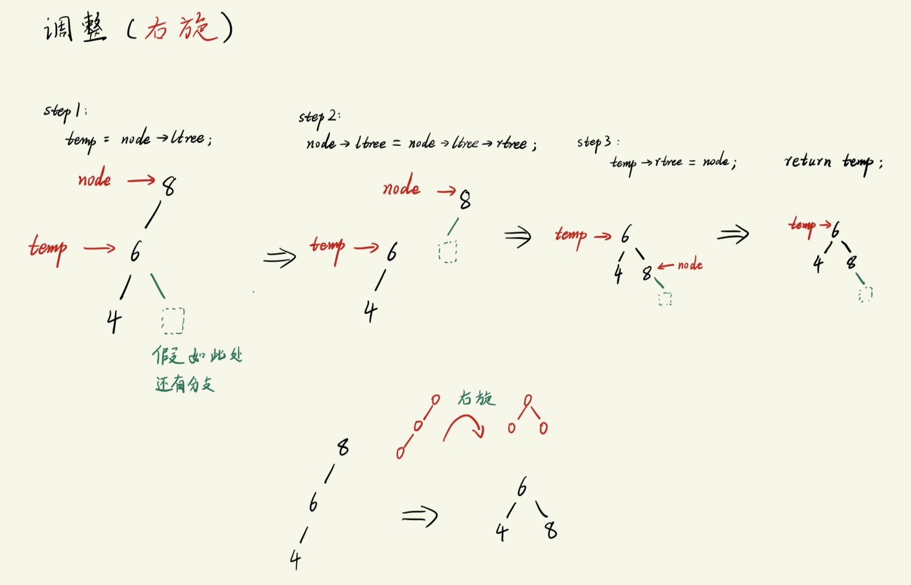

# 平衡二叉搜索树

平衡二叉搜索树: 
- Balance Binary Search Tree, BBST
- 也叫 `AVL`, 这是两个前苏联科学家的名字组合.


背景:
```txt
对于一颗二叉搜索树而言:
    如果它只有左子树或者只有右子树, 此时, 最坏的情况是我们需要遍历所有节点才能找到我们的目标节点, 这时候, 搜索这棵树就等同于 "暴力枚举", 效率极差.

    最好的情况则是, 这棵树刚好等同与二分查找, 此时, 最坏的情况下我们也只需要遍历大约一半的节点.

由此, 我们可以得出一个结论:
    如果二叉搜索的高度越高, 它的检索效率越差. 
        高度指的是它向下延伸的长度.
        
那么, 我们能不能找到一种方法, 将二叉搜索树的高度降低?  ===> 将二叉搜索树变成平衡二叉搜索树. 
```

平衡二叉搜索树:
```txt
二叉树的 "平衡" 概念: 
    二叉树的左右子树的高度接近一致.

    理想的平衡状态(很少, 不常见): 左右子树高度完全一致.

    一般的平衡状态(常见): 任意一个节点的左右子树的 "高度差" 不超过1.

平衡二叉搜索树的特性:
- 左右子树的 高度差不超过1
- 左右子树也分别是 平衡二叉搜索树.
    - 注意: 有时候只有单个子树是平衡二叉搜索树, 此时整棵树 并不是 平衡二叉搜索树
```

最小不平衡子树:
```txt
以 "新插入节点" 出发, 找到使得当前子树不平衡的节点, 以该节点作为根节点, 到新插入节点所形成的子树就是 "最小不平衡子树".
    - 最小不平衡子树 就是我们将一颗二叉树调整为平衡二叉树的处理对象.
```
- 下图为其中一种最小不平衡子树 -- LL型 :


## 调整平衡二叉搜索树
要将一个二叉搜索树调整为平衡二叉搜索树, 有两个关键步骤:
1. 计算**插入新增节点后**的`左右子树高度`, 用来判断是否平衡.
2. 如果新增节点使得树不平衡, 则需要`调整结构, 使得树重新平衡`.


-------------------------------------

### 计算树的高度
```txt
分成以下4种情况:
1. 传入的二叉树为空: 
    返回高度0
2. 传入的二叉树只有根节点:
    返回高度 1
3. 传入的二叉树右子树高度 > 左子树高度:
    返回右子树高度 + 1
4. 传入的二叉树右子树高度 <= 左子树高度:
    返回左子树高度 + 1

    case 3 和 case 4 需要使用递归.
```

代码实现:
```c
// 计算当前输入的树的 "高度"
int GetAVLTreeHeight(struct AVLTree_node * tree)
{
    if(tree != NULL){
        if(tree->ltree == NULL && tree->rtree == NULL){     // 只有根节点
            return 1;
        }
        else if(GetAVLTreeHeight(tree->rtree) > GetAVLTreeHeight(tree->ltree)){
            return  GetAVLTreeHeight(tree->rtree) + 1;      // 如果右子树高度 > 左子树, 则直接返回右子树高度 + 1  (由于采用了递归, 高度会被累计的)
        }
        else{                                               // 右子树高度 <= 左子树高度 
            return  GetAVLTreeHeight(tree->ltree) + 1;
        }
    }
    else{
        return 0;
    }
}
```


---------------------------------------------------

### 调整不平衡二叉树(LL型)
能计算树的高度之后, 接下来就是对树进行调整, 我们调整的目标是`最小不平衡子树`.
- 最小不平衡子树: 从新插入节点到失衡节点之间的子树.

- LL型指的是: 从**失衡点到新插入节点**的`前两个路径`如果是**左子树**(如下图) 
    
    - 对于这种子树, 调整时需要进行`右旋`.
    

代码实现:
```c
struct AVLTree_node * LL_Rotation(struct AVLTree_node *node)
{
    struct AVLTree_node * temp = NULL;      // temp 是调整后的新树的根节点

    /* 下面将以 temp节点 为轴, 进行右旋 */

    // step1: node的左子树 赋值给 temp (相当于备份了一下节点的地址)
    temp = node->ltree;

    // step2: 将 node的左子树的右子树 挪动到 node的左子树位置(第一步已经备份过地址, 这里可以安全地覆盖)
    node->ltree = node->ltree->rtree;

    // step3: 让 temp的左子树 设置为 node 节点
    temp->ltree = node;

    return temp;
}
```