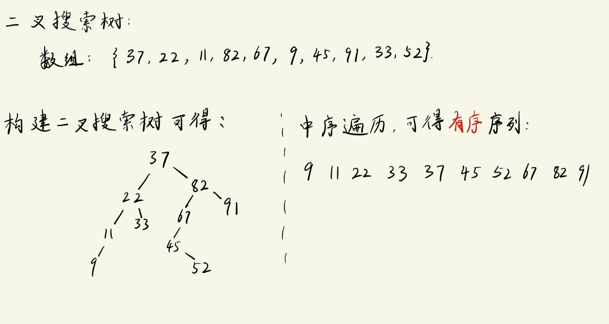
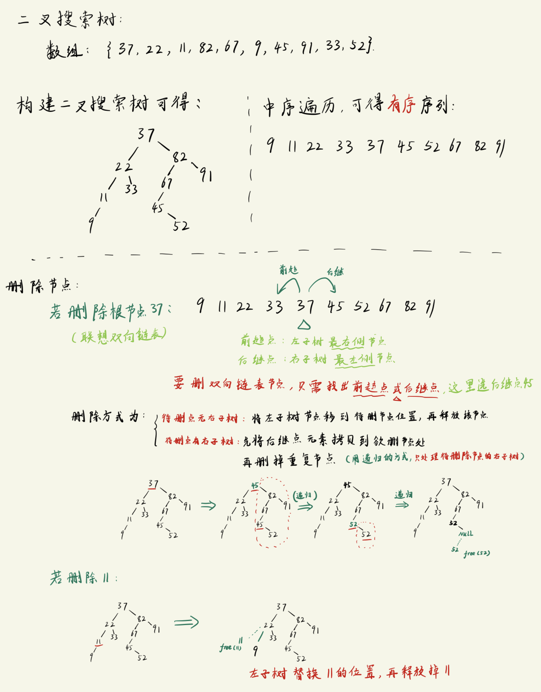

# 创建二叉搜索树
`二叉搜索树`也叫`二叉查找树`或`二叉排序`.

二叉搜索树特点:
```txt
1. 如果左子树非空, 则左子树所有节点 都要小于 根节点
2. 如果右子树非空, 则右子树所有节点 都要大于 根节点
3. 其中左右子树也分别是 二叉搜索树.
    左子树 < 根 < 右子树  (此时要按照这个大小排序输出的话, 就是中序遍历)

    注意: 二叉搜索树中 **不允许出现重复节点**
```

代码实现:
- 核心理念: 只要涉及二叉树, 必然用到`递归`!!!!!!!!!!

## 核心代码--创建二叉搜索树

```c
// ---------- 用数组内的元素创建二叉搜索树 -------------
struct BSTree_node * create_BStree(unsigned int arr[], int n)
{
    struct BSTree_node *tree = NULL;
    int i;

    for(i = 0; i < n; i++){
        tree = insert_bstree(tree, arr[i]);       // 往二叉树中插入新节点(按照大小排序插入子树)
    }
    return tree;
}

struct BSTree_node * insert_bstree(struct BSTree_node *T, unsigned int elem)
{
    // 如果传进来的是空树, 则: 创建根节点, 然后左右子树设置为空, 再将将它添作为新的树返回
    if(T == NULL){
        T = (struct BSTree_node *)malloc(sizeof(struct BSTree_node));       // 先开辟空间
        T->elem = elem;
        T->ltree = T->rtree = NULL;
    }
    else if(elem < T->elem){        // 假如传进来的不是空树, 则比较一下elem与当前(子树)根节点的大小, 从而确定把它放到左子树还是右子树位置
        T->ltree = insert_bstree(T->ltree, elem);      // 利用递归的思想: 此时 ltree 必然是空树, 会直接走上面的if分支
    }
    else if(elem > T->elem){        // 假如传进来的不是空树, 则比较一下elem与当前(子树)根节点的大小, 从而确定把它放到左子树还是右子树位置
        T->rtree = insert_bstree(T->rtree, elem);      // 利用递归的思想: 此时 rtree 必然是空树, 会直接走上面的if分支
    }
    else{                           // 此时 elem == T->elem
        printf("Inserting repeat node is forbidden!\n");
        exit(0);
    }
    return T;
}
```



---

# 查找 & 添加二叉搜索树
## 核心代码--查找
```c
// --- 非递归写法 ---
int search_bstree(struct BSTree_node *tree, unsigned int num)
{
    struct BSTree_node *p = tree;       // 指向当前遍历的节点

    while(p != NULL){
        if(num == p->elem){             // 找到想要的元素
            return 1;
        }
        else if(num < p->elem){         // 目标位于左子树
            p = p->ltree;               // p更新到左子树的根节点
        }
        else{
            p = p->rtree;               // 目标位于右子树
        }
    }
    return 0;
}

// ---- 递归写法 -----
int search_bstree(struct BSTree_node *tree, unsigned int num)
{
    if(tree != NULL){
        if(num == tree->elem){             // 找到想要的元素
            return 1;
        }
        else if(num < tree->elem){         // 目标位于左子树
            return search_bstree(tree->ltree, num);
        }
        else{
            return search_bstree(tree->rtree, num);
        }
    }
    return 0;
}
```

## 核心代码--插入新节点
```c
struct BSTree_node * insert_bstree(struct BSTree_node *T, unsigned int elem)
{
    // 如果传进来的是空树, 则: 创建根节点, 然后左右子树设置为空, 再将将它添作为新的树返回
    if(T == NULL){
        T = (struct BSTree_node *)malloc(sizeof(struct BSTree_node));       // 先开辟空间
        T->elem = elem;
        T->ltree = T->rtree = NULL;
    }
    else if(elem < T->elem){        // 假如传进来的不是空树, 则比较一下elem与当前(子树)根节点的大小, 从而确定把它放到左子树还是右子树位置
        T->ltree = insert_bstree(T->ltree, elem);      // 利用递归的思想: 此时 ltree 必然是空树, 会直接走上面的if分支
    }
    else if(elem > T->elem){        // 假如传进来的不是空树, 则比较一下elem与当前(子树)根节点的大小, 从而确定把它放到左子树还是右子树位置
        T->rtree = insert_bstree(T->rtree, elem);      // 利用递归的思想: 此时 rtree 必然是空树, 会直接走上面的if分支
    }
    else{                           // 此时 elem == T->elem
        printf("Inserting repeat node is forbidden!\n");
        exit(0);
    }
    return T;
}
```


---

# 删除二叉搜索树节点

过程描述如下:
```txt
1. 如果待删除节点 没有右子树
    将待删除节点的左子树移动到待删除节点位置, 再释放掉待删除节点 (需要使用一个临时指针暂存待删除节点, 才能确保待删除节点不丢失)
2. 如果待删除节点 有右子树, 先将后继点元素拷贝到欲删除节点处, 再删掉 "重复节点"
    这里需要使用递归的方式, 并且从当前遍历到的后继点作为遍历的起点进行删除.
```
过程图示:



## 核心代码
```c
struct BSTree_node * delete_bstree(struct BSTree_node * T, unsigned int elem)
{
    if(T == NULL){
        printf("Not exist %d node!\n", elem);
        exit(0);
    }

    if(T->elem == elem){            // 处理要删除的节点
        
        if(T->rtree == NULL){       // 情况1: 被删除节点 "无右子树"
            struct BSTree_node * temp = T;      // 临时存一下当前要删除的节点
            T = T->ltree;                       // 绕开待删除节点(相当于用左子树顶替了要删除的那个节点), 此时T的后继点仍然指向着T, 所以只需要替换T位置的节点地址就可以了
            free(temp);                         // 此时可以安全地释放掉 temp节点 (欲删除节点)
        }
        else{                       // 情况2: 被删除的节点 "有右子树", 删除方法是 "找出右子树的最左侧节点, 再将这个最左侧节点的值赋给T, 然后递归调用本函数来删除重复的节点"
            struct BSTree_node *temp = T->rtree;    // 遍历节点使用的指针, 此时需要找右子树的最左侧节点, 故从T的右子树开始找
            while(temp->ltree != NULL){
                temp = temp->ltree;                 // 如果还有左子树, 则继续更新
            }

            T->elem = temp->elem;                   // 右子树最左侧节点的值赋值给要删除的元素(覆盖掉之后, 目标元素就从二叉树中"消失"了, 且此时出现了重复节点)

            // 在T的右子树中删除重复的节点(注: 其实这个分支只会做元素值的覆盖, 真正删除节点的任务会交给上面的if分支)
            T->rtree = delete_bstree(T->rtree, T->elem);        // 注意是从 T的右子树 开始遍历, 防止删错
        }
    }
    else if(T->elem > elem){
        T->ltree = delete_bstree(T->ltree, elem);        // 去左子树中寻找&删除删除目标节点, 然后更新左子树
    }
    else{
        T->rtree = delete_bstree(T->rtree, elem);        // 去右子树中寻找&删除删除目标节点, 然后更新右子树
    }
    return T;
}
```


--- 

## 完整代码 
```c
#include <stdio.h>
#include <stdlib.h>

#define SIZE 10

// ------- 定义二叉查找树的节点结构体 ----------
struct BSTree_node
{
    unsigned int elem;
    struct BSTree_node *ltree, *rtree;
};

// -------------- 函数声明 ----------
struct BSTree_node * create_BStree(unsigned int arr[], int n);
struct BSTree_node * insert_bstree(struct BSTree_node *T, unsigned int elem);
void in_order(struct BSTree_node *tree);                    // 中序遍历
int search_bstree(struct BSTree_node *tree, unsigned int num);     // 在二叉搜索树进行搜索
struct BSTree_node * delete_bstree(struct BSTree_node * tree, unsigned int num);        //删除二叉搜索树的某个节点

// ------------- main -------------
int main(void)
{
    unsigned int arr[SIZE] = {37, 22, 11, 82, 67, 9, 45, 91, 33, 52};
    struct BSTree_node *mytree = NULL;
    unsigned int num;

    mytree = create_BStree(arr, SIZE);

    // 显式一下二叉树 -- 通过中序遍历
    in_order(mytree);
    printf("\n");

    // 从二叉搜索树中查找指定元素
    printf("Please enter a number you want to find in BStree: ");
    scanf("%d", &num);
    if (search_bstree(mytree, num)){
        printf("Find %d in mytree.\n", num);
    }
    else{
        printf("Cannot not find %d in mytree.\n", num);
    }

    // 往二叉搜索树中添加节点
    printf("Please enter a number you want to insert to the BSTree: ");
    scanf("%d", &num);
    mytree = insert_bstree(mytree, num);
    in_order(mytree);
    printf("\n");

    // 删除二叉搜索树中的某个节点
    printf("Please enter a number you want to delete from the BSTree: ");
    scanf("%d", &num);
    mytree = delete_bstree(mytree, num);
    in_order(mytree);
    printf("\n");

    return 0;
}

// ---------- 用数组内的元素创建二叉搜索树 -------------
struct BSTree_node * create_BStree(unsigned int arr[], int n)
{
    struct BSTree_node *tree = NULL;
    int i;

    for(i = 0; i < n; i++){
        tree = insert_bstree(tree, arr[i]);       // 往二叉树中插入新节点(按照大小排序插入子树)
    }
    return tree;
}

struct BSTree_node * insert_bstree(struct BSTree_node *T, unsigned int elem)
{
    // 如果传进来的是空树, 则: 创建根节点, 然后左右子树设置为空, 再将将它添作为新的树返回
    if(T == NULL){
        T = (struct BSTree_node *)malloc(sizeof(struct BSTree_node));       // 先开辟空间
        T->elem = elem;
        T->ltree = T->rtree = NULL;
    }
    else if(elem < T->elem){        // 假如传进来的不是空树, 则比较一下elem与当前(子树)根节点的大小, 从而确定把它放到左子树还是右子树位置
        T->ltree = insert_bstree(T->ltree, elem);      // 利用递归的思想: 此时 ltree 必然是空树, 会直接走上面的if分支
    }
    else if(elem > T->elem){        // 假如传进来的不是空树, 则比较一下elem与当前(子树)根节点的大小, 从而确定把它放到左子树还是右子树位置
        T->rtree = insert_bstree(T->rtree, elem);      // 利用递归的思想: 此时 rtree 必然是空树, 会直接走上面的if分支
    }
    else{                           // 此时 elem == T->elem
        printf("Inserting repeat node is forbidden!\n");
        exit(0);
    }
    return T;
}

void in_order(struct BSTree_node *tree)
{
    if(tree != NULL){
        // 左子树
        in_order(tree->ltree);      
        // 根节点      
        printf("%d ", tree->elem);
        // 右子树
        in_order(tree->rtree);
    }
}

// --- 非递归 ---
// int search_bstree(struct BSTree_node *tree, unsigned int num)
// {
//     struct BSTree_node *p = tree;       // 指向当前遍历的节点

//     while(p != NULL){
//         if(num == p->elem){             // 找到想要的元素
//             return 1;
//         }
//         else if(num < p->elem){         // 目标位于左子树
//             p = p->ltree;               // p更新到左子树的根节点
//         }
//         else{
//             p = p->rtree;               // 目标位于右子树
//         }
//     }
//     return 0;
// }

// ---- 递归 -----
int search_bstree(struct BSTree_node *tree, unsigned int num)
{
    if(tree != NULL){
        if(num == tree->elem){             // 找到想要的元素
            return 1;
        }
        else if(num < tree->elem){         // 目标位于左子树
            return search_bstree(tree->ltree, num);
        }
        else{
            return search_bstree(tree->rtree, num);
        }
    }
    return 0;
}

struct BSTree_node * delete_bstree(struct BSTree_node * T, unsigned int elem)
{
    if(T == NULL){
        printf("Not exist %d node!\n", elem);
        exit(0);
    }

    if(T->elem == elem){            // 处理要删除的节点
        
        if(T->rtree == NULL){       // 情况1: 被删除节点 "无右子树"
            struct BSTree_node * temp = T;      // 临时存一下当前要删除的节点
            T = T->ltree;                       // 绕开待删除节点(相当于用左子树顶替了要删除的那个节点), 此时T的后继点仍然指向着T, 所以只需要替换T位置的节点地址就可以了
            free(temp);                         // 此时可以安全地释放掉 temp节点 (欲删除节点)
        }
        else{                       // 情况2: 被删除的节点 "有右子树", 删除方法是 "找出右子树的最左侧节点, 再将这个最左侧节点的值赋给T, 然后递归调用本函数来删除重复的节点"
            struct BSTree_node *temp = T->rtree;    // 遍历节点使用的指针, 此时需要找右子树的最左侧节点, 故从T的右子树开始找
            while(temp->ltree != NULL){
                temp = temp->ltree;                 // 如果还有左子树, 则继续更新
            }

            T->elem = temp->elem;                   // 右子树最左侧节点的值赋值给要删除的元素(覆盖掉之后, 目标元素就从二叉树中"消失"了, 且此时出现了重复节点)

            // 在T的右子树中删除重复的节点(注: 其实这个分支只会做元素值的覆盖, 真正删除节点的任务会交给上面的if分支)
            T->rtree = delete_bstree(T->rtree, T->elem);        // 注意是从 T的右子树 开始遍历, 防止删错
        }
    }
    else if(T->elem > elem){
        T->ltree = delete_bstree(T->ltree, elem);        // 去左子树中寻找&删除删除目标节点, 然后更新左子树
    }
    else{
        T->rtree = delete_bstree(T->rtree, elem);        // 去右子树中寻找&删除删除目标节点, 然后更新右子树
    }

    return T;
}
```


