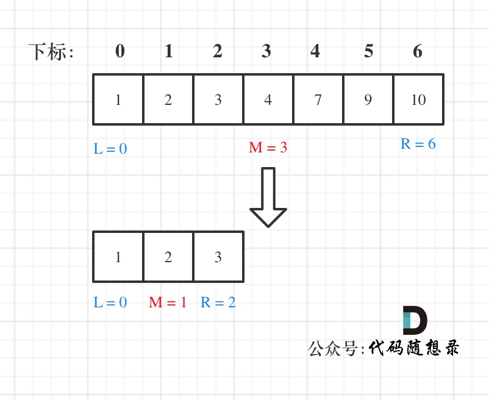

# 数据结构 -- 查找/搜索
查找可以分为`有序查找`和`无序查找`.


## 线性结构

### 无序查找(暴力穷举)
线性结构指的是在内存中连续存储的数据结构, 比如数组, 堆和栈.
- 线性结构中的`无序查找`最简单的就是暴力枚举, 遍历所有的元素, 然后依次比较. 
  - 这种方式通常需要进行两次比较: `判断当前访问是否越界` + `判断当前元素是否为目标元素`.

代码实现 -- `sqsearch.c`
```c
#include <stdio.h>

#define SIZE 100

int SqSearch(int array[], int n, int x);

int main(void)
{
    int n;
    int i;
    int arr[SIZE];
    int x;

    printf("Please enter the number of your data: \n");
    scanf("%d", &n);
    printf("Please enter the element of your data: \n");
    for(i = 0; i < n; i++){
        scanf("%d", &arr[i]);
    }

    printf("Please enter the element you want to search:");
    scanf("%d", &x);

    i = SqSearch(arr, n, x);

    if(i == -1){
        printf("Cannot find the element in your data.\n");
    }
    else{
        printf("The element you want to search is in %d position!\n", i);
    }

    return 0;
}

int SqSearch(int array[], int n, int x)
{
    int i;
    for (i = 0; i < n; i++){
        if(array[i] == x){
            return i;
        }
    }
    return -1;
}
```


- 针对这种查找模式的一个优化方案是`哨兵`思想. 
```txt
在数组的最后增加一个元素, 增加的元素是我们希望查找的目标target, 并且将它称为"哨兵".
    此时, 如果原来的数组中存在target, 那么增加"哨兵"后的数组就会有两个target. 显然, 此时一定能找到一次 target.

这种方法带来的优势是: 
    每次循环中减少了一次判断, 一定程度上降低了开销.
```

代码实现 -- `sqsearch_guard.c`
```c
#include <stdio.h>

#define SIZE 100

int SqSearch_Guard(int array[], int n, int x);

int main(void)
{
    int n;
    int i;
    int arr[SIZE];
    int x;

    printf("Please enter the number of your data: \n");
    scanf("%d", &n);
    printf("Please enter the element of your data: \n");
    for(i = 0; i < n; i++){
        scanf("%d", &arr[i]);
    }

    printf("Please enter the element you want to search:");
    scanf("%d", &x);

    i = SqSearch_Guard(arr, n, x);

    if(i == n){
        printf("Cannot find the element in your data.\n");
    }
    else{
        printf("The element you want to search is in %d position!\n", i);
    }

    return 0;
}

int SqSearch_Guard(int array[], int n, int x)
{
    int i;
    array[n] = x;       // 数组末尾增加哨兵

    for (i = 0; array[i] != x; i++);        // 这时候不再需要判断是否越界
    return i;
}
```

----

### 有序查找(二分/折半查找)
有序的线性结构进行查找, 最简单的就是二分法/折半查找法.

核心思想:
```txt
1. 将数组从中间划分为两部分: 
    左半部分 和 右半部分    (注意, 此时需要规定好划分区间是 "左闭右闭" 还是 "左闭右开", 这里以左闭右闭为例)

2. 此时就有一个 "中间位置元素middle", 如果我们要查找的目标元素 target > middle, 则说明 目标位于右半部分, 反之目标位于左半部分.

3. 不断对"左半部分/右半部分"进行二分, 直到
    target == middle        (这种情况是数组中 存在 target),
    或者
    区间已经不可再进行二分为止  (这种情况是数组中 没有 target). 
```


----

代码实现 -- `Binary_SqSearch.c`

使用迭代实现: 
```c
#include <stdio.h>

#define SIZE 100

int Binary_SqSearch(int array[], int n, int x);

int main(void)
{
    int n;
    int i;
    int arr[SIZE];
    int x;

    printf("Please enter the number of your data: \n");
    scanf("%d", &n);
    printf("Please enter the element of your data: \n");
    for(i = 0; i < n; i++){
        scanf("%d", &arr[i]);
    }

    printf("Please enter the element you want to search:");
    scanf("%d", &x);

    i = Binary_SqSearch(arr, n, x);

    if(i == -1){
        printf("Cannot find the element in your data.\n");
    }
    else{
        printf("The element you want to search is in %d position!\n", i);
    }

    return 0;
}

int Binary_SqSearch(int array[], int n, int x)
{
    /* 这里划分区间使用的规则是 "左闭右闭" 区间 */
    int low = 0;
    int high = n - 1;  
    int middle;
    
    while(low <= high){         // 左闭右闭区间, 区间两边的index都是有合法元素的
        middle = (int)(low*0.5 + high * 0.5);       // 防止加法溢出, 先除以2
        // middle = (low >> 1) + (high >> 1);       // 在二进制中, 右移一位相当于除以2再取整

        if(x == array[middle]){
            return middle; 
        }
        else if(x > array[middle]){
            low = middle +1;
        }
        else{
            high = middle -1;
        }
    }
    return -1;
}
```
- 注意: 由于在计算middle的时候可能存在加法溢出的极端情况, 所以这里更推荐使用等价写法:
    ```cpp
    middle = (int)(low*0.5 + high * 0.5);
    // 或者:
    middle = (low >> 1) + (high >> 1);

    // 而不是: 
    middle = (low + high) / 2;
    ```

---

使用递归实现:
```c
#include <stdio.h>

#define SIZE 100

int Recursion_Binary_SqSearch(int array[], int x, int low, int high);

int main(void)
{
    int n;
    int i;
    int arr[SIZE];
    int x;

    printf("Please enter the number of your data: \n");
    scanf("%d", &n);
    printf("Please enter the element of your data: \n");
    for(i = 0; i < n; i++){
        scanf("%d", &arr[i]);
    }

    printf("Please enter the element you want to search:");
    scanf("%d", &x);

    // 使用递归写法的二分查找
    i = Recursion_Binary_SqSearch(arr, x, 0, n-1);

    if(i == -1){
        printf("Cannot find the element in your data.\n");
    }
    else{
        printf("The element you want to search is in %d position!\n", i);
    }

    return 0;
}

int Recursion_Binary_SqSearch(int array[], int x, int low, int high)
{
    /* 这里划分区间使用的规则是 "左闭右闭" 区间 */
    int middle = (low >> 1) + (high >> 1);

    if(low > high){     // 这里的条件直接使用迭代写法的 while 条件的 "取反条件" 即可
        return -1;
    }

    if(x == array[middle]){
        return middle; 
    }
    else if(x > array[middle]){
        low = middle +1;
        return Recursion_Binary_SqSearch(array, x, middle+1, high);
    }
    else{
        return Recursion_Binary_SqSearch(array, x, middle, high-1);
    }
}
```

